# はじめてのQGIS

[目次に戻る](../index.md)

## 本ページの目的

- GISについて説明できるようになる
- QGISのインストールを行う
- QGISで地図情報を表示できるようになる

この教材は、[クリエイティブ・コモンズ 表示 - 継承 4.0 国際 ライセンス](http://creativecommons.org/licenses/by-nc-sa/4.0/)で提供されます。

## GISとは

地理情報システム(Geographic Information System; GIS)は、地理的位置を手がかりに、位置に関する情報を持ったデータ(空間データ)を総合的に管理・加工し、視覚的に表示し、高度な分析や迅速な判断を可能にする技術です。
日本国内では、平成7年1月の阪神・淡路大震災の反省等をきっかけに、GISに関する本格的な取組が始まりました(国土地理院より)。

## QGISとは

QGISは、無償で利用できるオープンソース（GNU General Public License v2で提供）のGISです。
Windows,Mac,Linux, Androidなど様々な環境で動作します。様々なプラグインや、他のオープンソースと連携して使用することで、さまざまな分析が可能です。
GISの基本操作に必要な機能を網羅しているだけでなく、Web上に多数のマニュアルがアップロードされているため、GISの学習がしやすいソフトウェアです。
[QGISのホームページ](https://qgis.org/)

## QGISのインストール

自分のパソコンにQGISをインストールしてみましょう。
初めに、[公式のダウンロードサイト](https://qgis.org/download/)を開き、自身のパソコンにあったファイルをダウンロードしてください。
なお、今回は執筆時点でLTR(長期サポート版)のバージョン3.40.11を使用します。
他のバージョンでも構いませんが、アプリケーションのウィンドウやテキストが異なる場合があります。

- windowsの場合

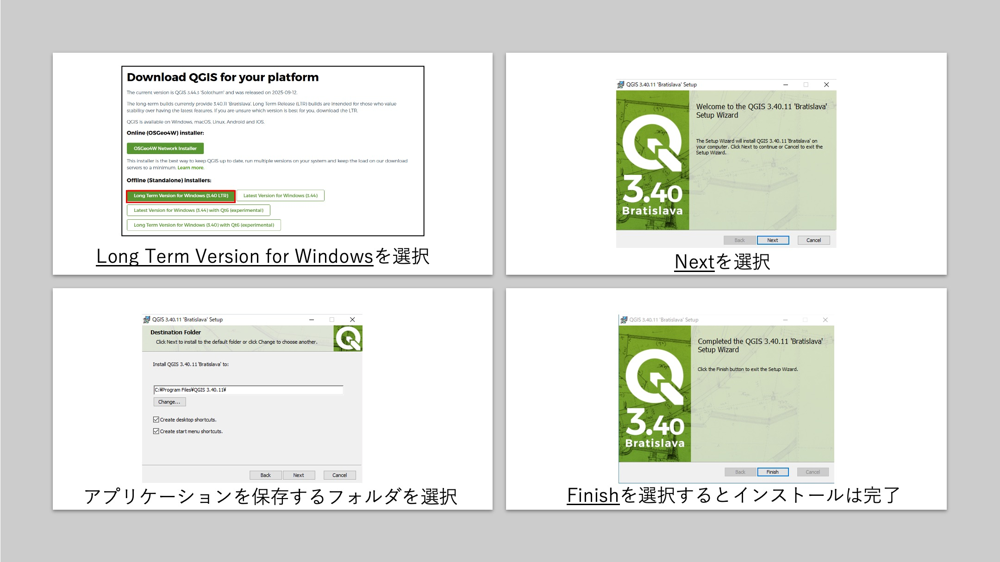
ダウンロードしたmsiファイルをダブルクリックするとインストールが始まります。(左上)
基本的にはnextを選択して次に進んでください。適宜、スタートやデクストップにアイコンを保存するかを選択してください。(右上)
アプリケーションを保存するフォルダには、**日本語を含まない**ようにしてください。(左下)
(NG例：C:¥Users¥松下将也¥~~~)
Finishを選択するとインストールが完了します。(右下)

- macOSの場合

macOSは、2020年以前に発売したパソコンとそれ以降に発売したパソコンでインストールするメディアが異なります。
自身にあった方を選択してください。
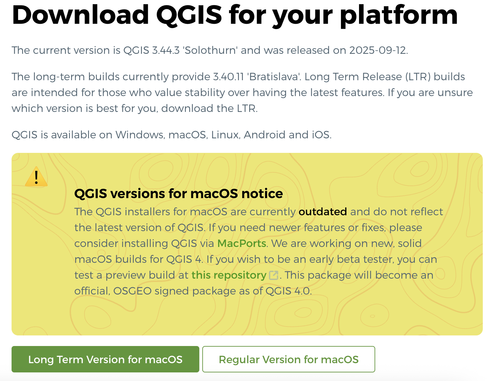
dmgファイルを展開し、QGISのアイコンをアプリケーションフォルダにD&Dするとインストールが完了します。
(注)macOS側でセキュリティの警告が出る場合があります。その場合は、「プライバシーとセキュリティ」設定でそのアプリのアクセス権をオンにすることで、アプリを許可することができます。

## QGISの動作確認

インストールしたQGISの動作確認の一環で、小金井市に存在する公共施設内のAED設置箇所の可視化を挑戦してみましょう。

(目標)
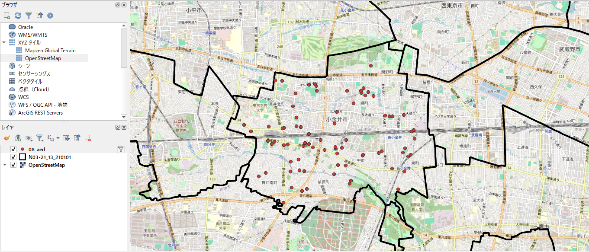

### QGISに標準搭載されているOpenStreetMapの表示

アプリケーションのホーム画面から「新規プロジェクト」を選択
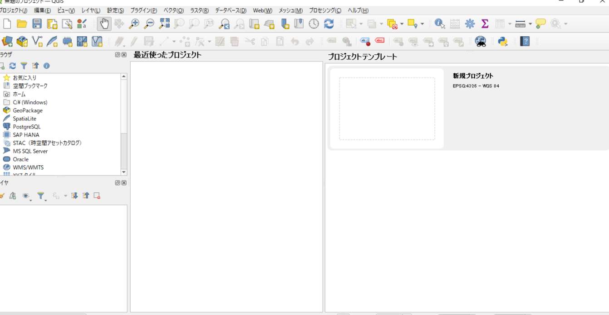

画面左の「ブラウザ」ウィンドウから、「XYZタイル」-「OpenStreetMap」を選択
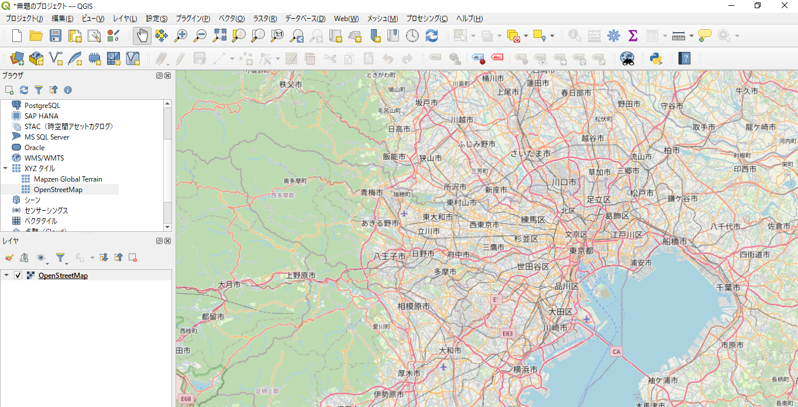
最初は世界地図全体が表示されますが、拡大すると画像のような具体的な都市名が表示されます。

### 東京都小金井市が所管するAEDの可視化

東京都は、[デジタルツインプロジェクト](https://info.tokyo-digitaltwin.metro.tokyo.lg.jp/)の一環で、一般市民に対しオープンデータを提供しています。
[小金井市AEDのデータセット](https://catalog.data.metro.tokyo.lg.jp/dataset/t132101d0000000026)から小金井市が提供するAEDに関するデータをダウンロードしましょう。
ダウンロードしたファイルを確認すると、市役所などの名称や住所の他に緯度・経度の列があることがわかりました。
緯度・経度のデータをうまく活用するとQGIS内のOpenStreetMapにうまくピンを刺すことができそうです。やってみましょう。

- このアイコンを選択
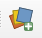

- 左のカラムから「CSVテキスト」を選択
- ファイル名にダウンロードしたファイル名のあるパスを指定
- 文字コードは「UTF-8」
- ファイル形式は「CSV」
- ジオメトリ定義は「ポイント座標」
- X値に「経度」、Y値に「緯度」を選択 (間違えないよう注意！)
- ジオメトリのCRSは「EPSG:4326 - WGS 84」を選択
- 右下の「追加」を選択
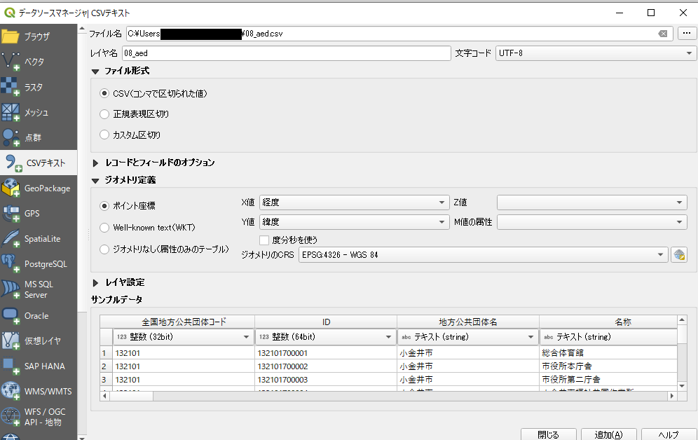

うまくデータを取り込むと、小金井市周辺に数十個の点が表示されます。
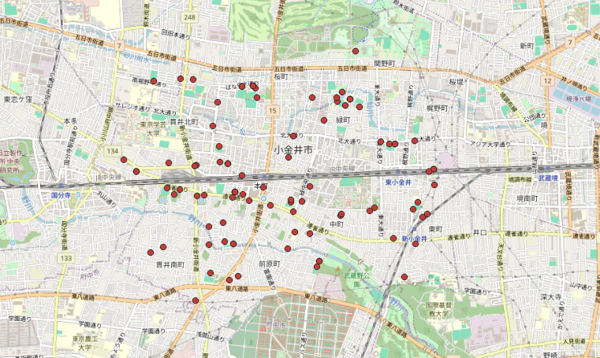
この時は点の色や形は指定していないので、例と異なる場合があります。

### 東京都の市区町村の境界の可視化

現在の表示でも大体の位置関係が見えてくると思いますが、市区町村の境界が表示されているとさらによく分かるような気がします。
その時は、国土交通省が公開している[国土数値情報](https://nlftp.mlit.go.jp/ksj/gml/datalist/KsjTmplt-N03-v2_3.html)を活用しましょう。
今回は、[このファイル](../materials/02/N03-21_13_210101.shp)を使用するのでリンクをクリックしてダウンロードしてください。

ダウンロードしたファイルをQGISに取り込みます。
- このアイコンを選択

- 左のカラムから「ベクタ」を選択
- ファイル名にダウンロードしたファイル名のあるパスを指定
- 右下の「追加」を選択
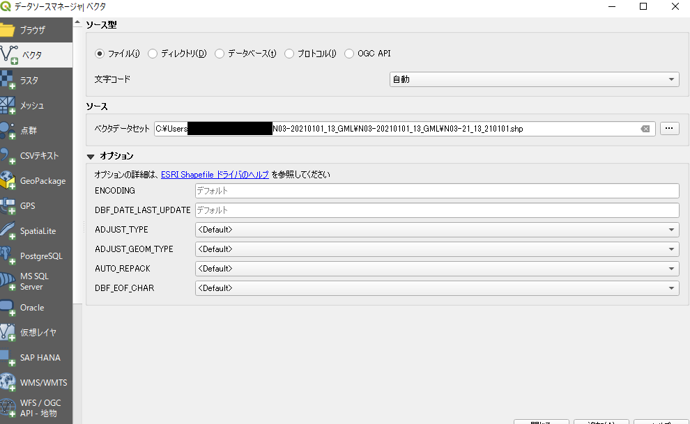

取り込みが成功すると、QGIS上に東京都の市区町村の境界が表示されます。
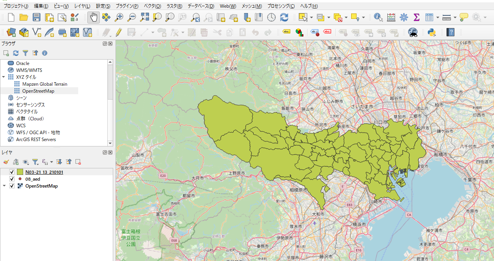
この時も色は特にしていないので何色でも構いません。

画像のようにQGISは取り込んだデータの順でレイヤを重ねていくため、最初に取り込んだOpenStreetMapやAEDの設置データが隠れてしまいます。
AEDの設置データを一番上のレイヤにくるように左下のレイヤ内の一番上に「08_aed」を移動しましょう。
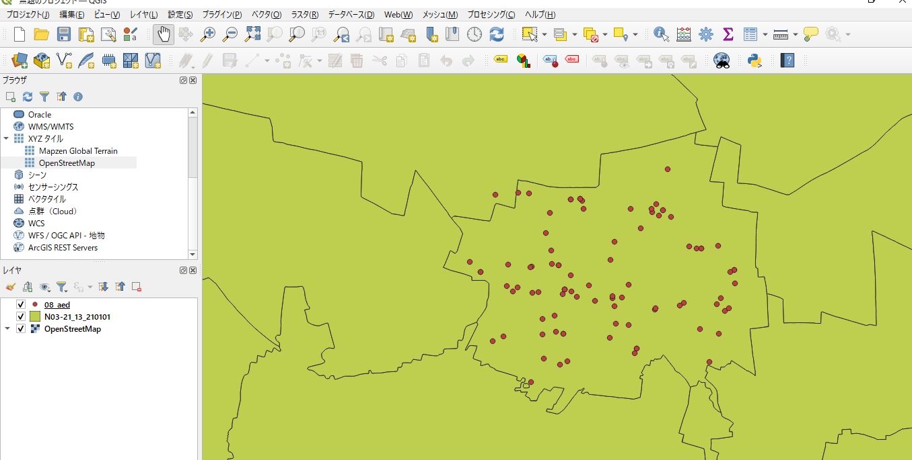

さて、小金井市の境界内に大体の点が表示されていることがわかりました。
OpenStreetMapの層も表示しておきましょう。

- 左下レイヤウィンドウから「N03-21_13_210101」を右クリック
- 「プロパティ」を選択
- プロジェクトスタイルから「outline blue」を選択
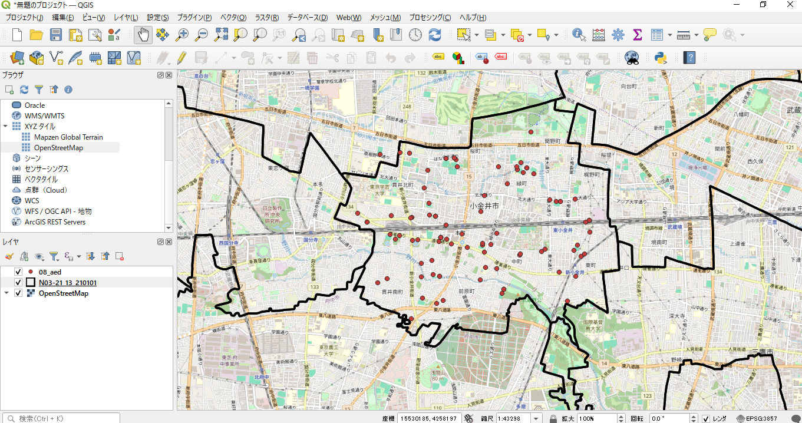
色は特に指定しませんが、画像では黒を選択しています。

さて、表示されたデータを見ると境界外に点データが表示されていることがわかりました。
このデータについて調べてみましょう。

- 左下レイヤウィンドウから「08_aed」を右クリック
- 「属性テーブルを開く」を選択
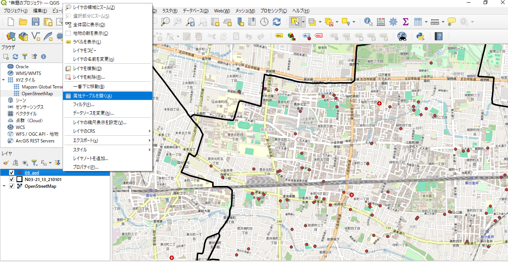

表テーブルが表示されました。(08_aedのデータであることを確認しましょう)

- このアイコンを選択
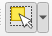
小金井市の境界外にある点データを選択 (選択すると黄色に変化します)
すると、属性テーブル内に選択されたデータが強調表示されます。
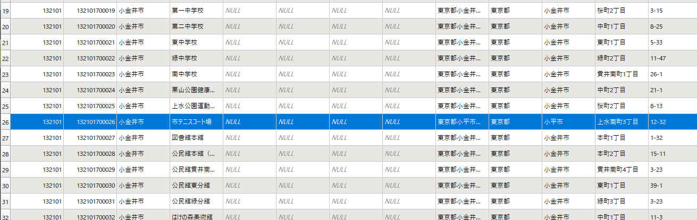
確かに、隣の小平市の施設内にあることがわかりました。

### 不必要なデータの非表示

データ分析をする上で、小平市にあるデータのような本来想定されていないデータの取り扱いをどうするかが重要になります。
今回は、小金井市にあるデータだけをみたいという想定で、それ以外のデータを非表示にしてみましょう。

- 左下のレイヤウィンドウから「08_aed」を右クリック
- 「フィルタ」を選択
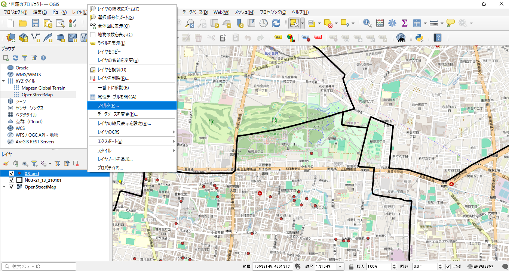

- フィールドのテーブルから「所在地_市区町村」を選択
- 値から「すべて」を選択
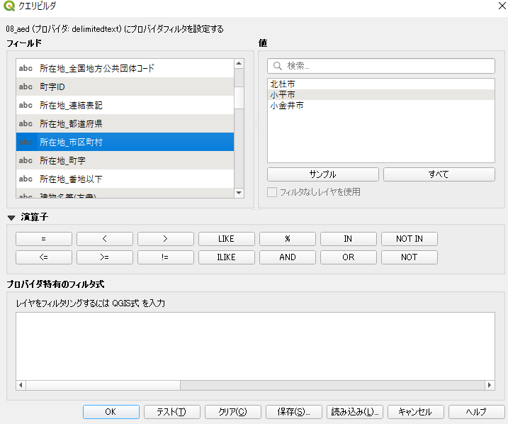
なんと、山梨県北杜市にもデータがあることが判明しました
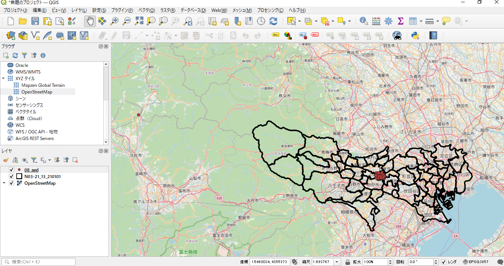
したがって、小平市と北杜市のデータを非表示にしてみましょう。

- 「所在地_市区町村」をダブルクリック
- 演算子から「=」をクリック
- 値から「小金井市」をダブルクリック
フィルタ式が下図のように表示されたら「OK」を選択
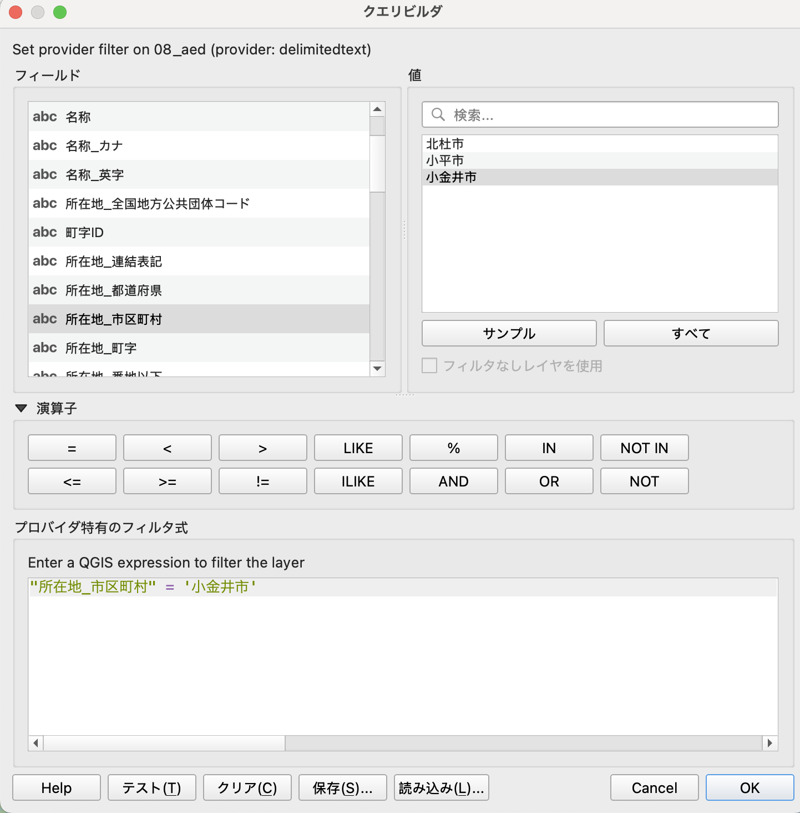

QGIS上で小金井市以外のデータが非表示になっていたら作業は完了です！

*(重要) このデータは「領域分析」で使用しますので必ず**保存**してください。

## まとめ

本ページでは、以下の事項について学習しました

- GISについて説明できるようになる
- QGISのインストールを行う
- QGIS上に地図情報を表示して分析する準備を整える

## 参考資料

本教材は以下の資料をもとに作成しました。

- [GIS実習オープン教材](https://gis-oer.github.io/gitbook/book/)
- [QGISのホームページ](https://qgis.org/)
- [デジタルツインプロジェクト](https://info.tokyo-digitaltwin.metro.tokyo.lg.jp/)
- [国土数値情報ダウンロードサイト](https://nlftp.mlit.go.jp/ksj/)
