# 第3回 QGISを用いた地理空間データ分析

[目次に戻る](../index.md)

## この講義の目次

{: .card .card-toc }

- [本ページの目的](#purpose)
- [空間データとは](#what-is-spatial-data)
- [空間データの可視化例](#example-of-visualization)
- [空間データの種類](#spatial-data)
- [座標参照系(CRS)](#CRS)
- [ベクタデータを使った演習](#vector-data-exe)
- [ラスタデータを使った演習](#raster-data-exe)
- [まとめ](#summary)
- [参考資料](#refs)

## 本ページの目的 {#purpose}

現在、GISのデータは、複数の形式があり、様々な機関が提供しています。
ここでは、GISに関するさまざまなデータについて学習することを目的とします。

- 空間データとは何かについて説明できる
- 座標変換系とは何かについて説明できる
- ベクタデータとラスタデータについてQGIS上でデータの取り込み、取り出しができるようになる

## 空間データとは {#what-is-spatial-data}

空間データ(または、地理空間データ)は、「空間上の特定の地点、または区域の位置を示すデータ(位置データ)とそれに関連づけられた様々な事象に関するデータ、もしくは位置データのみからなるデータ」と定義されています(国土地理院より)。
例えば、気象データや店舗ごとの来客数、人口密度などが一例として挙げられます。

空間データは以下のように分類できます。

- 地域データ：市区町村別人口のようなゾーンごとのデータ
- 点データ：観測所別の気温データのような地点ごとのデータ
- 点過程データ：地震や交通事故のようなイベントの発生地点の集合からなるデータ

現在では、衛星観測技術の発展に伴い、気象状況、大気状況などが極めて高い精度で観測可能になりました。
(現代にガリレオとかアリストテレスを召喚したら、彼らは何を思うのでしょうか...)
話が脱線しましたね。つまり、全世界測位システム(Global Positioning System; GPS)に代表される
全地球衛星航法システム(Global Navigation Satellite System; GNSS)の発達によって、人・物の位置の補足・追跡が容易になりました。これは我々の生活をより暮らしやすく豊かにしたシステムであると言えます。

## 空間データの可視化例 ~東京都デジタルツインプロジェクト~ {#example-of-visualization}

ここでは、空間データの可視化の事例について紹介しましょう。
[東京都デジタルツイン3Dビューア](https://3dview.tokyo-digitaltwin.metro.tokyo.lg.jp/)は、
東京都の政策の一環として実施されている東京都デジタルツインプロジェクトの一環として収集したデータの可視化を閲覧できるサイトです。
このサイトにアクセスすると、東京都の建物や街並みをデジタル上に再現していることが分かります。
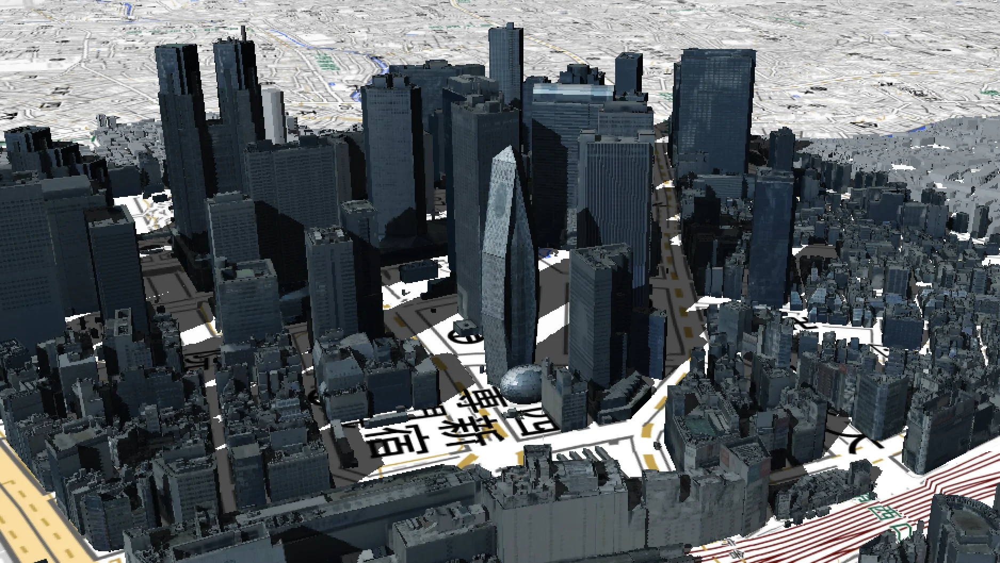

また、このサイトでは避難所と河川監視カメラが一体となった防災関連データセットが表示できます。
河川監視カメラをクリックすると、その地点のライブ映像が表示され、河川が氾濫する危険性をその場に行く必要なく知ることができます。
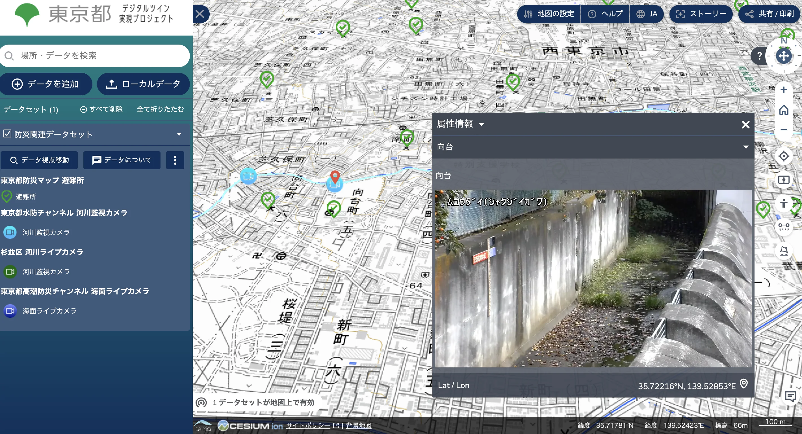
そういえば、ハザードマップも空間データの一つの可視化例として挙げられますね。

## 空間データの種類 {#spatial-data}

空間データには様々なファイル形式が存在しますが、大きく分けて2つの種類(ラスタデータとベクタデータ)に分類できます。

ラスタデータとは、画像ファイルのようなセル(ピクセル)で構成されるデータです。jpgファイルやpngファイルなどが一例です。
こちらのデータはみなさん馴染みがあるかと思います。空間データの場合、各セルは属性として位置座標や数値を持ちます。
GIS上ではよく、衛星画像や標高データなどによく用いられます。

一方、ベクタデータはポイント(点)、ライン(線)、ポリゴン(面)で構成されるデータ形式です。
馴染みがないかもしれませんが、WordやPowerPointで図形や線を挿入した際のデータだと思ってもらえると良いかと思います。
Adobe Illustratorを触ったことがあれば、拡張子にaiやeps、svgファイルを見たことがあるかもしれません。
これらはベクタデータで構成されています。そうそう、pdfファイルもその一つですね。
ベクタデータについてはもう少し掘り下げたいと思います。ベクタデータは、シェープファイルと呼ばれる形式で保存されます。
このシェープファイルは以下のような複数のファイル形式から構成されます(細かいものはまだありますが、主要なものは以下の通り)。

- .shp: 図形(点・線・面)を格納するファイル
- .shx: 図形(点・線・面)と造成データの対応関係を記述するファイル
- .dbf: 属性データを格納するテーブル
- .prj: 座標系(次節で紹介)を格納するファイル

QGISのインストールの説明の際に、東京都市区町村の境界を可視化したかと思います。この時はshpファイルをQGISに取り込んでデータを可視化しましたね。
このようにQGISにシェープファイルをさえ読み込めば、様々な情報を可視化したり保存したりできます。

よくありがちなミスとして、shpファイルのみを別のフォルダに移動してQGIS側でデータが正しく認識されないということがあります。
シェープファイルは、これらのファイルが揃って初めて機能することを覚えておきましょう。

## 座標参照系(CRS) {#CRS}

座標参照系(Coordinate Reference System; CRS)とは位置を2次元座標で示すための規格です。
かつて日本では主に日本測地系(JGD2011)が使用されていました。
古いデータ(2000年辺りから前)を取り扱う際にはこちらのデータを使用することがあります。
また、世界測地系(WGS84)もよく使われる測地系です。
こちらは、位置座標が緯度経度で与えられているため、適切な距離計算が困難です。具体的には第12回で紹介します。

本教材では基本的には世界測地系(WGS84)を選択しますが、指示がある際には、指示があった座標参照系を使用してください。

### 地理座標系と投影座標系 {#detail-of-CRS}

座標系には大きく2種類の分け方があります。
**地理座標系**は、地球上の位置を緯度・経度で表現する方法です。WGS84のような世界標準的な座標系があり、グローバルスケールでのデータ共有やGPS測位などに活用されます。

出典：国土地理院

**投影座標系**は、地球表面を平面に投影した座標系です。メルカトル投影やUTM投影など、様々な投影法があります。特定地域での距離や面積の計測がしやすいなど、目的やエリアに合わせて最適な投影を選ぶことで、分析の精度と利便性が向上します。日本では、JGD2011を基準とした平面直角座標系が全国で使用されています。

## ベクタデータを使った演習 {#vector-data-exe}

それでは実際に演習してみましょう。
今回は、国土地理院の基盤地図情報にあるデータを活用します。
本来であれば、国土地理院のサイトへ行きデータをダウンロードする必要がありますが、今回その代わりに、[以下のファイル](../materials/03/FG-GML-533944.gpkg)をダウンロードしてください。
(出典：国土地理院 基盤地図情報ダウンロードサイト)
(国土地理院でデータをダウンロードする方法は次の授業で扱います)

次に、ダウンロードしたファイルをQGIS上にドラッグアンドドロップしてデータを取り込みましょう。

4つのファイルが認識されていれば問題ないです。「レイヤの追加」をクリック
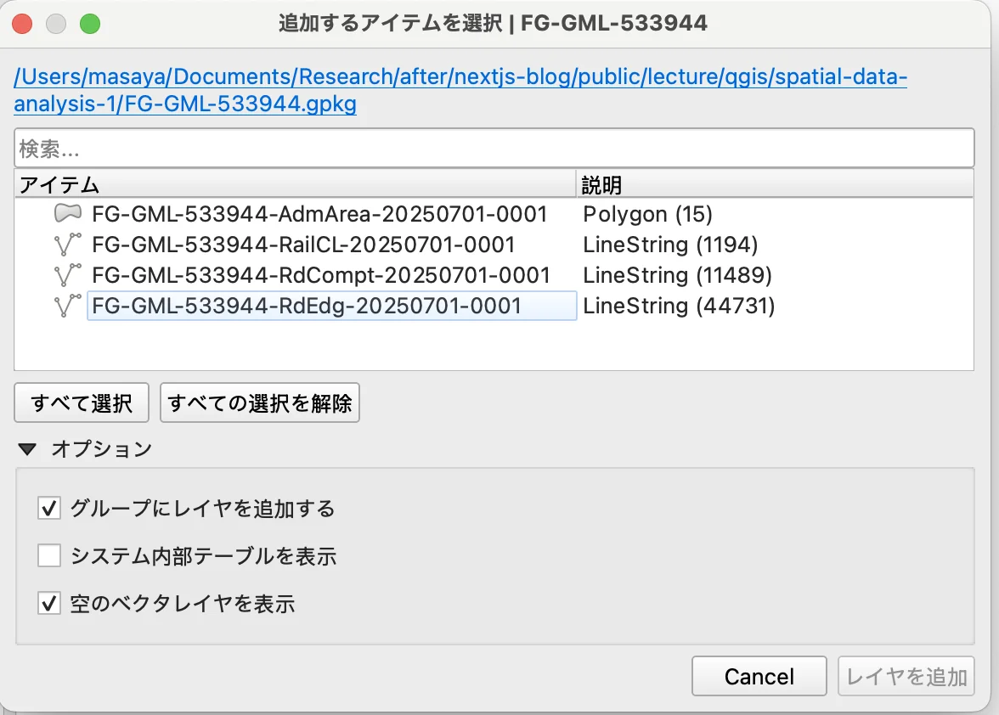

小金井市やその周辺地域の路線、道路が表示されていることを確認しましょう。
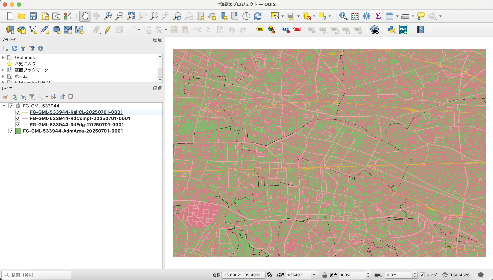

確認できたら、このデータをベクタデータとして保存してみましょう。

- レイヤウィンドウから、「---AdmArea---」を右クリック
- 「エクスポート」ー「新規ファイルに地物を保存」を選択
- 形式は「ESRI Shapefile」、そしてファイル名と保存場所を指定する。
- 最後に「OK」を選択
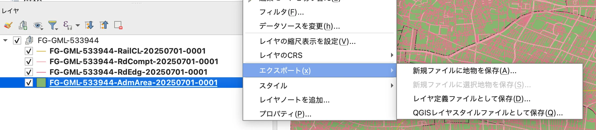

エクスポートしたファイルを見ると、複数のファイルが作成されたことが確認できます。
再度注意ですが、出力したファイルを移動する際は、すべて移動するように気をつけましょう。

## ラスタデータを使った演習 {#raster-data-exe}

次にラスタデータを使った演習を行いましょう。

先程の国土地理院の基盤地図情報には数値標高モデルのデータも存在しています。
次に、[このファイル](../materials/03/FG-GML-533944-DEM5A-20250620.zip)をダウンロードしてください。
今回扱うGML（Geography Markup Language）ファイルもGISでよく用いられるデータです。

さて、このzipファイルをQGISに取り込むのですが、標準のQGISにない機能を使います。
そのため、プラグインをインストールする必要があります。

ツールバーから「プラグイン」ー「プラグインの管理とインストール」を選択
検索バーに「QuickDEM4JP」を入力し、該当のプラグインをインストール
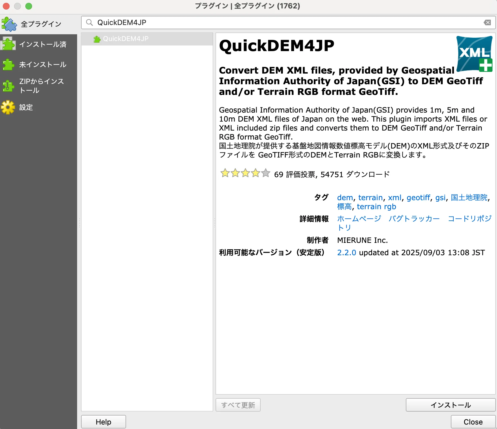

プロジェクト画面に以下のアイコンが表示されたら、インストールは完了です。
もし出ない場合は、QGISの再起動を行いましょう。

上のアイコンをクリックすると以下のウィンドウが表示されます。
ダウンロードしたzipファイルのパスを入力し、実行ボタンをクリックしてください。
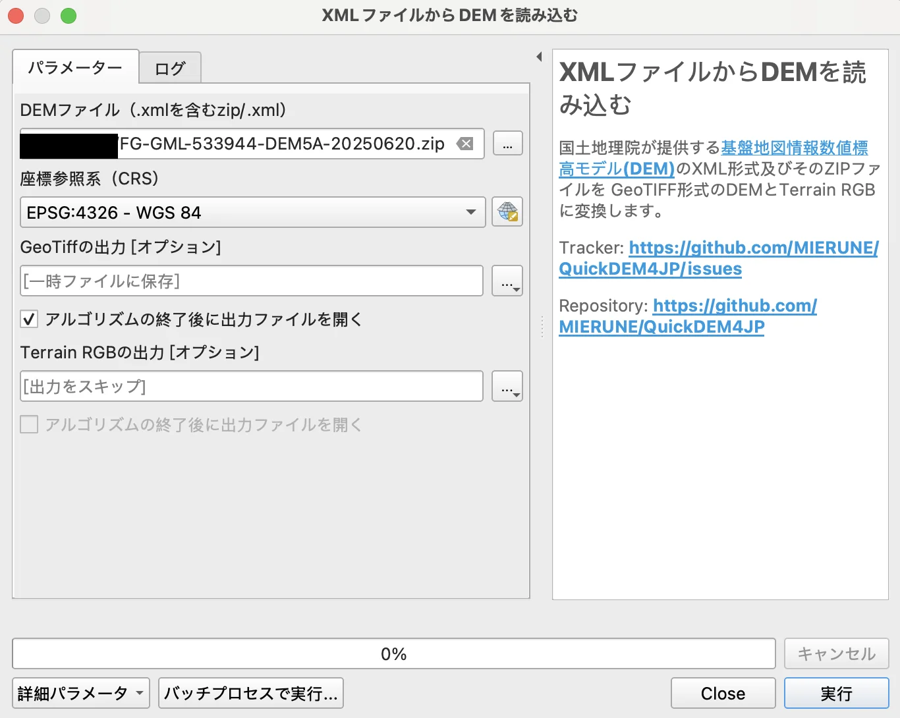

このようなグレースケールの地図が表示されたら完了です。
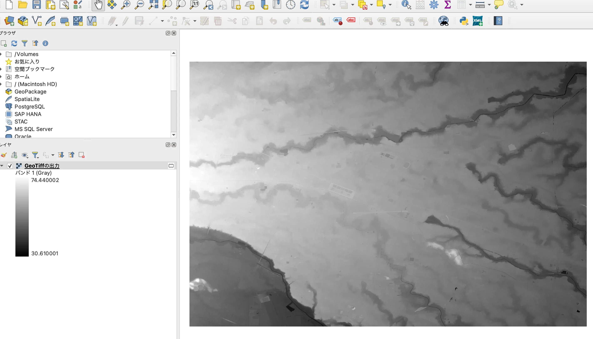

さて、この地図は何を意味しているでしょうか？
左のレイヤウィンドウを見ると、大体見当がつくかと思いますが、
色が白くなるごとに標高が高くなるようなデータとして取り込み、地図として表示したということになります。
少しわかりやすいように、10m高くなるごとに等高線を表示してみましょう。

「GeoTiffの入力」を右クリックし、プロパティを選択する。
シンボロジを選択し、以下のように設定する。
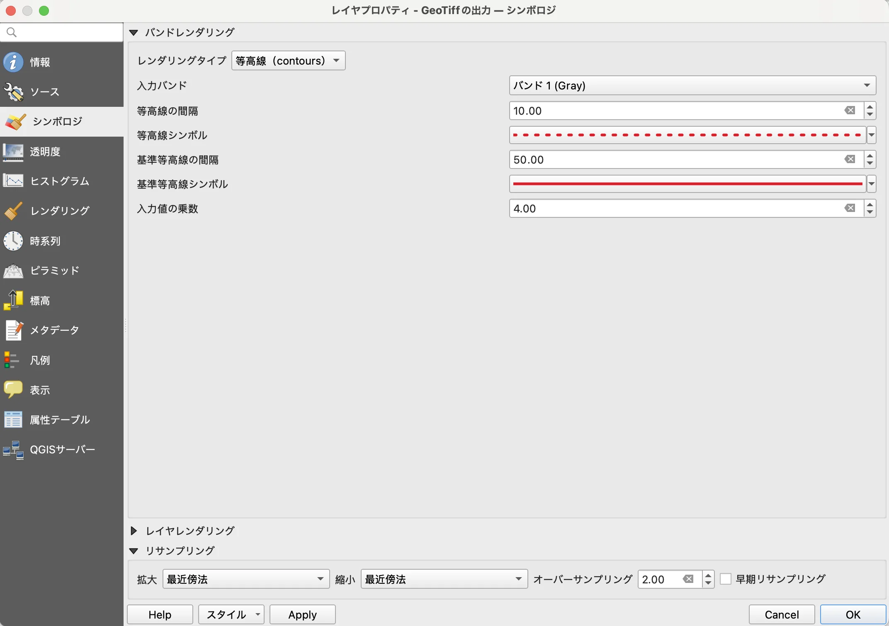

このように変更されれば大丈夫です。
これでこの地域の標高がわかりやすく可視化できましたね！
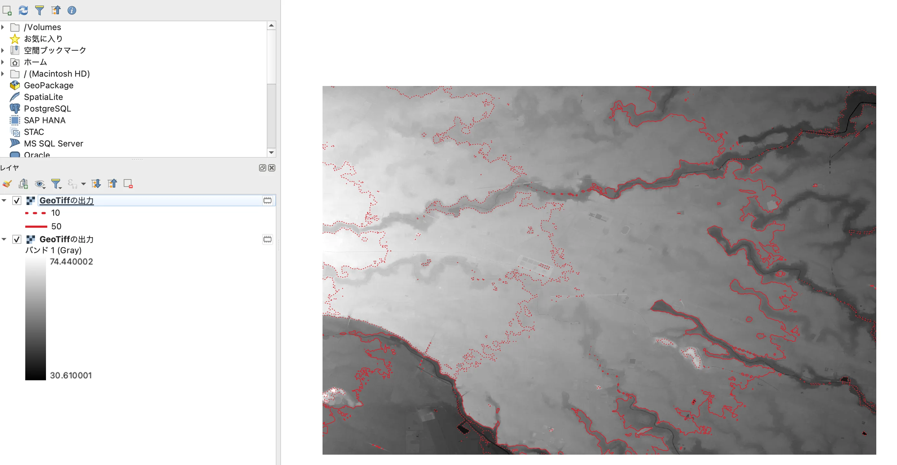
(この図では同じzipファイルを再度レイヤとして加えて最背面に配置しています)

この状態を画像データとして保存してみましょう。

- 表示したいレイヤをすべて表示状態にする
- ツールバーから「プロジェクト」 ー「インポートとエクスポート」 ー「地図を画像にエクスポート」を選択
- 下のようなウィンドウが出ます。そのまま保存したいときは「save」を選択、レイヤ部分だけを保存したいときは、「レイヤ」から該当するレイヤを選択する。
- その後、名前と保存するフォルダを選択し、最後に「保存」する。
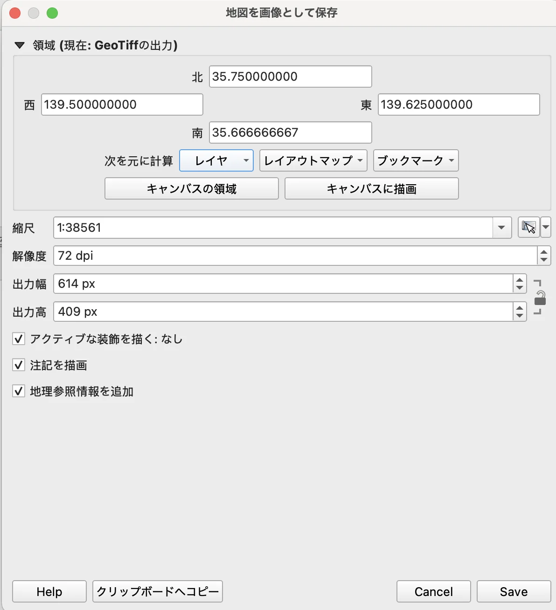

pngファイルは保存できたでしょうか？これでベクタデータとラスタデータの取り込み、取り出しは完璧ですね！

※ラスタデータの分析方法については、第8回の授業で扱います。

## まとめ {#summary}

本ページでは、以下の目的に対応する内容について学習しました。

- GISの基本概念（空間データ、ベクタデータ、ラスタデータ）を理解した  
- 座標参照系（CRS）の概念を理解し、GISで正しく地図を扱うための重要性を学んだ
- QGIS上でベクタデータおよびラスタデータを表示・保存できるようになった  

## 参考資料 {#refs}

- [3Dモデルでみる東京](https://info.tokyo-digitaltwin.metro.tokyo.lg.jp/3dmodel/)
- [東京都オープンデータカタログサイトホームページ](https://portal.data.metro.tokyo.lg.jp/)
- [国土数値情報ダウンロードサイト](https://nlftp.mlit.go.jp/ksj/)
- [QGISのホームページ](https://qgis.org/)
- [GIS実習オープン教材](https://gis-oer.github.io/gitbook/book/)
