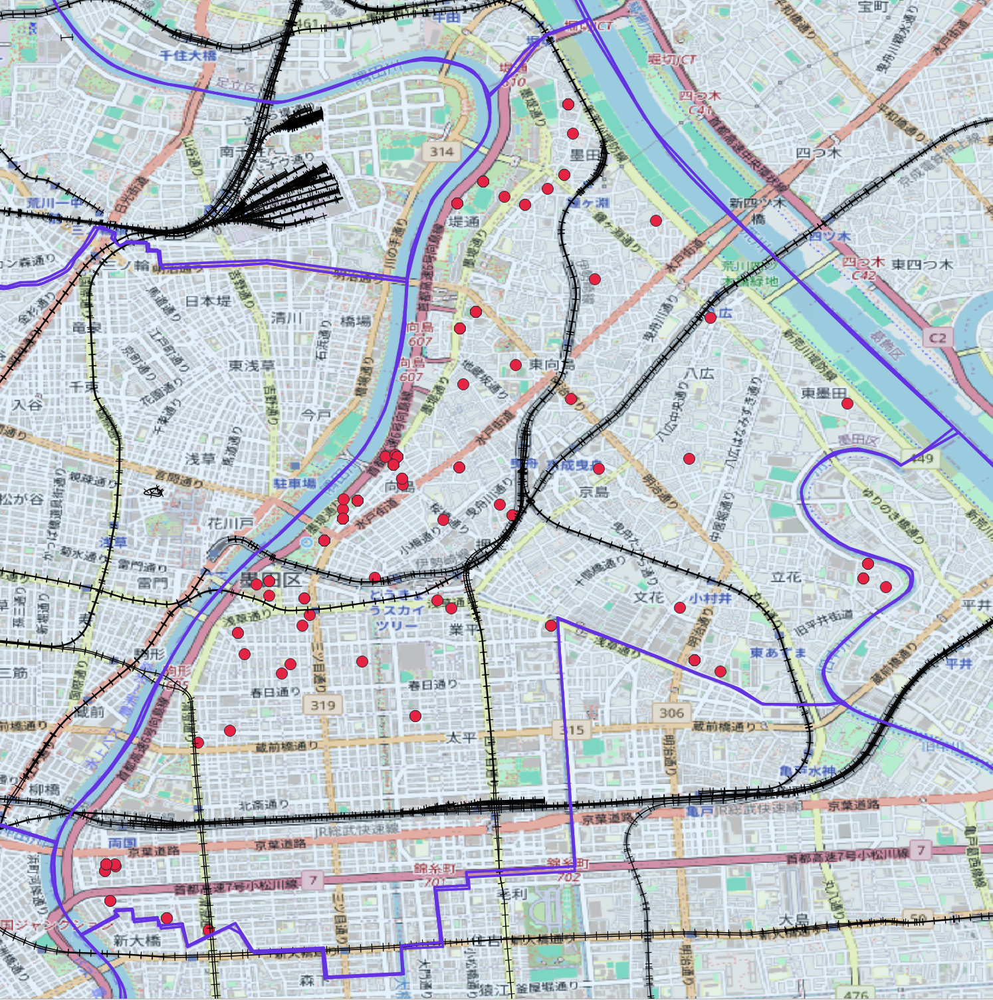
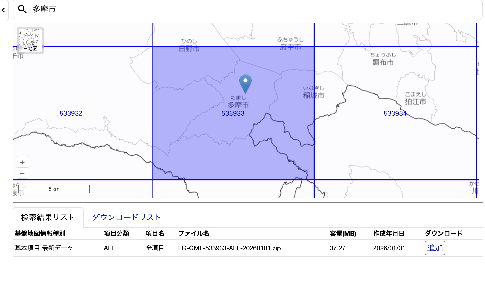
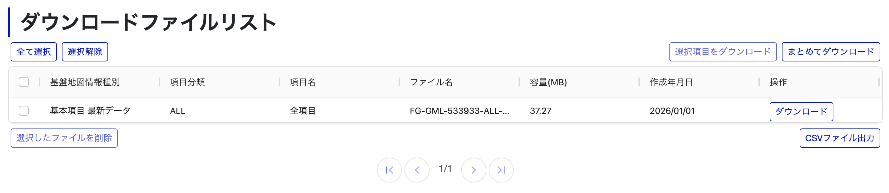

# 第4回 地理空間データ分析

[目次に戻る](../index.md)

## 本ページの目的

これまで学習した内容を踏まえて、地理空間データの分析を行ってみましょう。

## 成果物の目標(例)

今回の成果物の目標を以下に示します。

この図は、~~~で地物を点で表示し、周辺の道路状況や路線を線で表現しました。

皆さんには、これから類似する図を作成していただきます。

## 市区町村の選定

データを手に入れる前に、どの地域を可視化するかを決めます。
どの場所、どのデータでもいいのですが...
評価をつけるにあたって、**東京都の市区町村**に限定し、[東京都オープンデータカタログサイトホームページ](https://portal.data.metro.tokyo.lg.jp/)のデータを活用することにします。

一例として、この後紹介するデータ一覧で登場する市区は以下の通りです。

- 江東区
- 小金井市
- 国分寺市
- 多摩市

この中から選んでも良いですし、これ以外の市区町村でもいいです。
(データの入手の際に制約条件を満たしていればOK)

## オープンデータの入手

### 地物に関するデータ

まず、地物に関するデータを入手しましょう。

データの入手についていくつか制約条件を設けます。

- [東京都オープンデータカタログサイトホームページ](https://portal.data.metro.tokyo.lg.jp/)に存在するデータであること
- 地物データが10個以上含まれていること
- 緯度・経度データが列データに存在すること (列として用意されていてもデータがない場合があります)

上記の条件を満たす例を示します。このデータを活用しても構いません。(*活用する場合は、他の人と被らないように色や線の表示を工夫するようにしましょう)

- [【江東区】観光施設一覧](https://catalog.data.metro.tokyo.lg.jp/dataset/t131083d0000000016)
- [【小金井市】文化財一覧](https://catalog.data.metro.tokyo.lg.jp/dataset/t132101d0000000001)
- [【国分寺市】保育所一覧](https://catalog.data.metro.tokyo.lg.jp/dataset/t132144d3000000002)
- [【多摩市】スポーツ施設一覧](https://catalog.data.metro.tokyo.lg.jp/dataset/t132241d3100000004)

### 基盤地図情報に関するデータ

次に、基盤地図情報に関するデータを入手しましょう。
基盤地図情報のダウンロードにはユーザ登録が必要なため、まだ登録していない人は新規登録しましょう。

基盤地図情報のダウンロードの方法は以下の通りです。

- [基盤地図ダウンロードサービス](https://service.gsi.go.jp/kiban/)にアクセス
- 「基盤地図情報」ー「基本項目」を選択
  - 
- 取得したい市区町村を検索し、該当するメッシュを選択、ダウンロードに「追加」
  - 
  - 「追加」ボタンを押下すると、「削除」という文字に変わります
- 右上のダウンロード等をクリックし、ダウンロードファイルリストから追加したファイルを選択、ダウンロードする
  - 

例に出した多摩市は一つのセルで十分でしたが、他の市区町村では複数のダウンロードが必要な場合があります。判断に困った場合は相談してください。

さて、ダウンロードしたファイルを解凍すると、複数のxmlファイルがあります。
最低一つ選び、QGISに取り込んでください。
前回の講義では、以下のデータを取り込みました。

- AdmArea：行政区画(Administrative Area)
- RailCL：軌道の中心線(Railroad Track Centerline)
- RdCompt：道路構成線(Road Component)
- RdEdg：道路縁(Road Edge)

他にも面白いデータがあれば取り込んでみましょう。
片っ端から入れてみても構いませんし、詳しい情報を知りたい場合は、[基盤地図情報ダウンロードデータファイル仕様書](https://service.gsi.go.jp/kiban/contents/screen/basismap/documents/FGD_DLFileSpecV5.2.pdf)にあります。

## 課題の提出方法

Google Formで提出

提出期限：XX月YY日 23:59まで
