# 第5回 ネットワーク分析

[目次に戻る](../index.md)

## はじめに

ネットワークといっても色々なネットワークがありますが、ここで取り上げるネットワークは交通ネットワークになります。
国土交通省から定義を引用すると、「国民の日常・社会生活の確保、活発な地域間交流、国際的な交流や物流を実現する国土の骨格となる社会基盤」だそうです。
よくわかりませんね。簡単に説明すると、鉄道や道路といった交通手段を活用し、人や物の移動を可能にする網状のシステムだと思ってもらえれば十分です。
一つ例を出しましょう。休日に立川駅から池袋のサンシャインシティに遊びに行こうとしましょう。
皆さんなら、まず何をしますか？集合時間とかを決める感じでしょうか。そうですね、14時に集合する感じにしましょう。
GoogleMapを開き、池袋サンシャインシティに14時に着く想定で経路設定してみましょうか。
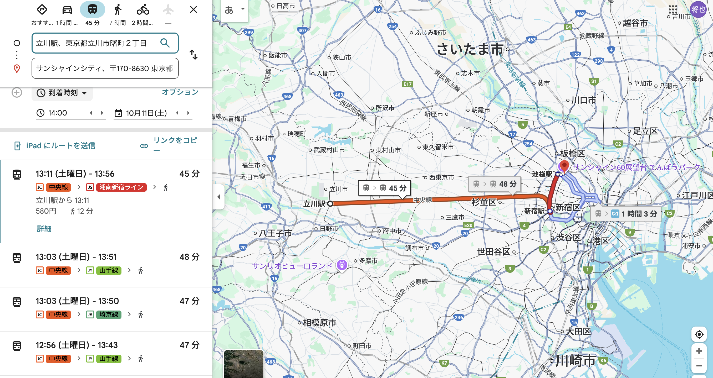

色々な経路が出てきましたね。この場合ですと、新宿で湘南新宿ラインに乗ると所要時間が最も短いことがわかりました。他にも埼京線や山手線も候補として挙げられていますね。
わかりやすいように地図を使いましたが、最近では乗り換え検索アプリの登場によって出発駅と到着駅を入力すると、自動的に乗る電車や運賃が簡単に知ることができるようになりました。
これも一つのGISの応用事例と言って良いでしょう。身近に感じてきましたか？

## 本ページの目的

ここでは以下の事項について学習することを目的とします。

- QGISでネットワーク分析を行う手法を習得する
- 最短経路問題を解くためのダイクストラ法の理解を深める
- 鉄道データを活用して、発車駅から到着駅までの最短経路を可視化できる方法を習得する

## (演習1) QGISでネットワーク分析 ~最短経路探索~

QGIS上でネットワーク分析を行う手法について学習しましょう。
はじめに、[network](https://github.com/gis-oer/datasets/raw/master/network.zip)のデータをダウンロードしてください。
ダウンロードしたデータを解凍し、path.shpとhospital.shpをQGIS上に取り込みます。

取り込んだデータを見ると、街の道路データと病院の位置が表示されていますね。
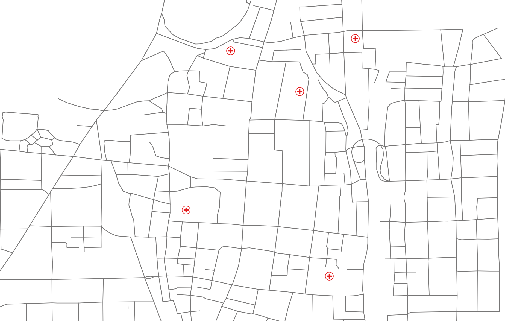
病院間の最短経路を調べてみましょう。

- 上部のリボンバーから「プロセシング」を選択、ツールボックスが表示されます。
- ツールボックス内の「ネットワーク解析」ー「最短経路（指定始点から指定終点）」を選択。

- ネットワークを表すベクタレイヤ内には「Path」を選択。
- 始点、終点に病院周辺を選択する（ちょっとコツが入ります）このような数値が表示されたら次へ
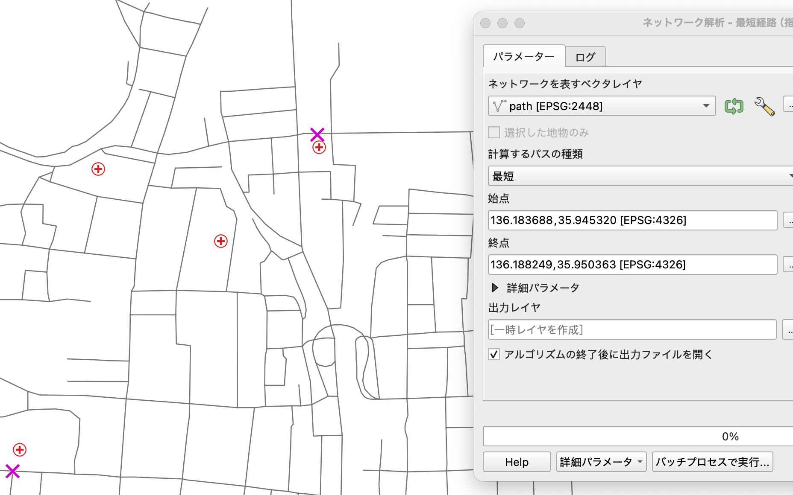
- 「実行」ボタンを押す
- 新しく「出力レイヤ」がレイヤウィンドウに表示されているはずです。このレイヤを最上部に移動し、色や線の太さを変えると見栄えが良いでしょう。
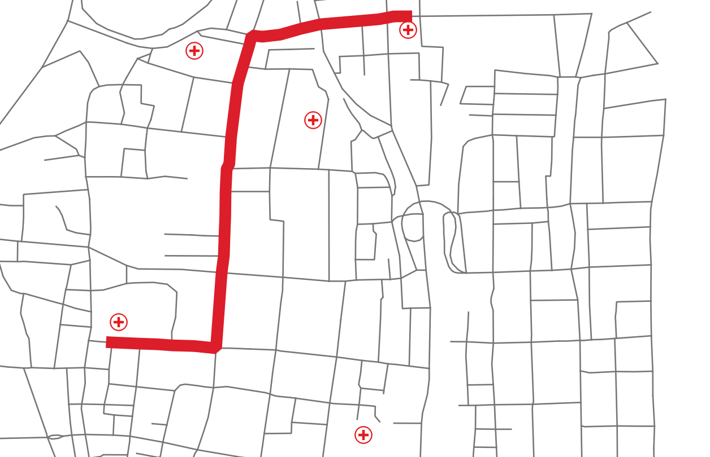

このように複雑な計算をしなくても、QGIS上で自動的に最短経路を可視化することができました。

## 最短経路問題 ダイクストラ法

先程の演習では、始点から終点を指定することで、最短経路を表示することができました。
一般的なナビアプリでも現在位置から目的地までの最短経路を計算し、ユーザに表示する機能が標準で搭載されていますね。
なぜこのような経路を簡単に求めることができるのでしょうか？
ここでは、最短経路問題を求める基本的なアルゴリズム、ダイクストラ法について学びましょう。

ダイクストラ法は、 重み付きグラフにおいて、ある始点からある終点までの最短経路を求めることができます。
ここでいう重み付きグラフとは、下図のようなノード(点)とエッジ(辺)からなり、エッジに情報が付与されたネットワークのことを言います。
鉄道データを用いると、ノードは駅、エッジは線路、付与されたエッジ情報は所要時間でしょうか。
よく電車に乗っていると駅間ごとの所要時間が表示されていますよね。その情報のことです。

そろそろアルゴリズムが知りたくなってきましたね。
具体的な手順は以下の通りです。

1. 始点から到達可能な頂点の距離を初期化し、始点の距離を0、その他の頂点の距離を無限大に設定する。
1. 最短距離が確定していない頂点の中から、距離が最も短い頂点を選択する。
1. 選択した頂点を経由して到達可能な頂点の距離を更新する。更新後の距離が、現在の距離より短い場合、距離を更新する。
1. すべての頂点の最短距離が確定するまで、手順2と3を繰り返す。

🤔🤔🤔
よくわかりませんね。こういう時は実際の例を使って考えてみましょう。
こういうネットワークを作りました。
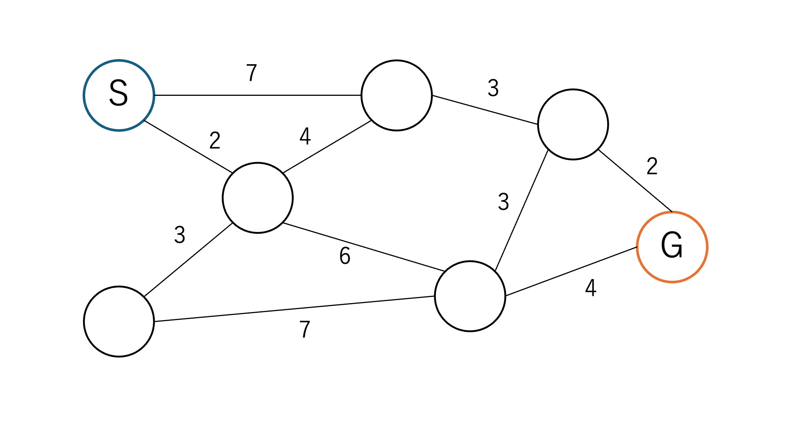

このネットワークには、始点(S)と終点(G)があります。
また、それぞれの線上には所要時間を表す数値を記載しています。
このとき、始点から終点までの最短時間となる経路を求めたいと思います。
アルゴリズムでは距離で表していますが、現実問題では所要時間の方が感覚が掴みやすいと思います。
ここでは距離という言葉を用いますが...。
また条件として、同じ道を2度通らないこととします。

はじめのステップ1ですね。これは簡単です。
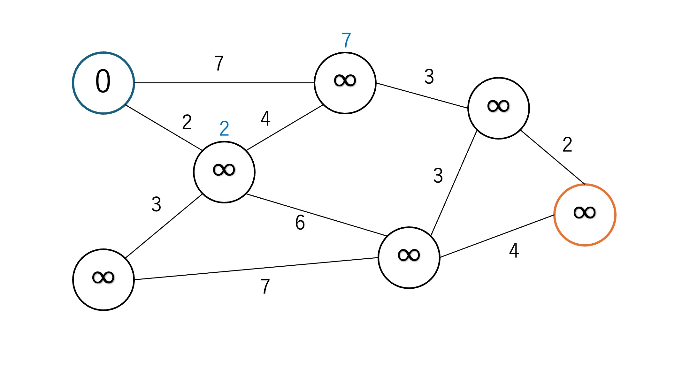
無限大は、どの数値よりも大きな数という意味です。実際にプログラムを作成する際は、無限大という値を10000のような大きな値で初期化することが多いです。

次はステップ2ですね。始点から到達可能な頂点の距離(青色で書かれた2と7ですね)のうち、距離が2を選択します。
ちなみに青色で書かれた数値は、その地点について現在の調べた中で最短の距離という意味です。この数値はより最短な経路が見つかると値が小さくなります。
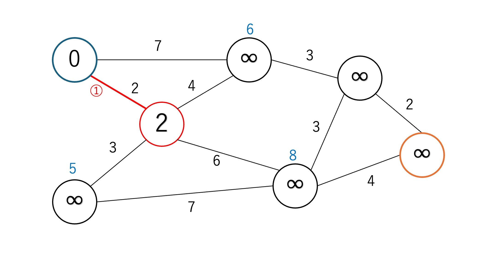

ステップ3では、選択した距離2の地点から到達可能な頂点の距離を更新します。
この時、始点から7の距離にあった地点が6に更新されていますね。つまり、選択された場所を経由した方が始点から直接行くより距離が近いことがわかりました。

この作業を全ての地点の最短距離がわかるまで繰り返していきます。
ステップ2の作業では、現在わかっている青色で書かれている最も小さい数値を選択します。
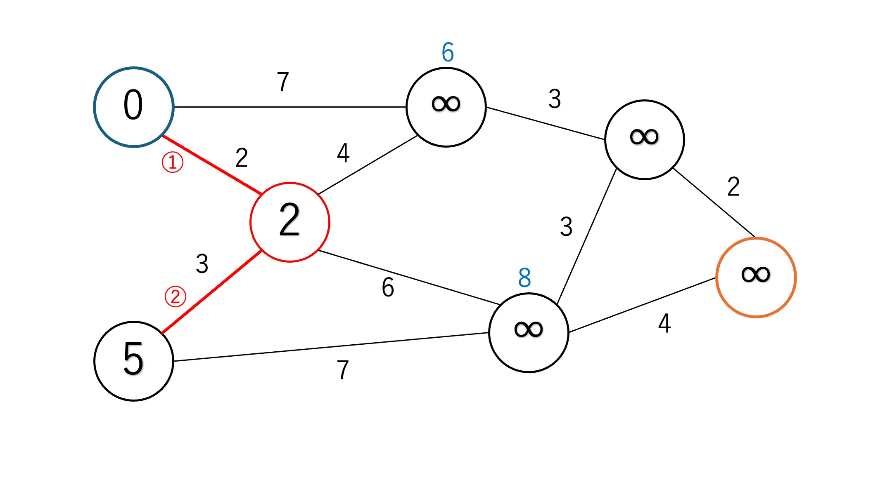このときは5ですね。
そして、ステップ3に進むのですが、今選ばれた地点から繋がっていて、かつ距離が更新される箇所はないみたいですね。
こんな感じで更新がないこともあります。
残りは皆さんでやってみましょう。

この作業を進めていくと最終的にはこのような図になります。丸で囲まれた数字は選択された経路の順番を示しています。
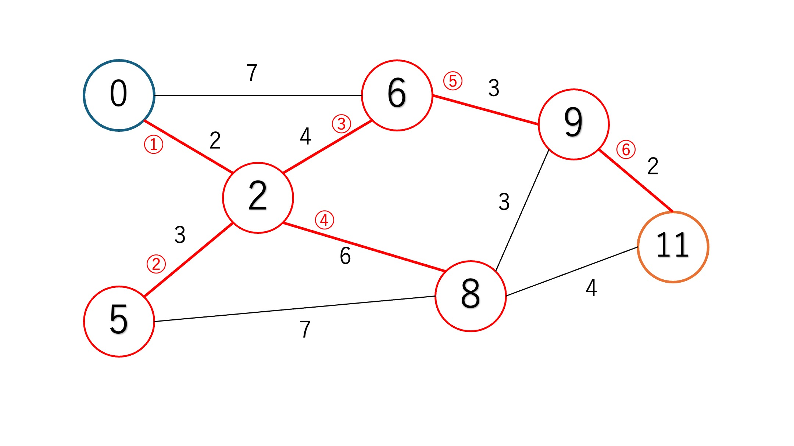

## (閑話休題) 最短経路問題と動的計画法

これで皆さんも最短経路問題を解くことができるようになりましたね！
実際の地図アプリでは、所要時間のほかに最短距離や料金といった様々な値を使って複数の経路を提案します。
このとき、駅間の所要時間だけでなく、乗り換えの時間も考慮されることがあります。特に新宿のような大きなターミナル駅では、乗り換えに時間がかかることもありますよね。

さて、最短経路問題を解くアルゴリズムとして有名な「ダイクストラ法」ですが、これが優れている点のひとつに、「すべての経路の組み合わせを調べる必要がない」という特徴があります。
どういうことかというと、途中の青い数値を更新する作業（ステップ3）がありましたよね？
この作業によって、すでに遠回りになるような経路をわざわざ調べる必要がなくなります。
つまり、ある地点にたどり着く最短距離がすでにわかっているなら、「それ以外の手段でその地点にたどり着く経路なんて、調べる必要がない」ということです。
このようにして、無駄な組み合わせを減らしているのです。

この考え方、実は「動的計画法（Dynamic Programming）」を活用しています。
アルゴリズムに興味がある方や、競技プログラミングをしたことがある方なら、「0-1ナップザック問題」と聞けばピンとくるかもしれません。
動的計画法とは、対象となる問題を複数の部分問題に分割し、それぞれの部分問題の解を記録（メモ化）しながら、全体の問題を効率よく解いていく手法です。
ダイクストラ法も、各地点までの最短距離を一つずつ確定させながら、その情報を使って次の地点の距離を更新していきます。
これはまさに「部分問題の解を使って、より大きな問題の解を構築する」という動的計画法の考え方そのものです。
例えば、0-1ナップザック問題では「限られた容量の中で価値を最大化する」ために、各選択肢の組み合わせを部分的に評価していきます。
最短経路問題も同様に、「ある地点までの最短距離」を評価しながら、次の選択肢を絞り込んでいく点で、その考え方を活用しています。
このように、最短経路問題は「全探索」ではなく「部分的な最適解の積み重ね」で解ける問題であり、動的計画法の考え方がしっかりと活かされています。
アルゴリズムの世界では、こうした「考え方の共通点」を見つけることが、理解を深める大きな助けになります。

## (演習2) 鉄道データを活用して、発車駅から到着駅までの最短経路を可視化

ここでは東小金井から熱海までJRを使った場合の最短経路を可視化してみましょう。
このような経路を可視化することが目標です。
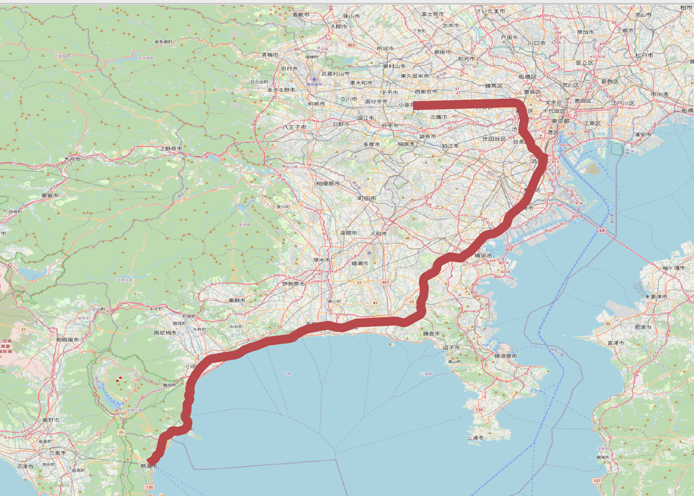

はじめに国土交通省から国土数値情報にある最新の[鉄道データ](https://nlftp.mlit.go.jp/ksj/gml/datalist/KsjTmplt-N02-2023.html)をダウンロードしてください。
ダウンロードしたらファイルを解凍し、N02-XXX_Station.shpとN02-XXX_RailroadSection.shpをQGISに取り込んでください。
こんな感じでデータを表示しましょう。線やマーカーの色形は指定しません。お好みで。
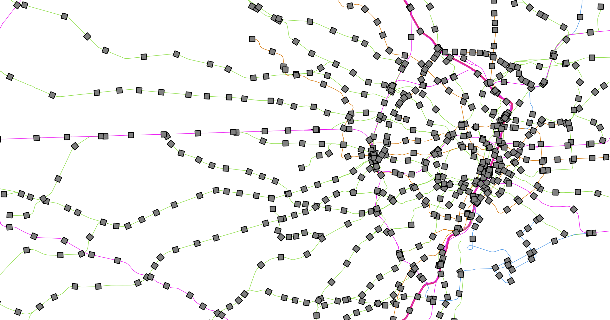
ただし、鉄道に関しては「新幹線」、「JR在来線」、「公営鉄道(東京メトロなど)」、「民営鉄道(京王線など)」、「第三セクター(多摩モノレール)」の5つに分けられているようです。
新幹線だけ線の太さを変えると見栄えが良いでしょう。

一番下のレイヤにOpenStreetMapを挿入するといい感じに表示されます。
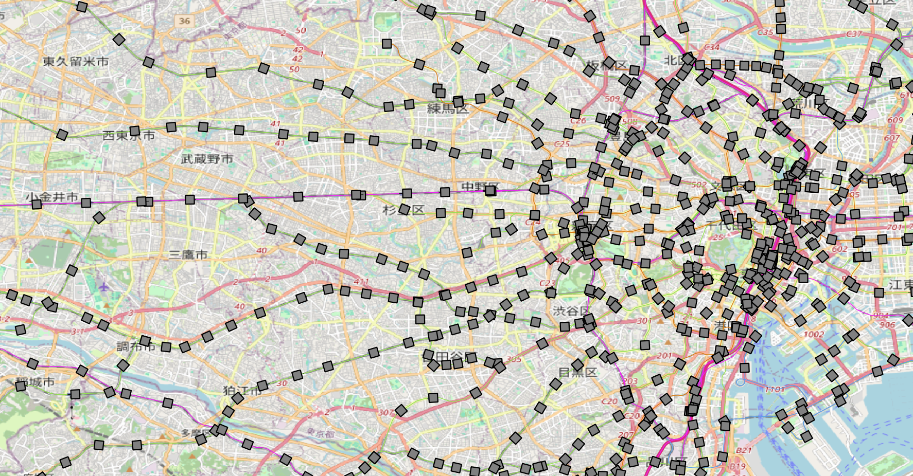

ここから本題です。JRを使って東小金井から熱海までの最短経路を可視化しましょう。

- 上部のリボンバーから「プロセシング」を選択、ツールボックスが表示されます。
- ツールボックス内の「ネットワーク解析」ー「最短経路（指定始点から指定終点）」を選択。

- ネットワークを表すベクタレイヤ内には「N02-XXX_RailroadSection」を選択。
- 始点に東小金井駅を選択する（ちょっとコツが入ります）（139.523813,35.701568 [EPSG:4326]）このような数値が表示されたら次へ
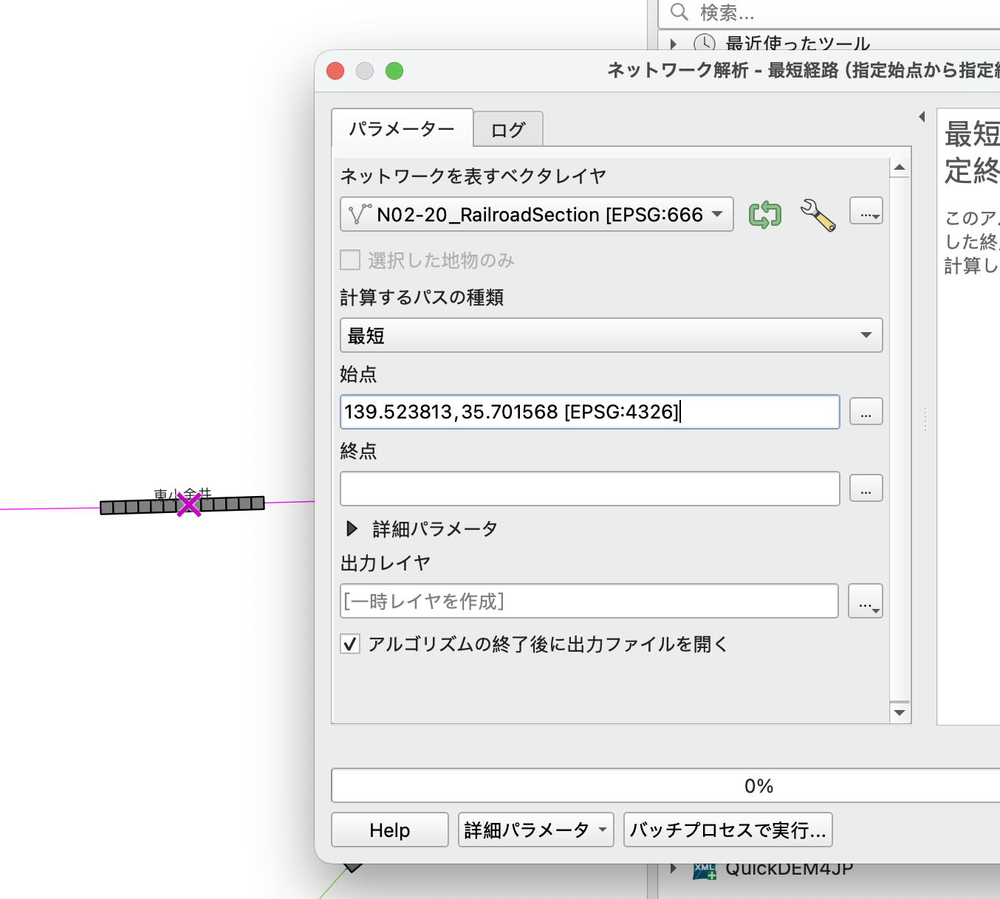
- 終点に熱海駅を選択する（このときは、在来線の線路（細い方）を選択すること）
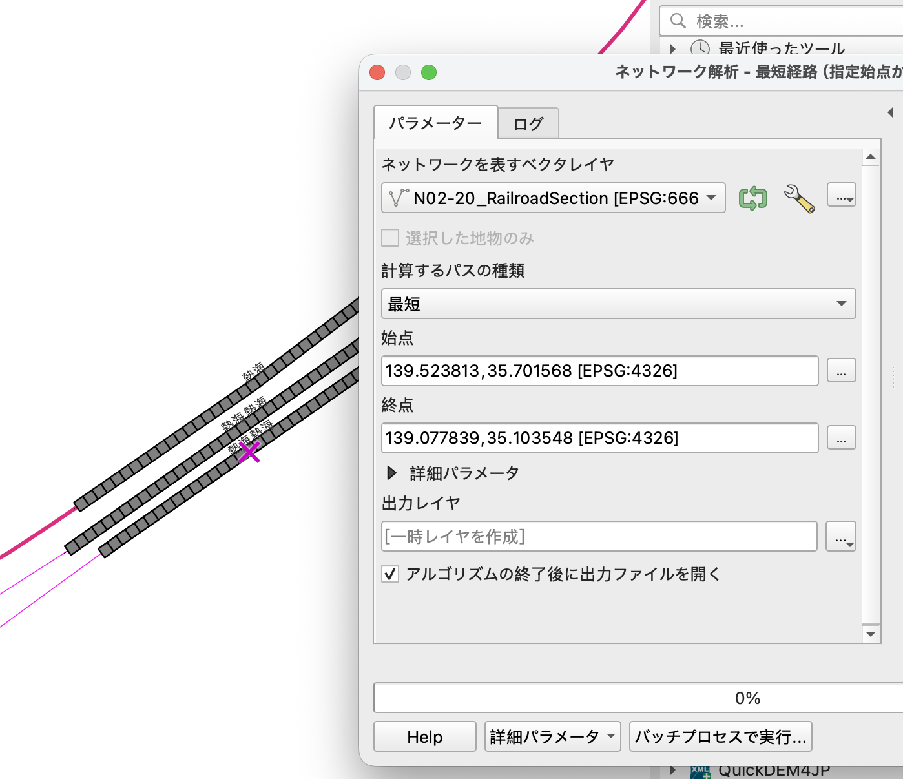
- 「実行」ボタンを押す (計算に少々時間がかかります)
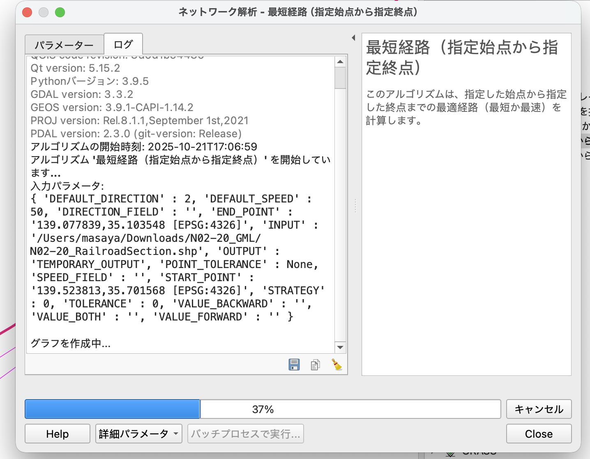
- 新しく「出力レイヤ」がレイヤウィンドウに表示されているはずです。このレイヤを最上部に移動し、色や線の太さを変えると見栄えが良いでしょう。

出力された経路を確認すると、中央線で新宿、山手線で品川、そして東海道を経由していることが分かりました。

## まとめ

本ページでは、以下の事項について学習しました

- QGISでネットワーク分析を行う手法を習得する
- 最短経路問題をQGISを活用して探索できるようになる
- ダイクストラ法を説明できるようになる。
- 鉄道データを活用して、発車駅から到着駅までの最短経路を可視化できる方法を習得する

## 参考文献

本教材は、以下の資料をもとに作成しました。

- [GIS実習オープン教材](https://gis-oer.github.io/gitbook/book/)
- [国土数値情報 鉄道データ](https://nlftp.mlit.go.jp/ksj/gml/datalist/KsjTmplt-N02-2023.html)å

この教材は、[クリエイティブ・コモンズ 表示 - 継承 4.0 国際 ライセンス](http://creativecommons.org/licenses/by-nc-sa/4.0/)で提供されます。

