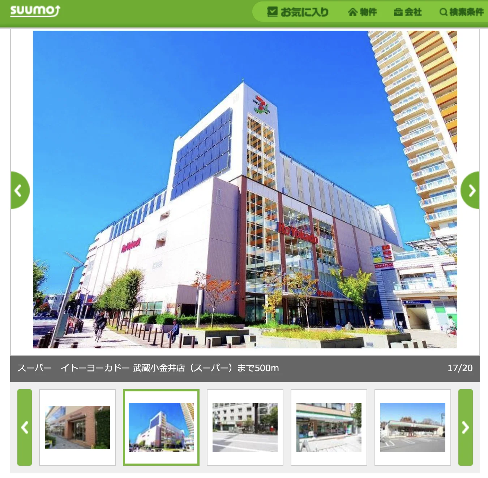
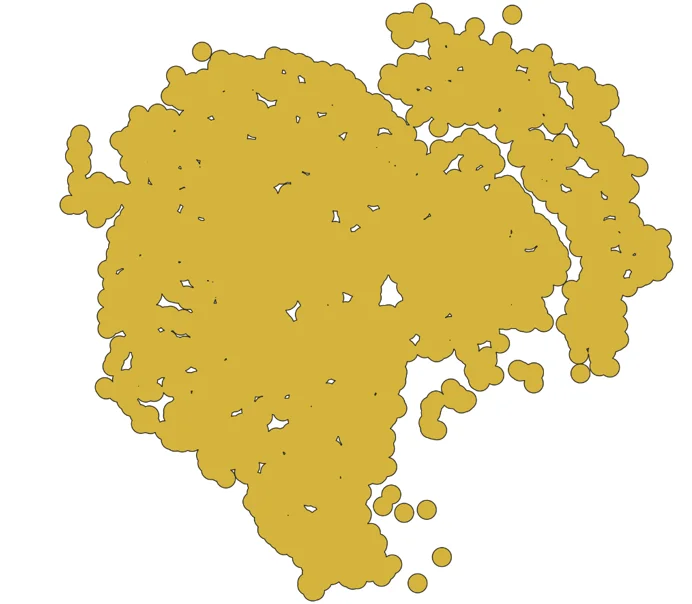
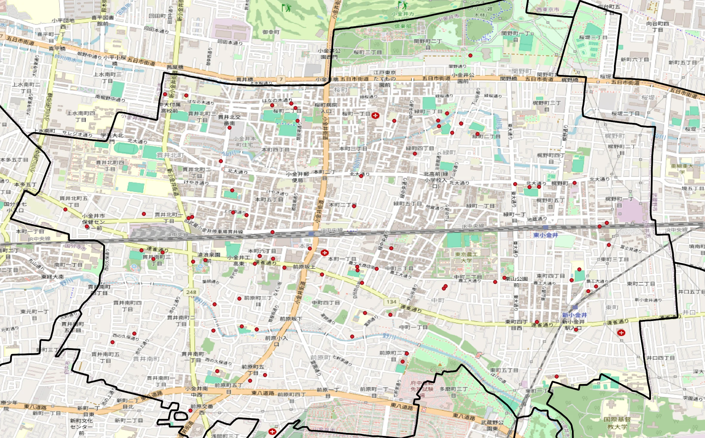
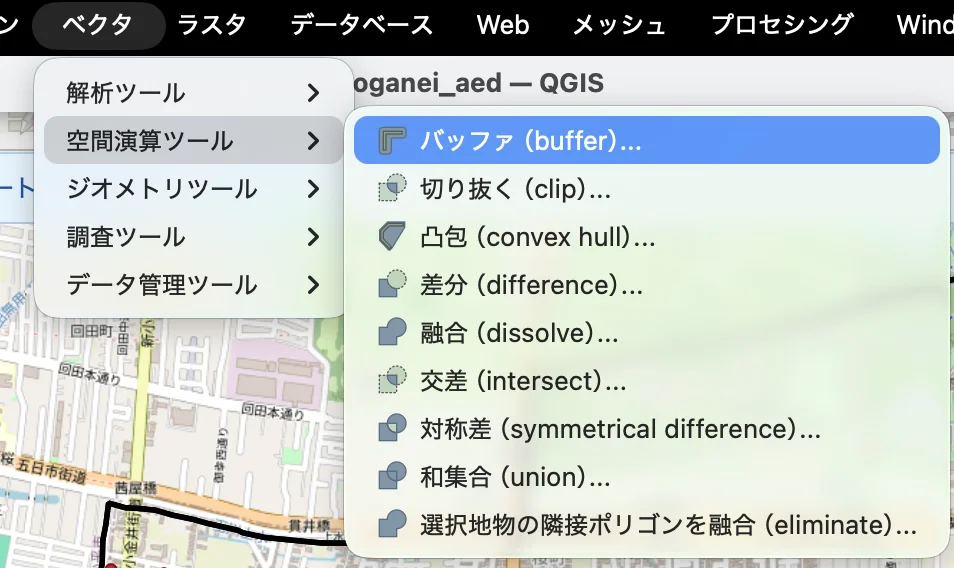
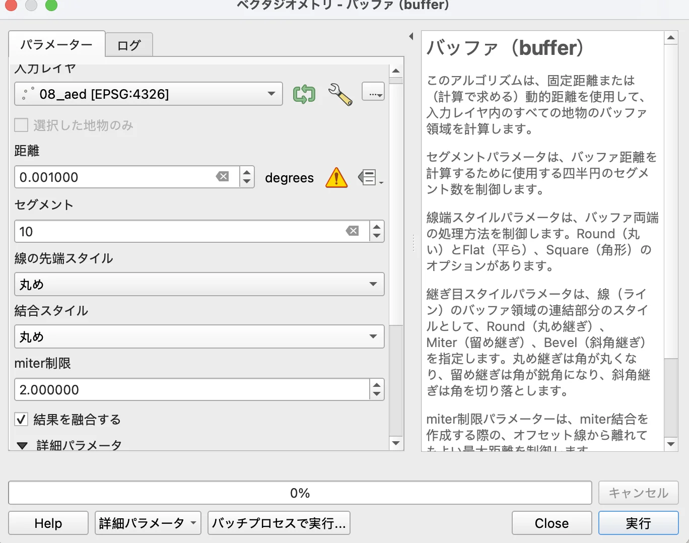
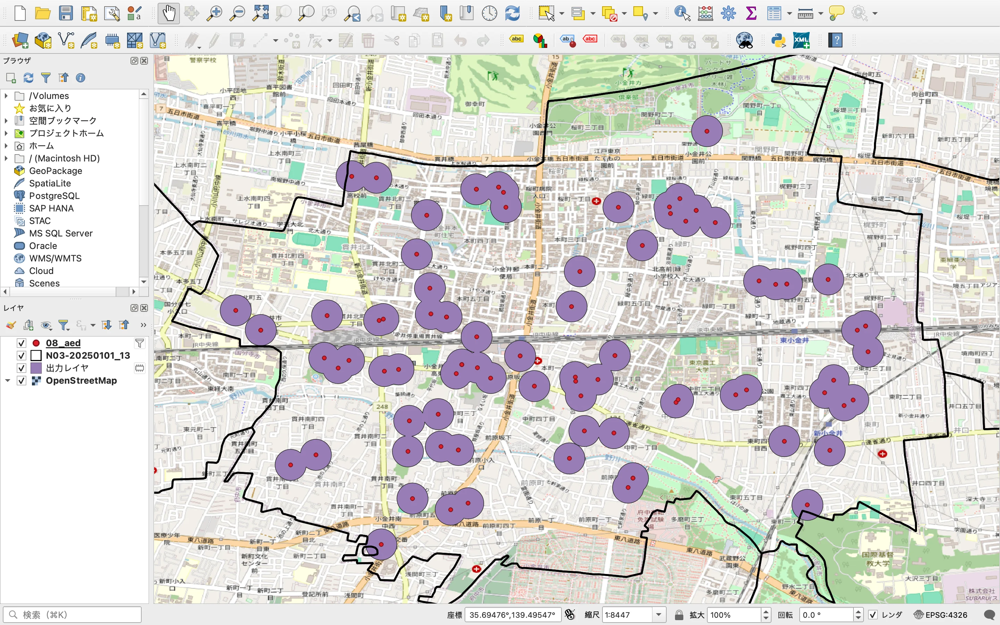
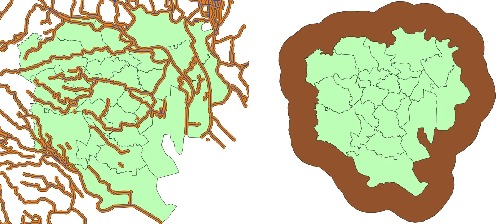
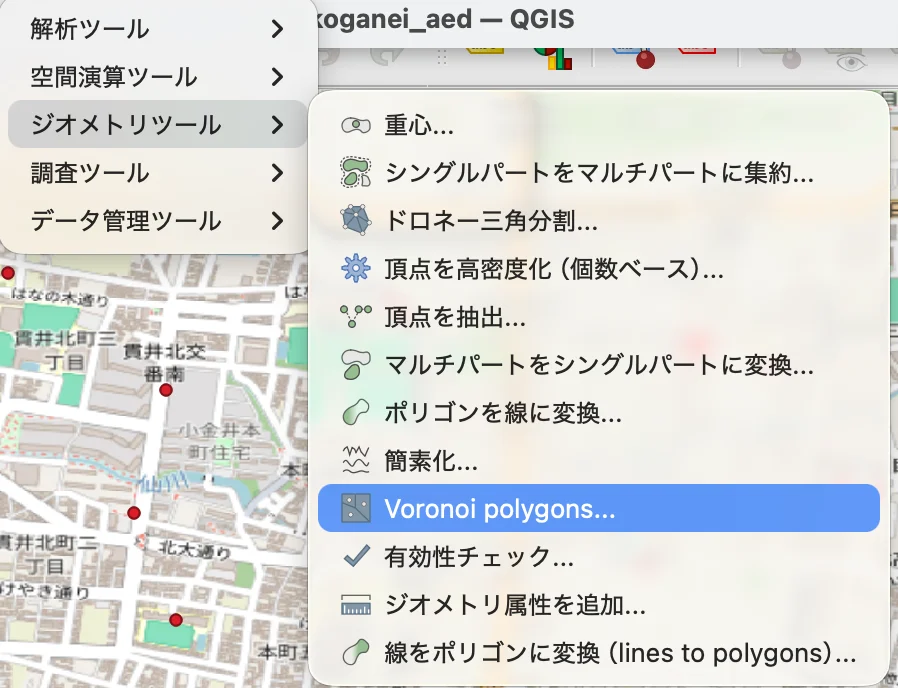
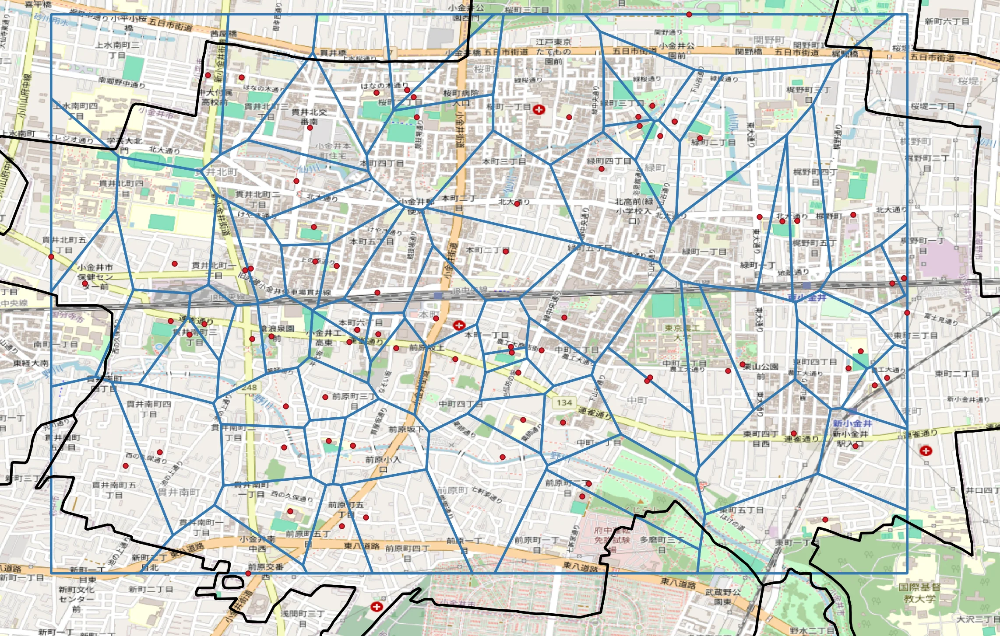
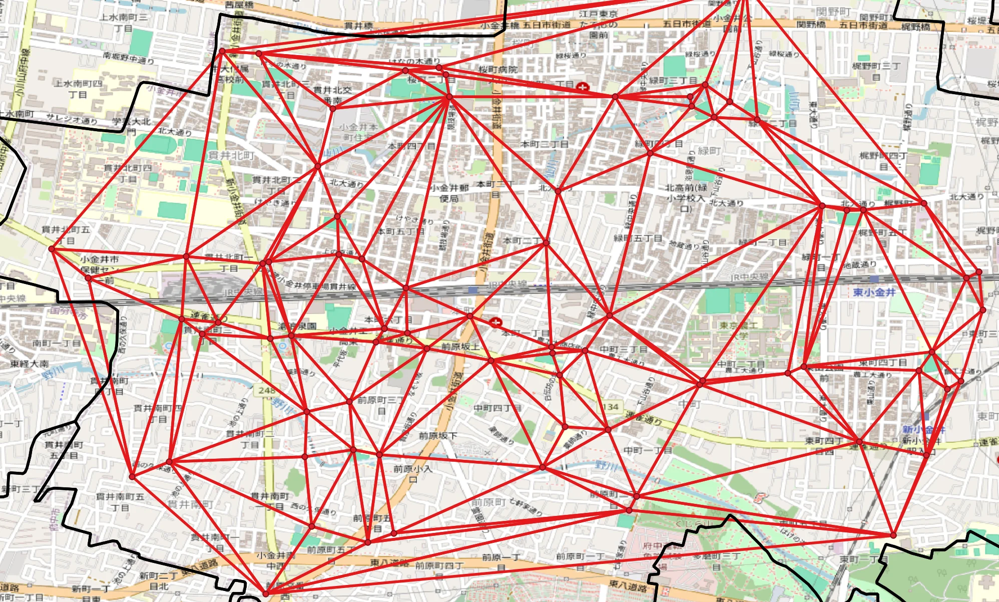

# 第6回 領域分析

[目次に戻る](../index.md)

## はじめに

大学生になって、一人暮らしを始めた学生はいることでしょう。
実家から通っている学生も、社会人やライフステージの変化で実家を離れるかもしれませんね。
そうなってくると、一般的には？不動産会社に行って家を借りるわけになるのですが、
家賃はもちろんのこと、周辺のコンビニやスーパーも重要になってきますね。私は自炊をする人間なのですごく気にします。
(もちろん価値観の差がありますが)
例えば大手の賃貸サイトをみると、検討している家の周辺には何があるのかを写真付きで紹介しています。
この場合ですと、検討している賃貸の500m付近に大型ショッピングセンターがありますね。
とても便利な立地にあることが分かります。

出典：SUUMO<https://suumo.jp>

このように、ある地点や領域を中心として、
どのような施設や性質を有しているかを分析することを**領域分析（Area Analysis）**といいます。
地理情報システム（GIS）などを用いて、施設の分布やアクセス性、利便性などを定量的に評価することができます。

このページでは、さまざまな手法を学習していきます。
実際の地図データを使って、身近な地域の分析にも挑戦してみましょう！

## 本ページの目的

ここでは以下の事項について学習することを目的とします。

- バッファ（点・線・面）分析について理解を深める
- 演習を通じて、点バッファの分析手法について学習する
- ボロノイ分析について理解を深める
- ドローネ三角形の作成手法について説明できる

## バッファ分析とは

領域分析の中でも、特定の地点や施設の周囲にどのようなものが存在するかを調べる際に用いられるのが「バッファ分析」です。
QGISでは、点・線・面それぞれに対してバッファを作成することができます。

どんな感じに分析するかという事例として23区内にある東京都のコンビニデータを利用し、コンビニから500mのバッファを算出しました。

さすが23区、ほとんどの地点において周囲500mにコンビニが存在するという結果を得ることができました。
個人的な感想として、「じゃあ逆にこのエリアに該当しない場所ってなんだ？」って興味が湧きますよね。
例えば、中央に空いた穴はおそらく**皇居周辺**でしょう。あとは荒川もはっきり見えますね。
お台場や羽田周辺も少し空いている感じがしますね。こんな感じで可視化すると色々なことが見えてきます。

### (演習)点バッファ

この演習では、小金井市内に設置されているAED（自動体外式除細動器）の位置情報をもとに、
それぞれのAEDから一定距離（例：100m）のバッファを作成し、周辺地域がその範囲内に含まれているかを調査します。
AEDは緊急時に命を救う重要な機器です。公共施設の利用者が迅速にアクセスできるよう、適切な配置が求められます。
この分析を通じて、AEDの設置状況が市内の公共施設を網羅しているかを可視化・評価してみましょう。

ここでは、第2回で使用したデータを活用します。こんな図でした

まずは、バッファツールを起動します
メニューから [ベクタ] → [空間演算ツール] → [バッファ(buffer)] を選択。

表示されたウィンドウ画面に以下の項目を入力します。

- 入力レイヤ：AEDの点レイヤを選択。
- 距離：0.001 度（約100m）を指定。
- 線の端点スタイル：丸め（Round）。
- 結合スタイル：丸め（Round）。
- 結果を融合する：チェックを入れる

「実行」をクリックすると、AEDごとにバッファポリゴンが作成されます。
地図上に、AEDを中心とした円形のバッファが表示されます。
下図のように、AEDの周囲に紫色の円が描画されていれば成功です。

もし、道端で急病人を見かけた場合は、このデータを活用することができそうですね！
(公共施設のデータなので大学施設などは入っていません。そのような抜けはあります)

### 線バッファ・面バッファ

演習では、点バッファの可視化に挑戦しましたが、バッファ分析には線バッファや面バッファもあります。
これらは、道路や河川などの線データ、行政区域などの面データを対象に、一定距離の範囲をポリゴンとして作成する手法です。

事例を見てみましょう。

左図：23区内の区域に河川データを追加し、河川から一定距離（例：500m）の範囲をバッファとして可視化したものです。
これは、河川沿いのエリアを強調することで、洪水リスクや水辺の利用可能性を分析できます。

右図：23区の外周に対して面バッファを作成した例です。
これは、区境界から一定距離の範囲を抽出することで、都市境界付近の施設分布やアクセス性を評価できます。

点バッファとの違いを説明すると、

- 点バッファ：1次元の位置情報（点）を中心に円形の範囲を作成。
- 線バッファ：線状のオブジェクト（道路・河川・鉄道）を中心に、両側に帯状の範囲を作成。
- 面バッファ：ポリゴン（行政区域など）の外周に沿って、外側または内側に一定距離の範囲を作成。

点は「半径」で範囲を定義しますが、線や面は「外周に沿った距離」で範囲を定義します。
線バッファは道路沿いの騒音影響や河川沿いの浸水リスク評価に使われます。
面バッファは都市境界付近の施設分布やサービス圏分析に使われます。

## ボロノイ分析

ボロノイ分析は、複数の地点データに基づいて、最近隣の勢力圏を求める手法です。
各地点に対して「その地点が最も近い領域」を割り当てることで、地図上をポリゴンに分割します。
この分割図をボロノイ図と呼びます。

### (演習)ボロノイ分析

以下では、先ほどのAEDのデータを用いて、ボロノイ分析を行う手法について演習しましょう。

1. メニューから [ベクタ] → [ジオメトリツール] → [Voronoi polygons] を選択

2. 入力レイヤに AED の点レイヤを指定
3. 出力形式を選択（例：一時レイヤ）
4. 実行して結果を確認

下図のように、AEDを中心としたボロノイポリゴンが表示されれば成功です。

この図の見方について説明します。
各ポリゴンは「そのAEDが最も近い範囲」を示します。
空白地帯や広いポリゴンは、AEDが少ないエリアを意味します。

このデータを使ってどのようなことがわかるでしょうか？
例えばこんな感じです。AEDの勢力圏の広さに差があるのはなぜでしょう？また、空白地帯（AEDが遠いエリア）はどこでしょうか？
考察すると面白いかもしれませんね。
補足として、ボロノイ図は距離ベースの分割なので、道路や障害物は考慮されません。実際の道路状況によって異なります。

## ドローネ三角形の活用方法

最後に、ドローネ三角形について解説します。

**ドローネ三角形分割（Delaunay Triangulation）**は、複数の点を結んで三角形のネットワークを作成する手法です。
特徴として、どの三角形の外接円にも他の点が含まれないように分割されます。
この性質により、三角形の形ができるだけ均等になり、ネットワーク解析や地形モデリングに適しています。

これまでデータとして活用していたaed設置データを適応すると、このような結果を得ることができます。

この図は、AED間の近接関係を表します。

このデータはこのような見方をすると良いです。

- 三角形の辺は、「AED同士が比較的近い」ことを示し、隣接関係の基盤として利用できます。
- 三角形の大きさが大きいエリアは、AEDが少ないといった、「空間的な疎密を視覚化」できます。

先ほどのボロノイ分析とは正反対の性質じゃないか...と思った方、大正解です
両者は以下のような関係を持ちます。

- ドローネ三角形とボロノイ図は双対関係にある
- ボロノイ図の境界線は、ドローネ三角形の辺の垂直二等分線で構成される
- ボロノイは「勢力圏」、ドローネは「接続関係」を示すという違いがある

活用のポイント

- AEDの配置最適化（疎なエリアを特定）
- 災害時のネットワーク構築（最短経路の基盤）
- 地形解析や施設間距離の評価

このように、領域分析にはさまざまな手法があります。
目的に応じて適切な手法を選択し、空間データ分析に活用していきましょう。

## まとめ

- バッファ分析
点・線・面を対象に、一定距離の範囲を可視化する方法を理解しました。
→ 施設の周辺環境やサービス圏の評価に活用できます。

- ボロノイ分析
複数の地点に基づき、最近隣の勢力圏を求める方法を学びました。
→ 商圏分析や施設配置の評価に有効です。

- ドローネ三角形分割
点を結んで三角形ネットワークを作成し、接続関係を把握する方法を学びました。
→ ネットワーク解析や空間的な疎密の評価に活用できます。

表にするとこのようになります

| 手法     | 主な目的       | 可視化の特徴             |
|----------|----------------|--------------------------|
| バッファ | 周辺範囲の評価 | 円形または帯状の領域     |
| ボロノイ | 勢力圏の分割   | 最近隣でポリゴン分割     |
| ドローネ | 接続関係の把握 | 三角形ネットワーク       |

## 参考文献

本教材は、以下の資料をもとに作成しました。

- [GIS実習オープン教材](https://gis-oer.github.io/gitbook/book/)
- [東京都オープンデータカタログサイトホームページ](https://portal.data.metro.tokyo.lg.jp/)

この教材は、[クリエイティブ・コモンズ 表示 - 継承 4.0 国際 ライセンス](http://creativecommons.org/licenses/by-nc-sa/4.0/)で提供されます。

