# 第7回 点データの分析

[目次に戻る](../index.md)

## この講義の目次

{: .card .card-toc }

- [第7回 点データの分析](#第7回-点データの分析)
  - [この講義の目次](#この講義の目次)
  - [はじめに](#はじめに)
  - [本ページの目的](#本ページの目的)
  - [メッシュによる点密度の表示](#メッシュによる点密度の表示)
  - [(演習)行政区域による点密度の表示](#演習行政区域による点密度の表示)
  - [カーネル密度推計](#カーネル密度推計)
  - [まとめ](#まとめ)
  - [参考文献](#参考文献)

## はじめに

これまでに紹介してきた分析を通して、地理空間データの可視化ができるようになりました。
しかし、可視化した図を相手に紹介したところで、納得がいく説明をすることは難しいです。
具体的な例を紹介しましょう。
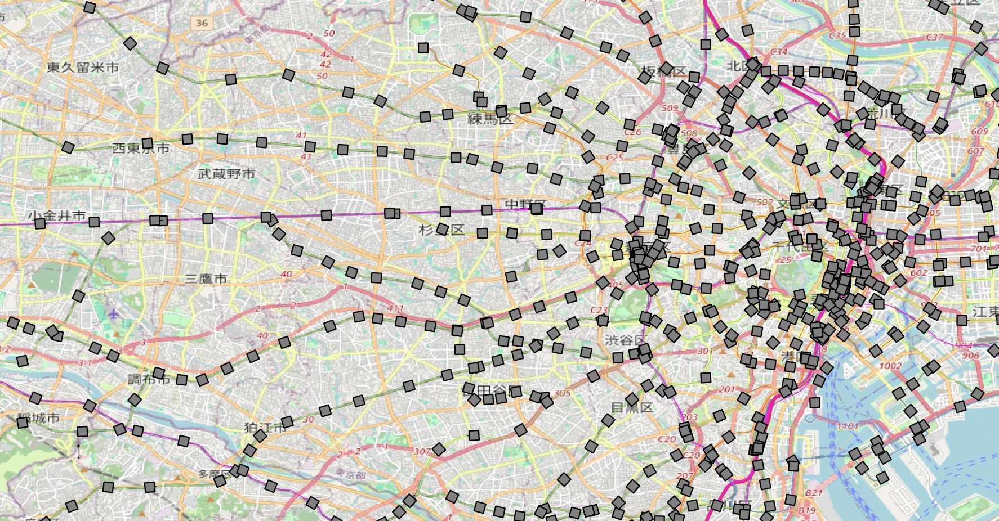
ネットワーク分析の時に作成した、鉄道駅データですね。
例えば、東京都の行政区画に対する鉄道駅の密度を求めようとしましょう。
市区町村ごとにアクセスのしやすさを説明できるかもしれません。
当たり前ですが、東京、新宿駅周辺は密度が高そうに見えますが、
具体的な数値を出すためにこれから紹介する分析が必要になります。

## 本ページの目的

本ページでは、以下の事項について学習します。

- メッシュによる点密度の表示が分析できるようになる
- カーネル密度推計を説明できるようになる

## メッシュによる点密度の表示

鉄道駅やAEDなどの点データを地図上に表示するだけでは、分布の偏りを定量的に説明できません。
そこで、メッシュを使って点の密度を可視化し、どの地域に集中しているかを明らかにします。
前回、演習で用いた小金井市の公共施設に配置しているAEDデータを使用します。
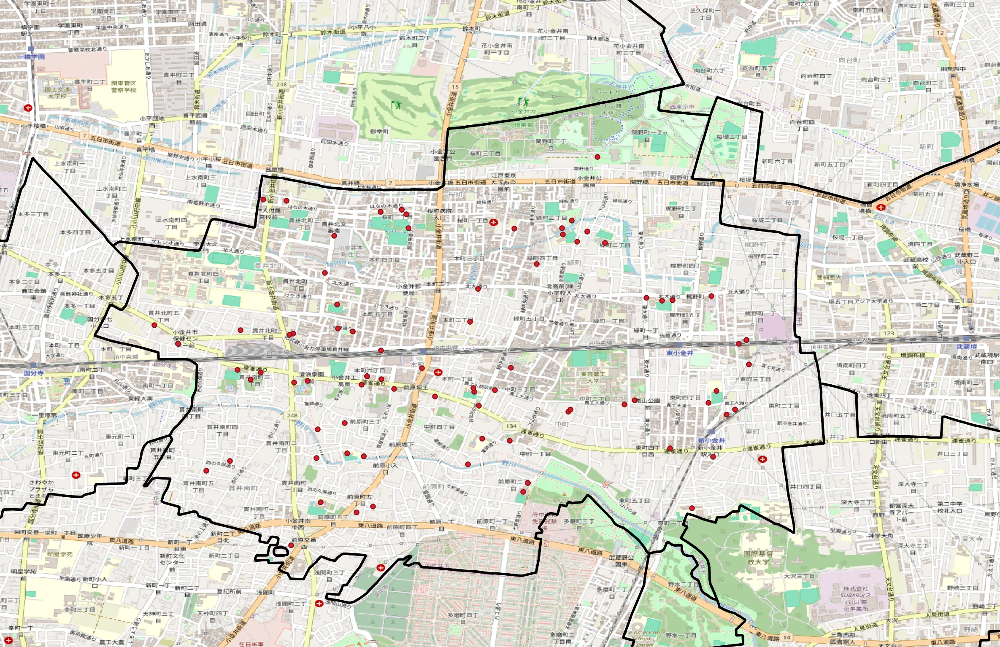

点密度を分析するためには、まず対象地域を均等なメッシュで分割します。
QGISでは、次の手順でグリッドを作成します。

1. プロセシング → ツールボックス → ベクタ作成 → グリッドを作成 を選択。
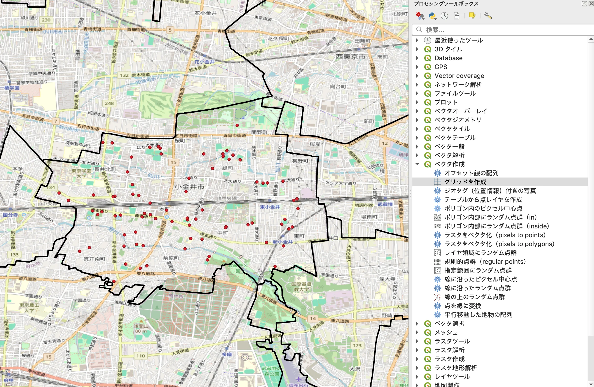
2. ダイアログで以下を設定します

- グリッドタイプ：長方形（Polygon）
- 水平・垂直方向の間隔：0.005 degrees（約500m）
- 出力グリッドのCRS：EPSG:4326（WGS84）
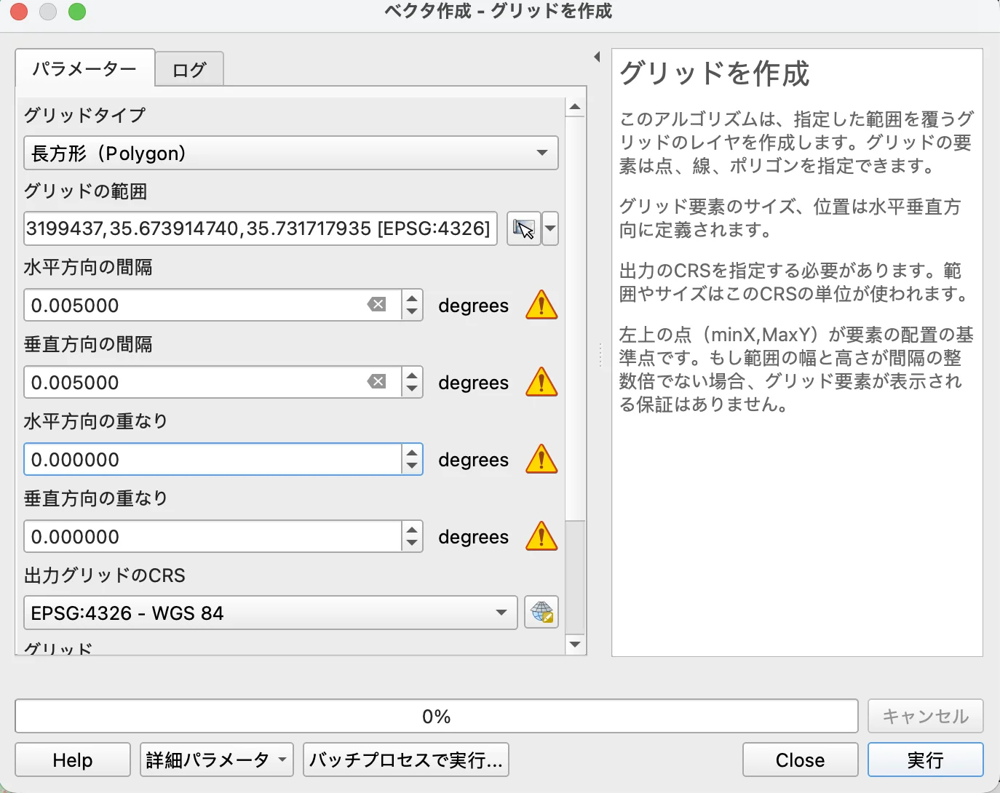

この設定により、地図上に均等なメッシュが生成されます。
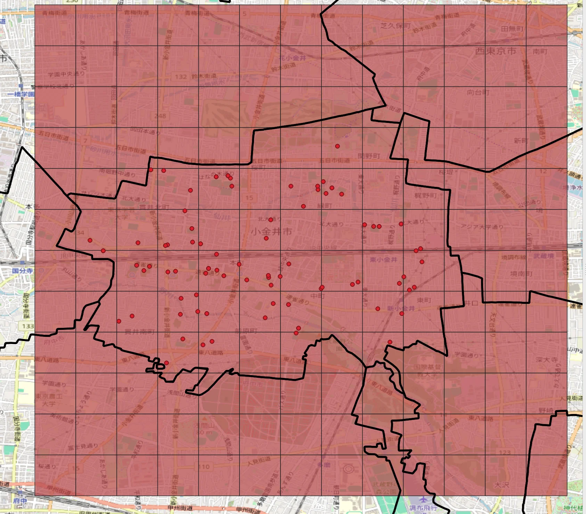

次に、各メッシュ内に含まれる点の数を計算します。
QGISの「ベクタ→解析ツール→ポリゴン内の点の数」を使い、
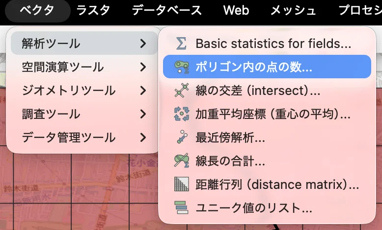
以下のダイアログに入力します。

ポリゴンレイヤ：作成したグリッド
ポイントレイヤ：AEDの位置情報
を指定します。
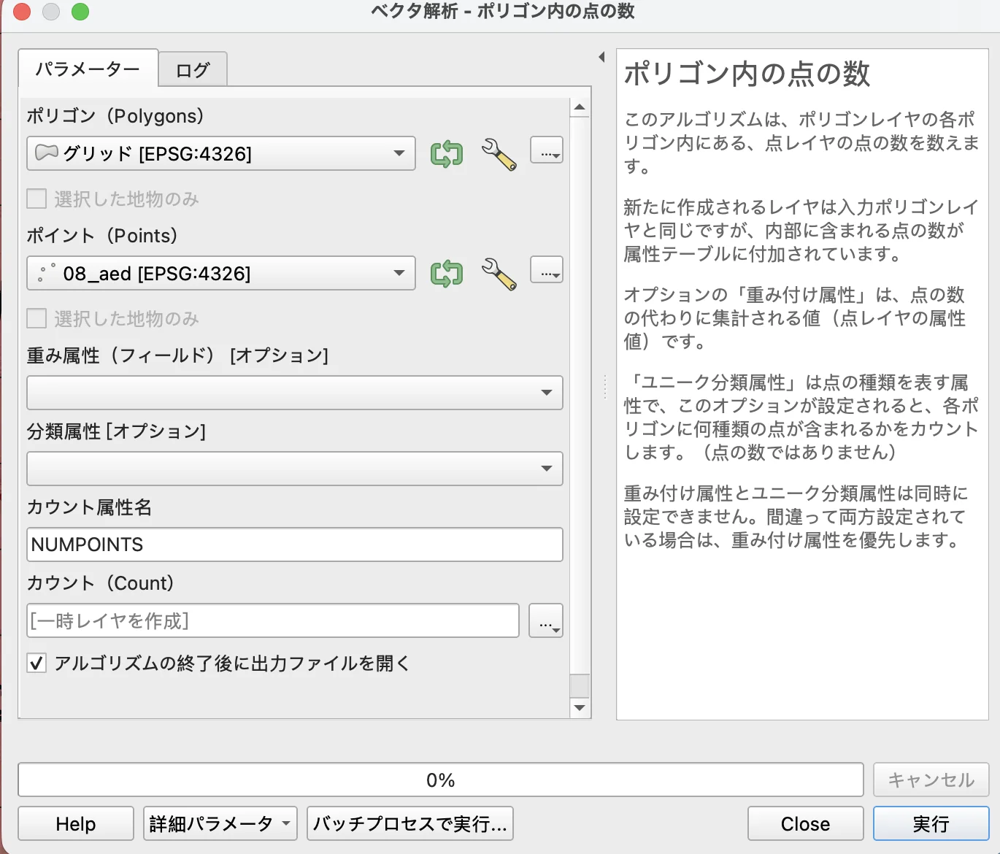

結果として、新しいメッシュが作成されます。
作成されたメッシュレイヤを右クリックして、属性テーブルを確認しましょう。
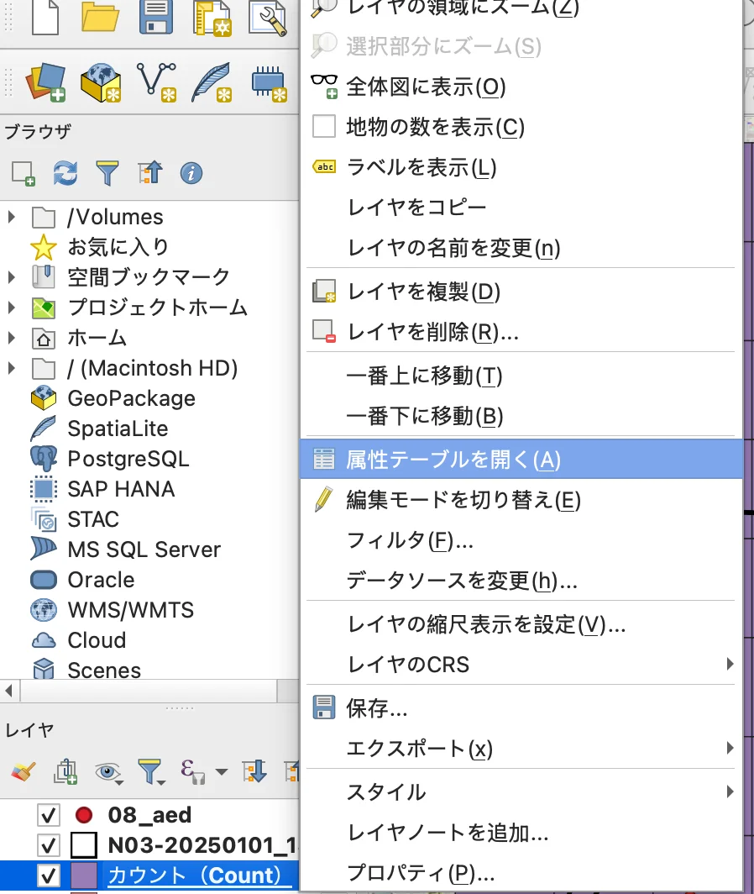
NUMPOINTS フィールドが追加されていますね。
この値は、各メッシュ内の点の数、つまり500m四方にAEDが何個配置されているかを表しています。
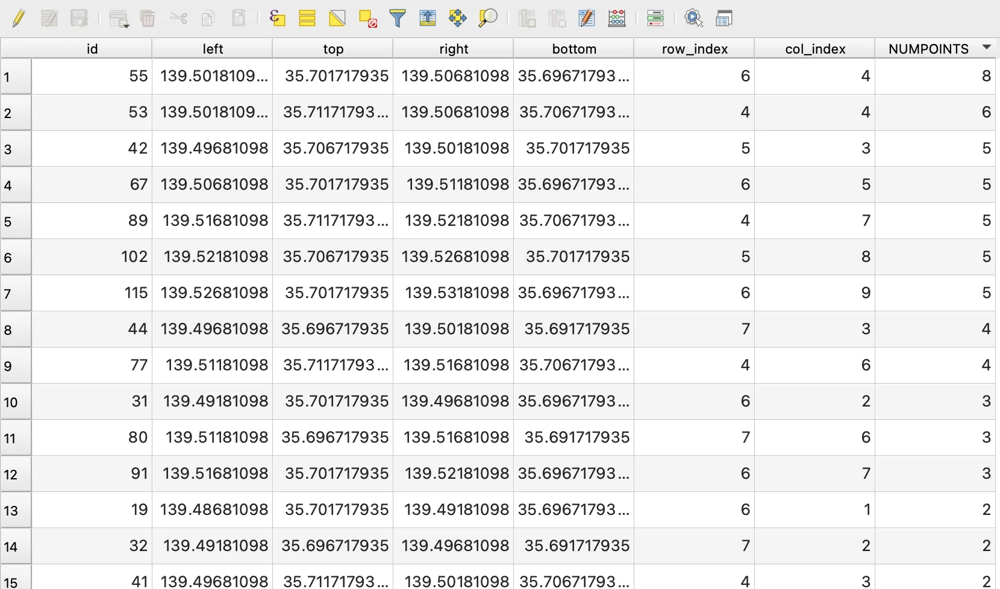

しかし、この数値データは少数を含んだ値(double型)になっていますので、整数型(int型)のフィールドを作成しましょう。

- 新規フィールドを作成にチェック
- 出力する属性の名前を入力「NUMPOINTS_INT」
- フィールド型をに「整数型（integer）」を選択
- 式にround("NUMPOINTS")を入力
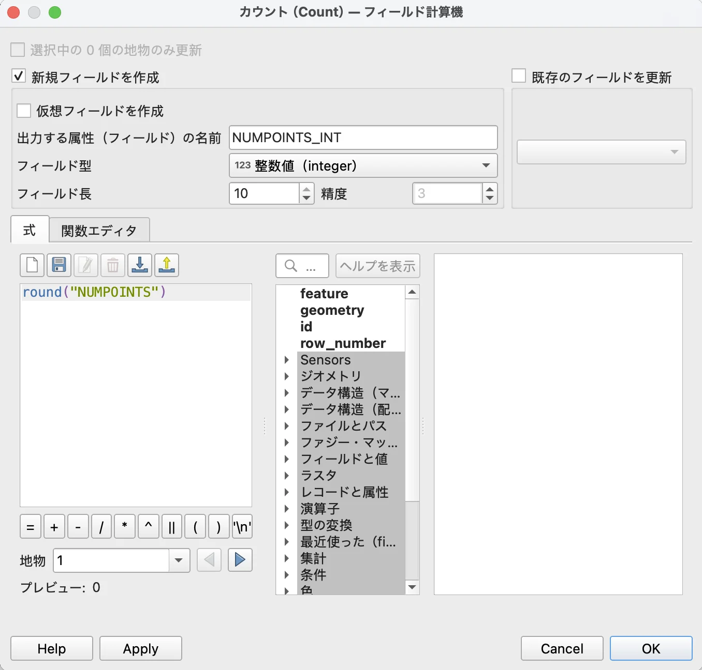

新しいフィールドが作成されました。
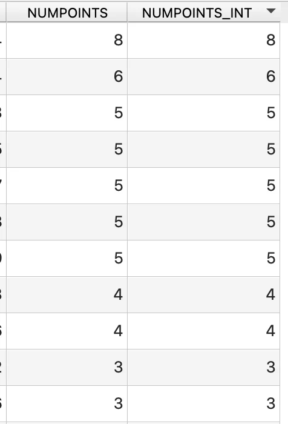
(一見同じに見えますが、新しく作ったデータは少数桁を含んでいません)

最後に、NUMPOINTS_INT を使ってメッシュを色分けします。
作業中のメッシュレイヤを右クリックして、プロパティを選択。

- 分類方法は「連続値による定義」
- 値は「NUMPOINTS_INT」
- モードは「等間隔分類」
- 不透明度を50%にするといいかもしれません
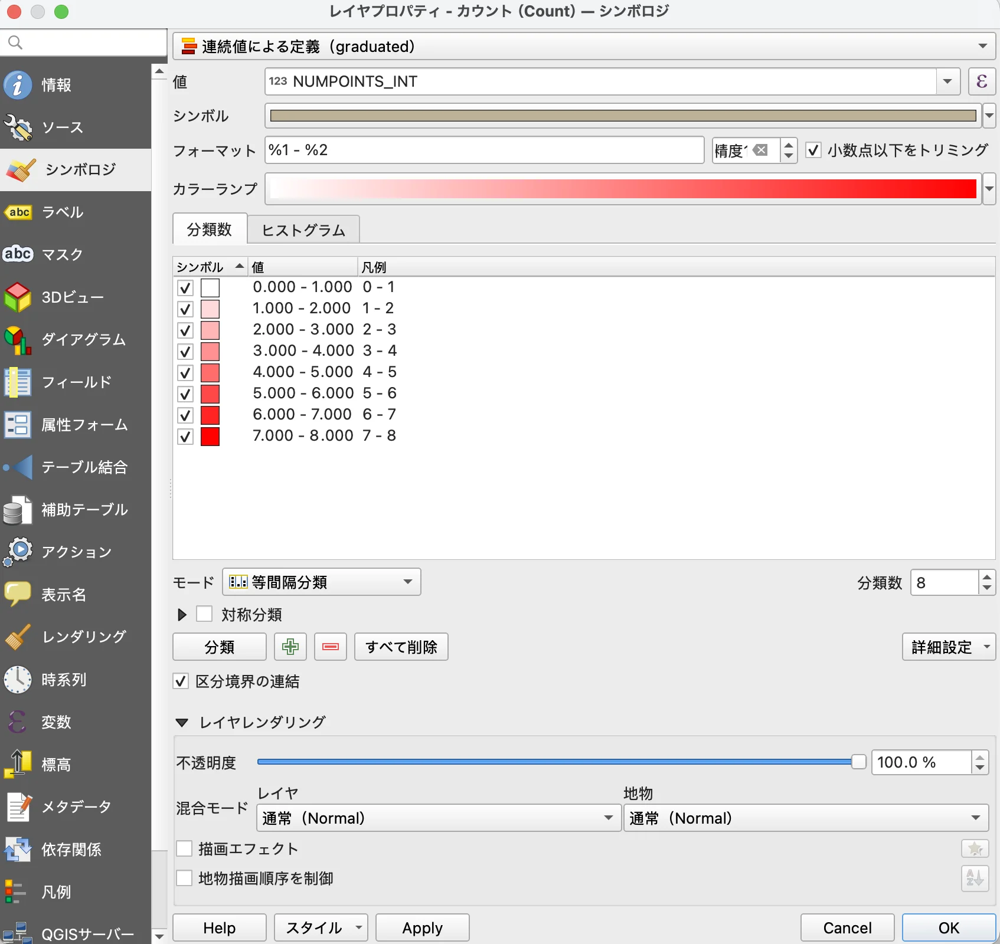
okを選択すると、点が多いメッシュほど濃い赤で表示され、分布の偏りが視覚的にわかります。

これで、AEDの分布密度を可視化することができました。

完成したメッシュ図を見ると、武蔵小金井駅周辺のメッシュが濃い赤で表示されており、AEDが集中していることがわかります。
一方、緑町や関野町周辺にはAEDの配置があまりないことが見えてきました。
このような分析を通して、AEDの追加設置場所を検討する際の根拠になります。
まとめると、メッシュによる点密度分析は、単なる地図表示では見えない「分布の偏り」を定量的に示し、意思決定に役立つ情報を提供します。

## (演習)行政区域による点密度の表示

先ほどは自分でメッシュの領域を作成し、点を数えましたが、
あらかじめ領域を持っておけば、その領域内の点の数を数えることができます。
実際にやってみましょう。

下の図は東京都内にある公共の図書館を示した図です。
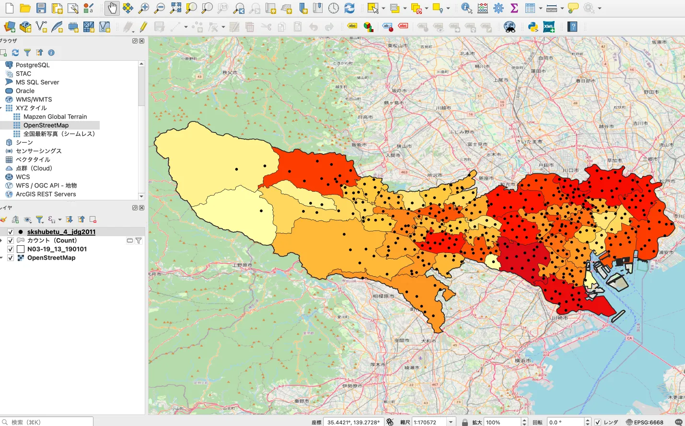

- 図書館データは[こちら](https://catalog.data.metro.tokyo.lg.jp/dataset/t000021d2000000003)
- 行政区域データは[こちら](https://nlftp.mlit.go.jp/ksj/gml/datalist/KsjTmplt-N03-v2_3.html)

## カーネル密度推計

カーネル密度分析は犯罪発生マップなどに用いられる手法で、カーネル関数を用いてポイントの分布密度を連続的な密度局面としてモデル化する手法です。
この手法を用いて可視化した例を下に示します。
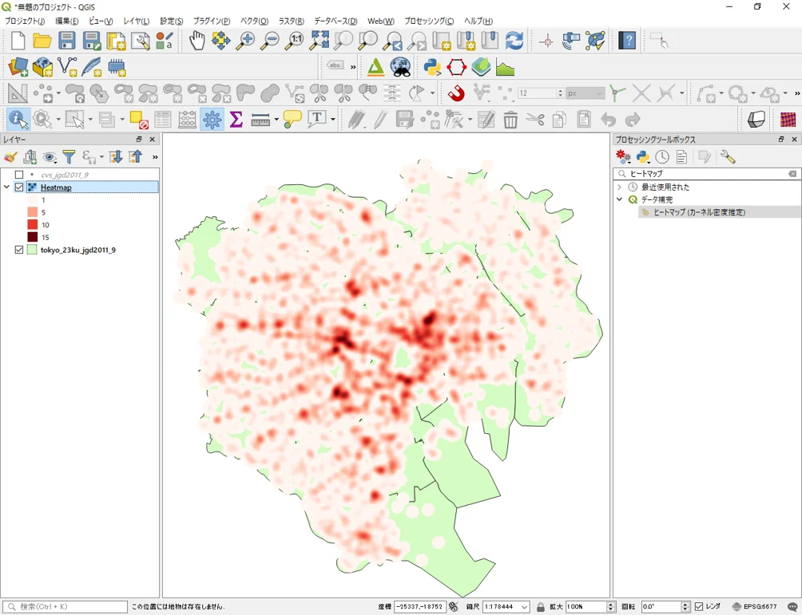

どのように可視化しているか説明しますと、犯罪発生地点を示す点データがあるとします。
このデータを用いて、犯罪発生がない場所の発生率を推定したいとします。
当然、犯罪発生地点が複数ある場所＝犯罪発生率が高いと推定したいので、点データ周辺の密度を評価するそんな関数が欲しいですね。
その関数が名前の由来にもなっている「カーネル関数」です。
他にも、それぞれの点の影響度（広がり）も見る必要がありますが、
点データ周辺の密度を評価するということを抑えておけば問題ありません。

QGISでも試すことができますので興味のある方は挑戦してみましょう。

## まとめ

本ページでは、以下の事項について学習しました。

- メッシュによる点密度の表示が分析できるようになる
実際の地図データを使って、小金井市の公共施設に配置されているAEDの位置情報とその密度をメッシュとして表示しました。

- カーネル密度推計を説明できるようになる
点データ周辺の密度を評価するカーネル関数について説明し、その事例について説明しました。

## 参考文献

本教材は、以下の資料をもとに作成しました。

- [GIS実習オープン教材](https://gis-oer.github.io/gitbook/book/)
- [国土数値情報 鉄道データ](https://nlftp.mlit.go.jp/ksj/gml/datalist/KsjTmplt-N02-2023.html)
- [東京都オープンデータカタログサイトホームページ](https://portal.data.metro.tokyo.lg.jp/)
