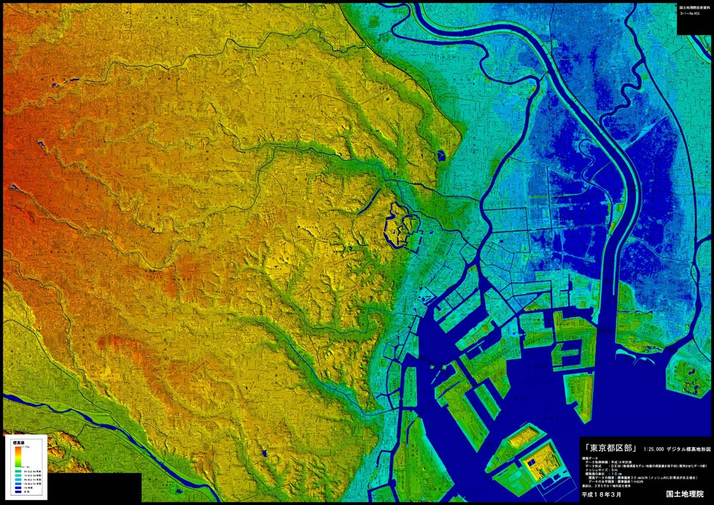
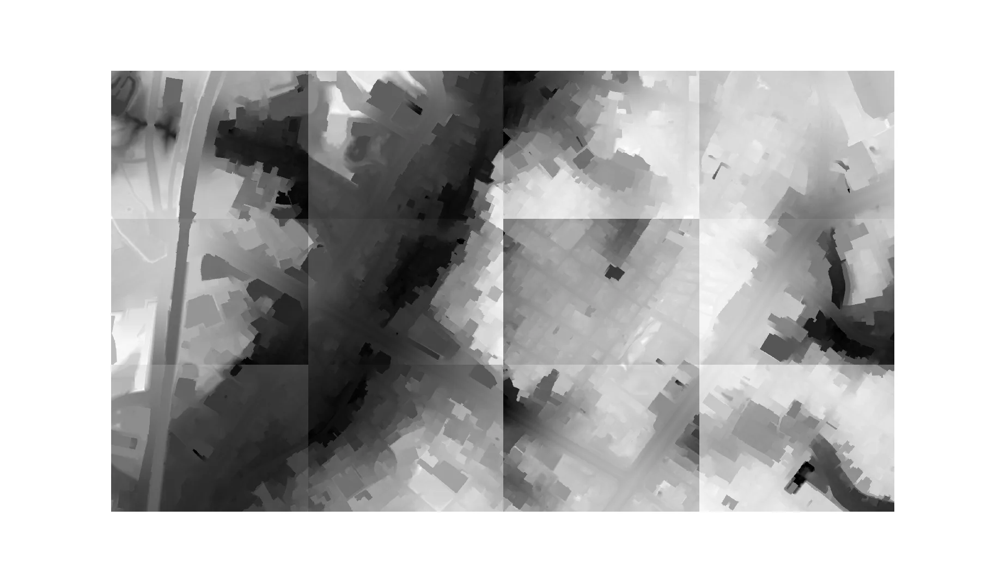
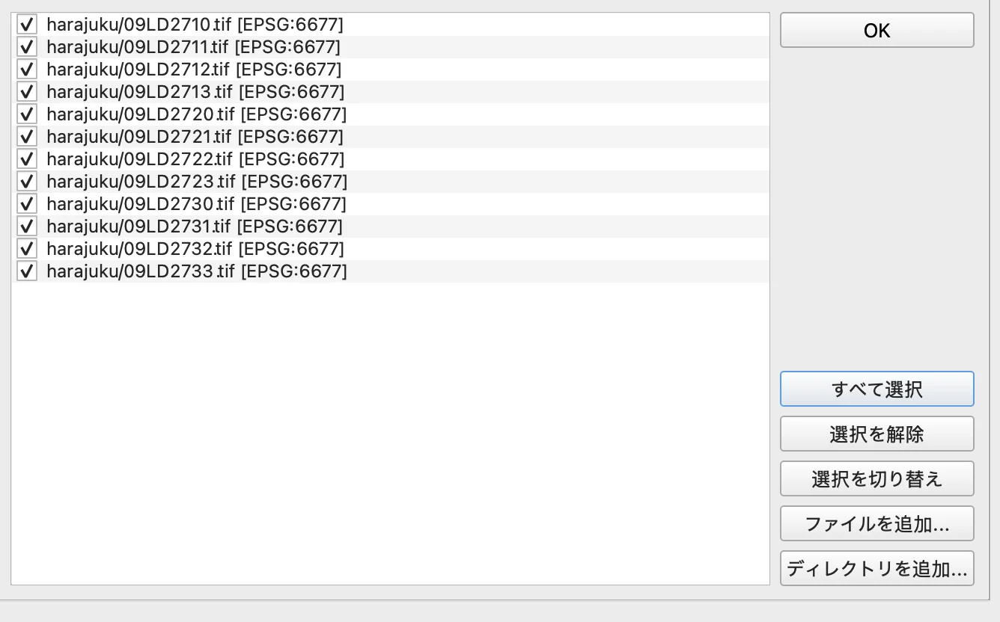
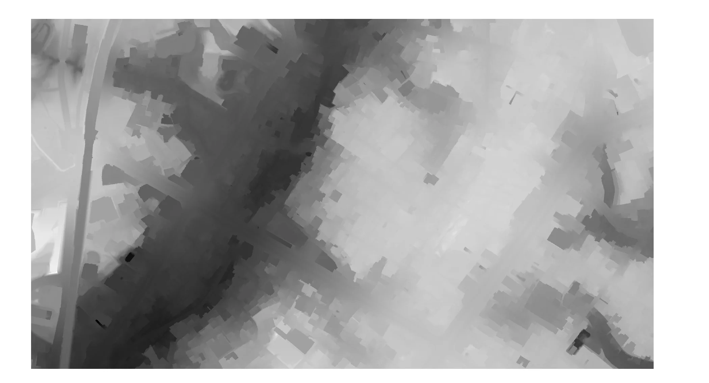
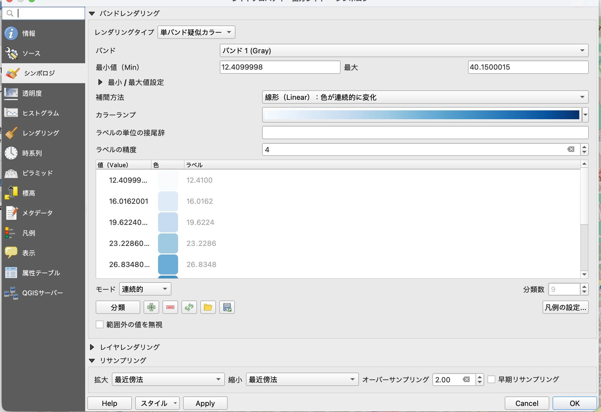
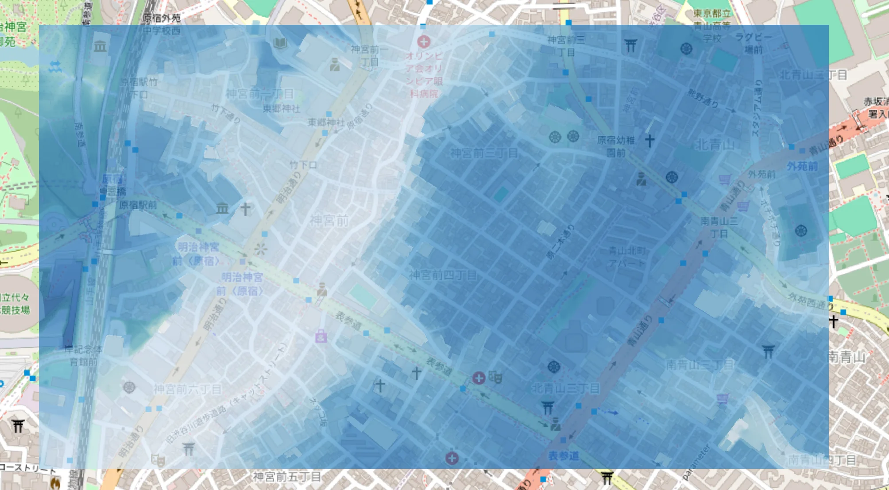
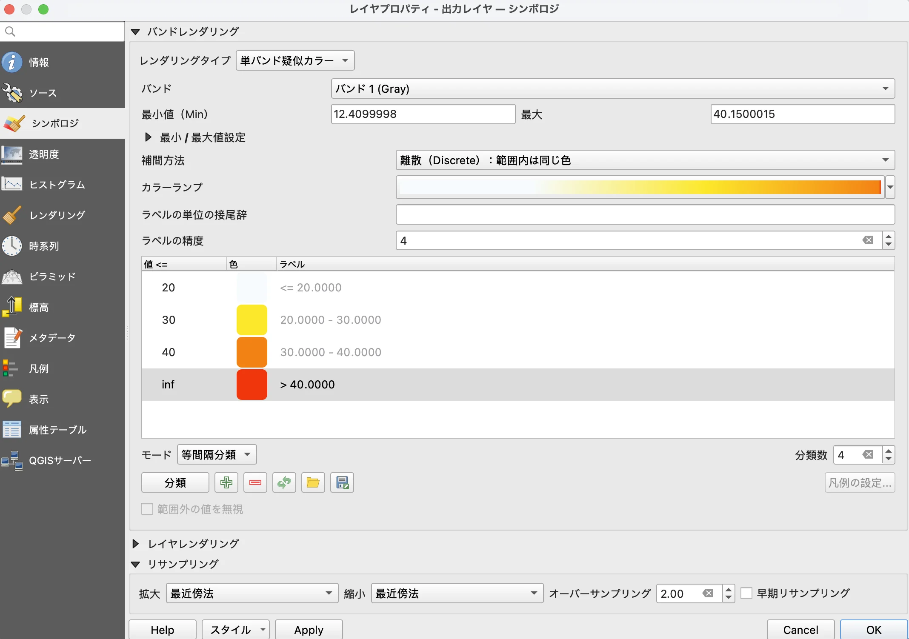
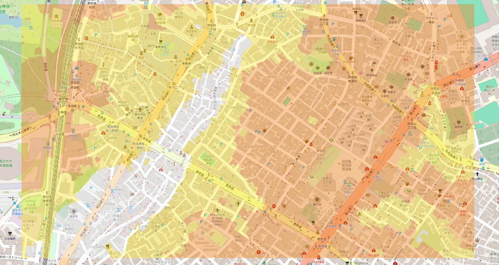
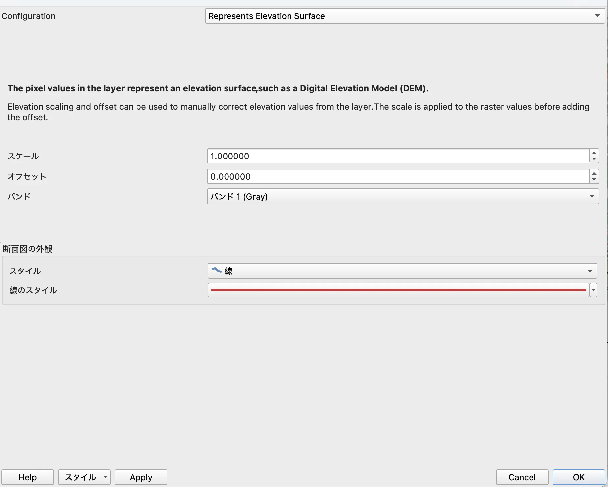
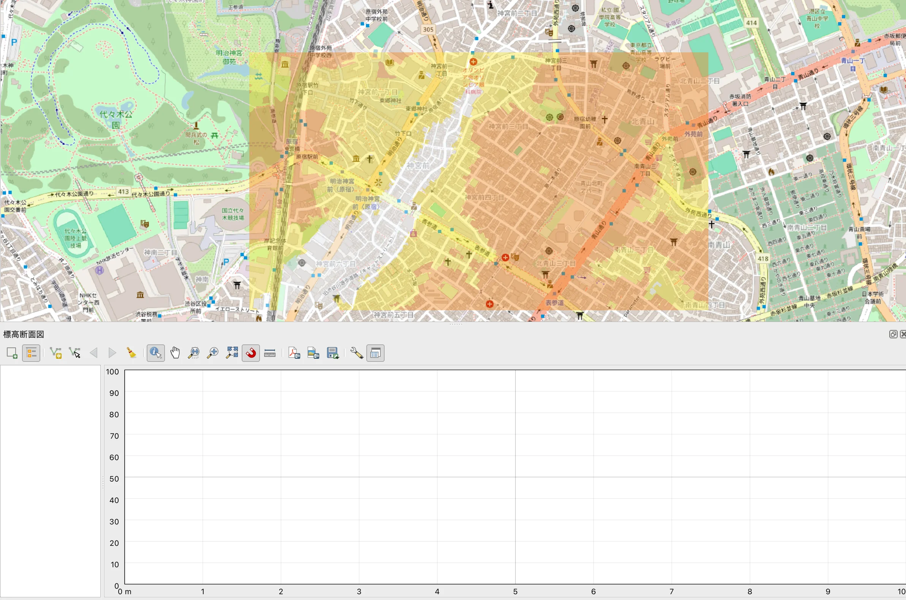

# 第8回 ラスタデータの分析

[目次に戻る](../index.md)

## この講義の目次

{: .card .card-toc }

- [ラスタデータとは（復習）](#rastor)
- [本講義の目的](#purpose)
- [はじめに](#intro)
- [数値標高モデルの視覚的分析](#elevation-model)
- [ラスターデータとDEM](#dem)
- [地形断面図の作成] (#topographic)
- [まとめ](#summary)
- [演習](#exe)
- [参考資料](#refs)

## ラスタデータとは（復習）{#rastor}

ラスタデータとは、画像ファイルのようなセル(ピクセル)で構成されるデータです。
空間データの場合、各セルは属性として位置座標や数値を持ちます。
GIS上ではよく、衛星画像や標高データなどによく用いられます。
今回は、東京都の基盤地図情報にあるデータを活用し、東京都の標高データの可視化に挑戦してみます！

## 本講義の目的 {#purpose}

- 数値標高モデルの視覚的分析を実施できる
- 地形断面図の作成ができる

## はじめに {#intro}

この文章を書いている当時、山手線の環状運転が100周年を迎え、さまざまなイベントが催されていました。
山手線は31の駅を環状に繋いでいる線で日本で一番有名な路線といって良いでしょう。
しかし、実際に山手線に属している駅は品川から田端なんですよね（鉄道オタクなら知っている人がいるかも）。
というか、名前が山の手なんで高いところにある路線のような気がしますが、実際どうなんでしょう？想像したことがありますか？
下の地図は、東京都の1:25,000デジタル標高地形図です。

（出典：国土地理院）

この図は、詳細な地形の起伏がカラー表示されており、地形の特徴を直感的に理解することができます。
これを見ると、東京って平坦じゃないということが分かりますね。
皇居から見て東側（城東エリア）は平坦な一方で、西側（城西エリア）は山って感じがしますね。（どちらかというと丘ですが）
山手線は品川から新宿を経て田端までつながっていると説明しました。
つまり城西エリアを縦に貫いている線だから山手線なんて呼ばれています。これで理解できましたね。

大分脱線した感じがしますが、このように地形を色などを用いて調べるためにはラスターデータの分析が必須です。
これを身につけることが目標です！実際に演習でやってみますよ。

## 数値標高モデルの視覚的分析 {#elevation-model}

[このデータ](../materials/08/harajuku.zip)をダウンロードし、QGISで可視化しましょう
ファイル名から分かる通り、ダウンロードしたデータは原宿周辺ラスタデータです。
QGISを起動し、「データソースマネージャ>ラスタ」からラスタデータを表示してください。

こんな感じの12個の四角形が隣接して表示されていると思います。

一つ一つに濃淡があり、どの地点が高いのか低いのかいまいちよく分かりません。
一つの大きな四角形として表示しましょう。
「ラスタ>その他>結合(gdal_merge)」を選択
入力レイヤに12個のレイヤを登録し、実行

濃淡が統一された一つの四角形が表示されましたね！

最初に表示した12個の四角形はQGIS上から削除しても構いません。

作成したレイヤを少し調整しましょう。
出力レイヤを右クリックし、プロパティを選択。
シンボロジからレンダリングタイプを「単バンド擬似カラー」を選択。
補完方法は「線形」、モードは「連続的」、あとは自動でやってみました。
このあと、色々設定をいじってみます。
下の画像を参考にしてください。

この後、下にレイヤを重ねますので、透明度を30~70%あたりにするといいでしょう。

さて、OpenStreetMapを下のレイヤに設定して原宿周辺の高さを可視化してみましょう。
どんな感じでしょうか。

色が濃いほど標高が高く、薄いと標高が低いという結果を示しています。
こうやってみると、道路や区画整理は標高に強く影響がありそうだなぁという感じが見えてきますね。

もう少し見やすい感じにしたいですね。
最小の標高が12mくらい、最大が40mくらいですので、大体10mから40mくらいの幅であることが分かります。
10mおきに値を決めるとして4分割くらいにしたらいい感じに分けられそうです。
補完方法を「離散」、モードは「等間隔分類」、分類数は4にしました。
あとは、標高が高くなるにつれて赤に近づくように色を考えてみました。

このような結果になりました。

標高が低いところ、中くらい、高いところに分類することができました。さっきと違う印象になりましたね。

## ラスターデータとDEM {#dem}

先程ダウンロードしたデータはDEM(Digital Elevation Model)と言います。
DEMは地表面を等間隔のメッシュで区切り、その中心点あるいは交点の標高を数値化し、この数値データをもとに作成した標高のメッシュデータです。
一つ一つの点に標高データがあると思ってもらえれば良いです。
その点に色分けをすることで先程の可視化ができたというからくりです。

同様のデータとして、地表面とその上にある地物表面の標高からなる DSM(Digital Surface Model：数値表層モデル)や、
地表面のみの標高からなる DTM(Digital Terrain Model：数値地形モデル)もあります。
DTMはDEMの仲間です。

## 地形断面図の作成 {#topographic}

原宿周辺の地形断面図を作成してみましょう。
最初に作成済みのレイヤを右クリックし、プロパティを選択。
標高からConfigurationで「Represents Elevation Surface」を選択

次に、「ビュー>標高断面図」を選択
下のウィンドウが表示されました。

新しく表示されたウィンドウの、左から三番目のボタン「曲線キャプチャ」を選択
レイヤの上に線が弾けます。
そして出力レイヤにチェックマークを引くと、標高断面図が作成できます！

山手線の左側は起伏があるってこと、理解できましたね！

## 今回のまとめ {#summary}

今回の演習では、ラスタデータ（特にDEM）を用いて標高を可視化し、地形の特徴を理解する方法を学びました。
具体的には、複数のラスタを結合し、シンボロジ設定で標高を色分けすることで、地形の起伏を視覚的に把握できました。
さらに、標高断面図を作成することで、平面的な地図だけでは分かりにくい高低差を定量的に確認できました。

この分析から、都市構造や道路配置が標高に影響されていることが見えてきました
こうした視覚化は、防災計画や都市計画、交通網の設計など、さまざまな分野で重要な役割を果たします。
今回の演習を通じて、ラスタデータの分析が地理情報の理解に不可欠であることを実感できたら嬉しいですね。

## 演習 {#exe}

今回作成した地図から何が言えるか、考察しなさい。

考察のポイント

- 竹下通りと地形
- 明治通り
- 標高が低い場所と高い場所の区画整理
（一つでもいいし複数触れても大丈夫です）

余談ですが、渋谷周辺の地形もとても面白いですよ。可視化してみるとまさに「谷」だ！となります。

## 参考文献 {#refs}

本教材は、[GIS実習オープン教材](https://gis-oer.github.io/gitbook/book/)や以下の資料をもとに作成しました。

- [国土数値情報ダウンロードサイト](https://nlftp.mlit.go.jp/ksj/)
- [3Dモデルでみる東京](https://info.tokyo-digitaltwin.metro.tokyo.lg.jp/3dmodel/)
