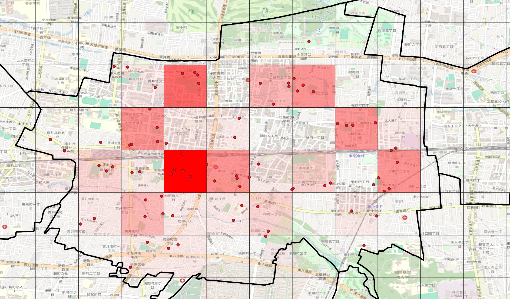
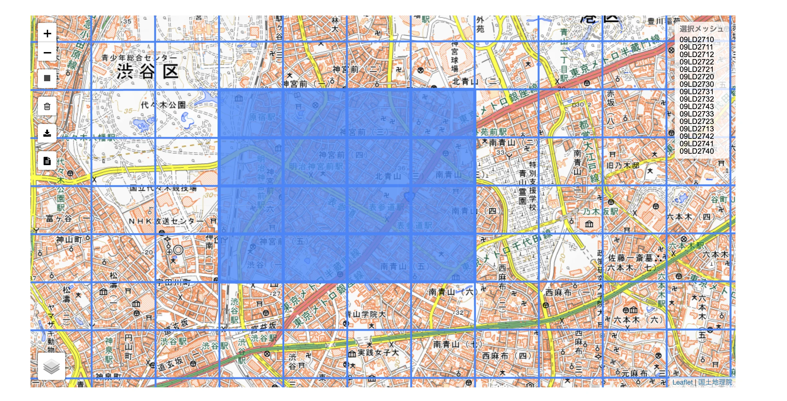
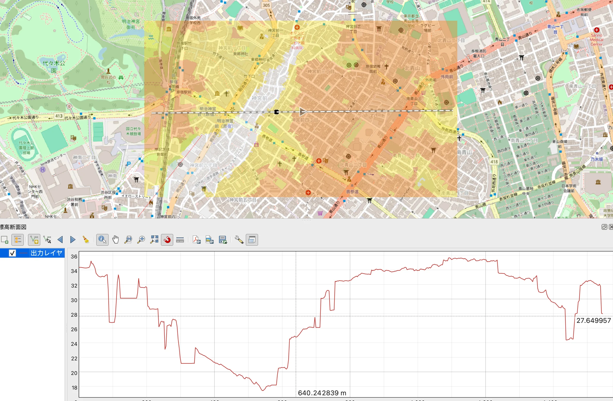

# 第9回 QGISを用いた時空間分析

[目次に戻る](../index.md)

## この講義の目次

{: .card .card-toc }

- [（演習1）点データの分析](#exe1)
- [（演習2）ラスタデータの分析](#exe2)
- [課題の提出方法](#how-to-submit)

## （演習1） 点データの分析 {#exe1}

第6回、第7回で点データを活用した分析方法について取り組みました。
ここでは、2つの分析手法のうち1つを選択し、分析を実施しましょう

- 取得するデータについて

東京都オープンデータカタログサイトホームページにアクセスし、小金井市のデータセットを選択してください
<https://catalog.data.metro.tokyo.lg.jp/organization/t132101>

「AED設置箇所一覧」を**除く**データセットをダウンロードすること

### 第6回より 領域分析によるボロノイ分析の表示

ここでは、ダウンロードした点データを活用し、以下の可視化を行ってください。

- **点データの可視化**
- **ボロノイ分析の実施とその可視化**

上記を実施し、図を作成する際の工夫した点についてまとめること

ここでは一例として、「小金井市のAED設置箇所一覧」のデータの可視化を表示します。

### 第7回より メッシュによる点密度の表示

ここでは、ダウンロードした点データを活用し、以下の可視化を行ってください。

- **点データの可視化**
- **メッシュによる点密度の表示**

上記を実施し、図を作成する際の工夫した点についてまとめること

ここでは一例として、「小金井市のAED設置箇所一覧」のデータの可視化を表示します。

## （演習2）ラスタデータの分析 {#exe2}

第8回でラスタデータを活用し分析方法について取り組みました。
ここでは、以下のデータをダウンロードし、ラスタデータの分析を実施しましょう。

- 取得するデータについて

[東京都デジタルツインプロジェクト 区部点群データグリッドデータDEM（0.50m）](https://www.geospatial.jp/ckan/dataset/tokyopc-23ku-2024/resource/ff8305fd-a993-4535-80b4-fd6dcb339775)にアクセスし、
メッシュデータを隣接して9つ以上選択してください。
(3x3、3x4、または4x4がいいかと思います)

例として表参道周辺を選択した場合を表示します

提出物には以下のデータを含めること

- **標高データ(可視化がわかりやすいように色分けすること)**
- **地形断面図**
  - 可視化の例(第8回で実践しました)
  - 

## 課題の提出方法 {#how-to-submit}

Google Formで提出

提出期限：XX月YY日 17:00まで
