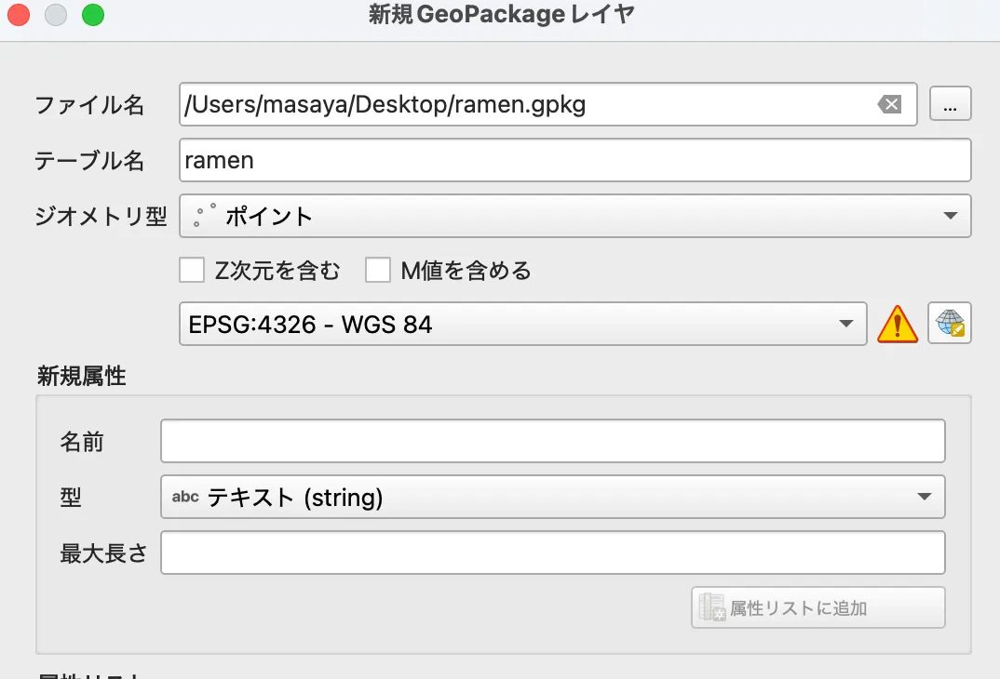
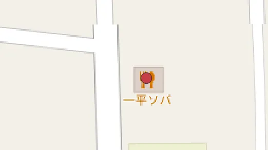
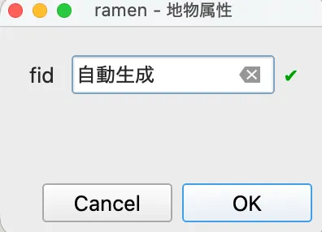

# 第9回 QGISを用いた時空間分析

[目次に戻る](../index.md)

## この講義の目次

{: .card .card-toc }

- [第9回 QGISを用いた時空間分析](#第9回-qgisを用いた時空間分析)
  - [この講義の目次](#この講義の目次)
  - [（演習1）バッファ分析](#演習1バッファ分析)
    - [新規ポイントデータの追加方法](#新規ポイントデータの追加方法)
  - [（演習2）ラスタデータの分析](#演習2ラスタデータの分析)
  - [課題の提出方法](#課題の提出方法)

## （演習1）バッファ分析

第6, 7回で点データの分析を行いました。ここでは以下の文章を読み、課題に取り組みましょう。

A太さんは、サークルの打ち上げの幹事を任されました。
お店選びに苦労しているみたいです。
「お店のジャンルや値段も大事だけど、みんなが簡単に集まることができる駅近のお店がいいよなぁ...。お酒を飲んだ帰りとか近いと楽だし...」
さて、皆さんはどのようなお店を選んであげたら良いでしょうか。

*ここでは駅近の定義を駅から徒歩5分(約300m)とします。
お店のポイントデータを追加する方法を下記に示しています。

提出物には以下の用意すること

- 分析結果のスクリーンショット(画面キャプチャ)
- GISのプロジェクト
  - csvやGMLファイルといった一式すべてを一つのファイルにまとめること
- お店の住所
- どのようにバッファ分析を実施したか説明(500字程度)

### 新規ポイントデータの追加方法

- レイヤから、「レイヤを作成」ー「新規GeoPackageレイヤ」を選択
  - 
- ファイル名、テーブル名は任意の名前、ジオメトリ型は「ポイント」、CRSは「WGS84」を選択し、レイヤを作成
  - 
- 「編集モード切替」アイコンと「点地物を追加」アイコンをクリックし、地図上のポイントを作成したい場所でクリック
  - 
  - 
  - 
- ポイントの属性値を入力するための「地物属性」というウインドウが出現します。そのままOK
  - 
- 「編集モード切替」アイコンを再度選択し、編集を終了する

## （演習2）ラスタデータの分析

第8回でラスタデータを活用し分析方法について取り組みました。
ここでは、以下のデータをダウンロードし、ラスタデータの分析を実施しましょう。

- 取得するデータについて

[東京都デジタルツインプロジェクト 区部点群データグリッドデータDEM（0.50m）](https://www.geospatial.jp/ckan/dataset/tokyopc-23ku-2024/resource/ff8305fd-a993-4535-80b4-fd6dcb339775)にアクセスし、
メッシュデータを隣接して9つ以上選択してください。
(3x3、3x4、または4x4がいいかと思います)

例として表参道周辺を選択した場合を表示します

提出物には以下のデータを含めること

- 分析結果のスクリーンショット(画面キャプチャ)
- GISのプロジェクト
  - csvやGMLファイルといった一式すべてを一つのファイルにまとめること
- 自身でダウンロードしたGMLファイルについて、分析結果から言えること(500字程度)
- 最後に2つの演習を実施した感想を述べてください。

## 課題の提出方法

[こちら](https://docs.google.com/forms/d/e/1FAIpQLSfxWe2CTpKXqzNtOPh4Q6VCPPeg_UjfAbh0vk9kQ_9_V-eY9A/viewform?usp=publish-editor)に提出

提出期限：6月25日 17:00まで
