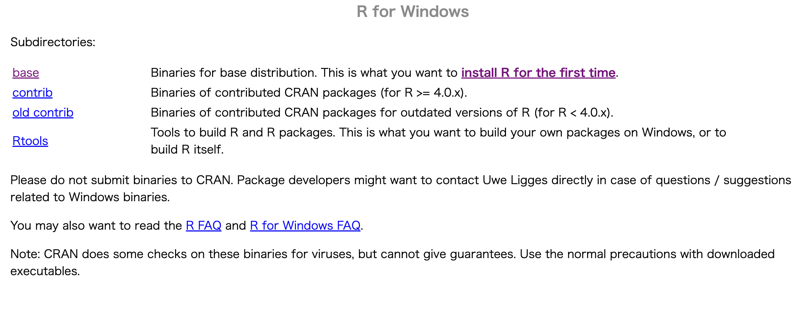
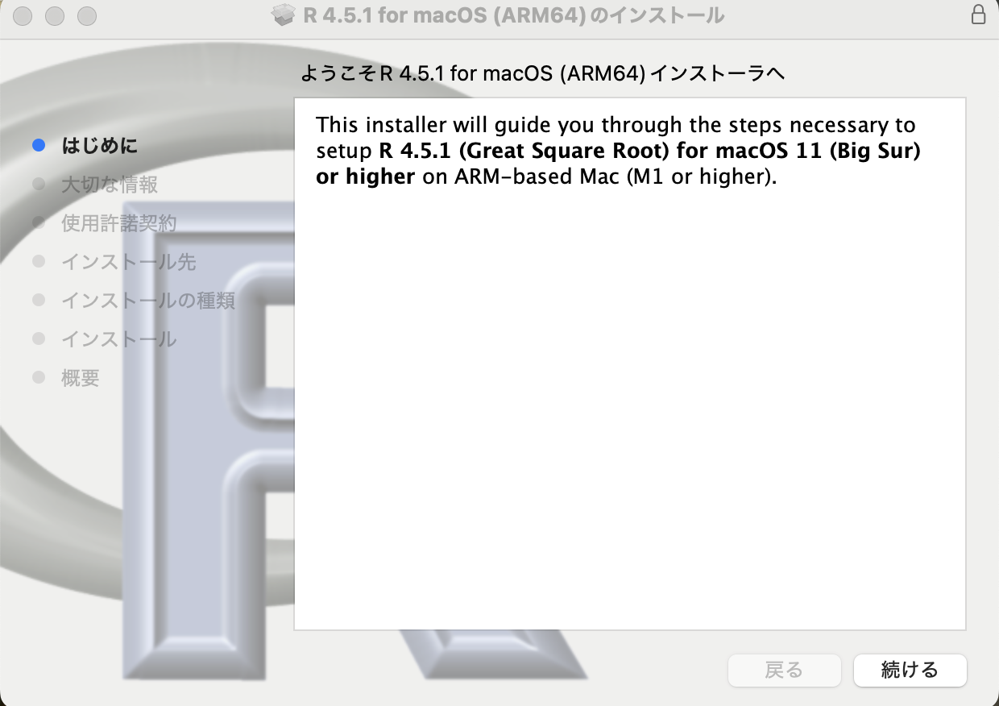
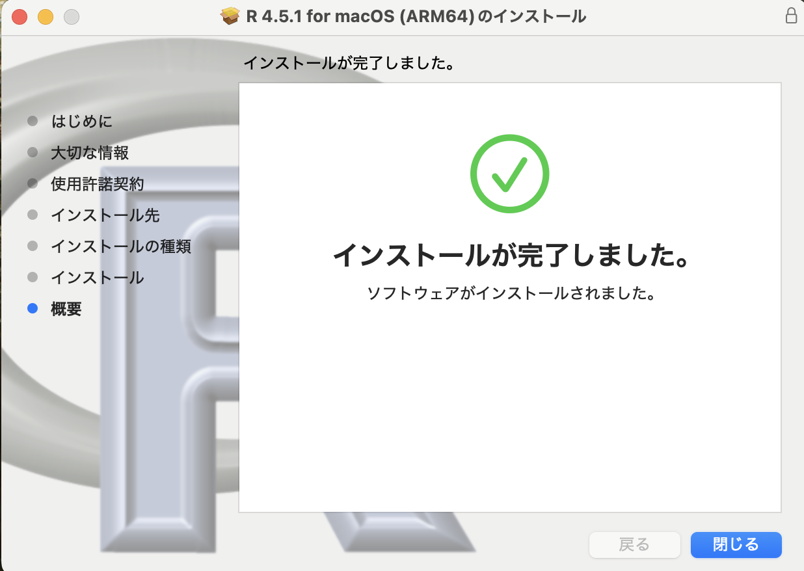
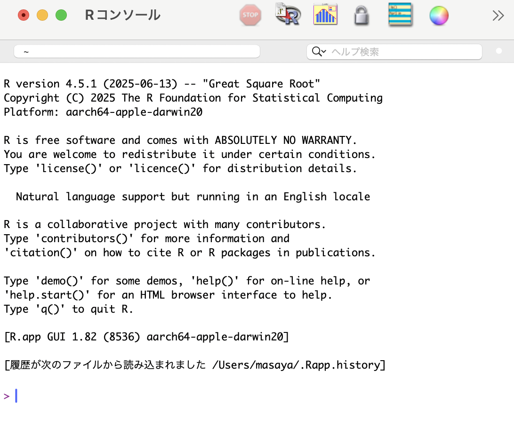
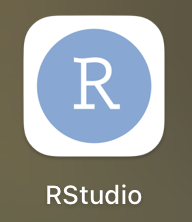
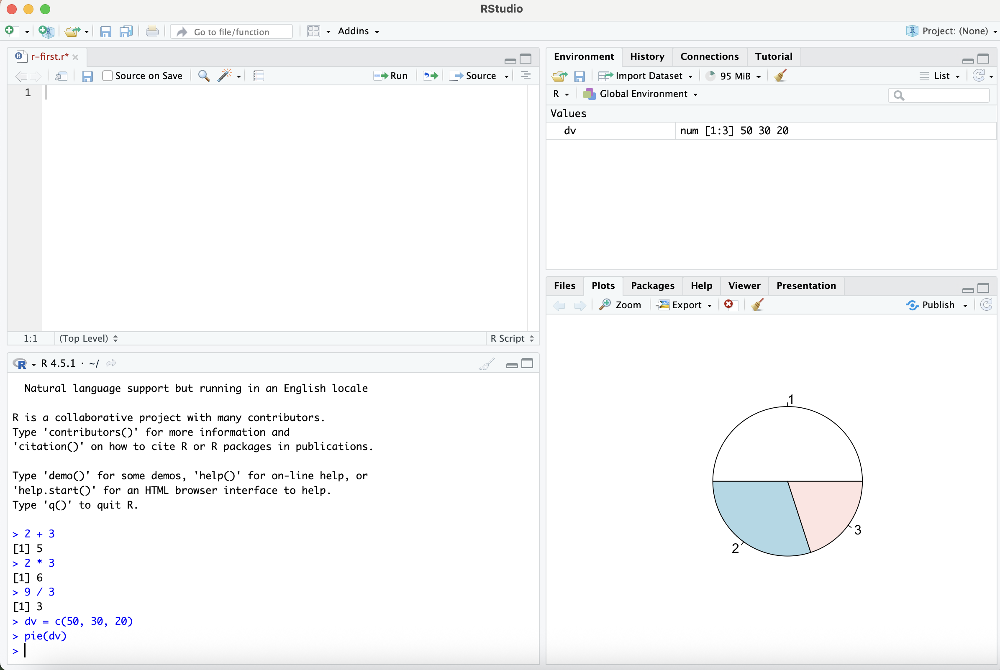
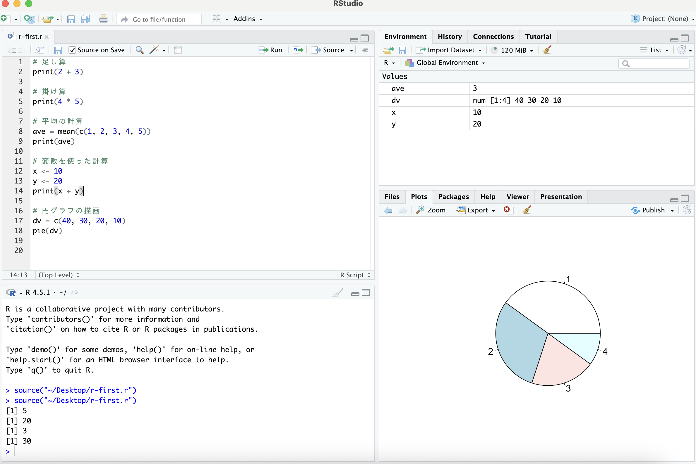

# 第10回 R，Rstudioの使用

[目次に戻る](../index.md)

## はじめに

Rは、統計解析やデータ分析に特化したプログラミング言語である。
もともとは統計学者のために開発されたが、現在では幅広い分野で活用されている。
Rを活用することで、以下のことができるようになる。

- データの読み込みと加工
- 統計的な分析とモデリング
- グラフや図の作成
- 機械学習の実装
- レポート作成

似たようなことをExcelやPythonでも実行することができるが、
Rと比較して前者は学習コストが低い反面、柔軟性や拡張性に乏しく、
後者は汎用的であり統計解析ではRがより専門的であると言える。
しかし、最近ではRでできてPythonにできないという問題は限りなく少なくなってきた。

## Rのインストール

1. CRANにアクセスし、パッケージをダウンロードする

[CRAN](https://cran.r-project.org/)のサイト


- ここから自分が使っているOS(windows、macOS、その他)を選択する。
- windowsの場合

  - 初めてのインストールの時はbaseを選択

  - Download R-4.X.X for Windowsを選択し、ダウンロードする。(執筆時点では、4.5.1)
- macOSの場合

  - Download R-4.X.X arm64(または、x86_64).pkgを選択し、ダウンロードする。(執筆時点では、4.5.1)
*基本的にはarm64で良いが、Intel Chipのmac(2020年以前)を使用している場合はx86_64を選択すること。

1. パッケージのインストール

ダウンロード終了後、Rのインストールを行う

- windowsの場合
  - R-4.X.X-win.exeを実行し、「次へ」を選択し、Rをインストールする。
  - (わかる人向け)適宜、デスクトップにショートカットを作らないなどしても良い。

- macOSの場合
  - R-4.X.X-arm64.pkgを実行し、「続ける」、「同意する」、または「インストール」を選択し、Rをインストールする。
  
  

1. インストールできたかを確認する

インストールが完了すると、デスクトップ上にRのアイコンが表示される。これを選択する。
  
以下のような画面が表示される
  
これは、コンソール画面といい、コマンドを入力するとすぐに結果が返ってくる仕組みになっている。この画面を使って実際に計算してみる。

```R
> 2+3
[1] 5
> 2*3
[1] 6
> 9/3
[1] 3
> dv = c(50,30,20)
> pie(dv)
```


足し算、掛け算(バツではなく*を使う)、割り算、そして円グラフの描画ができた。これでRのインストールができたことを確認した。

## RStudioのインストール

このままでもR言語を使ったデータ分析を行うことができるが、一般的にはRStudioといった統合開発環境(IDE)を使うことが多い。
ここでは、RStudioのインストール方法を説明する。
(わかる人向け)自分のお気に入りの開発環境を構築してもよい。(VSCodeなど。ただし説明は省略)

1. RStduio Desktopのダウンロード
[RStduio Desktop](https://rstudio.com/products/rstudio-desktop/)のサイトにアクセスし、自分の使用しているOSに該当するパッケージをダウンロードする。


2. パッケージのインストール
ダウンロードしたパッケージを選択すると、インストーラーが起動する。そのままインストールを続ける。
インストールが完了すると、デスクトップ上にRStudioのアイコンが表示される。これを選択する

以下のような画面が表示される

左下のウィンドウは、Rのインストールの時に紹介したコンソール画面である。上記のように先ほどのコマンドを入力することができる。
実際の開発では、左上のエディタ画面でプログラムコードを記述する。以下のように記述してみると、左下や右下に結果が表示される。

さらに右上には、プログラム実行後の変数の値を確認することもできる。

## 変数と基本演算子

ここからはRの基本としてR言語の文法の基礎について解説する。
これまでに他言語を学習してきたことがある場合は、その違いを確認しながら学習していこう。

Rでは、計算結果を変数に代入することができます。
例えば、足し算の結果を変数aに代入してみよう。

```R
> a <- 2 + 3
> print(a)
[1] 5
```

インストールの際には簡単な四則演算を使って動作の確認を行いました。
他にも紹介する演算記号について紹介しましょう。

```R
# 累乗
print(3^2)
[1] 9
# 対数
print(log(10, base=10))
[1] 1
# 自然対数
print(log(10))
[1] 2.302585
# 商と余り
print(7%/%3)
[1] 2
print(7%%3)
[1] 1
```

特に割り算の結果を商と余りで欲しい時は、紹介した演算を使いましょう。
(この後紹介する繰り返しの処理でよく使います)

## 基本的な関数

Rでは標準で多数の関数が用意されています。以下ではその一例を紹介します。

```R
# dat <- c(0,⋯,100)と同じ
dat <- 0:100

# 総和
print(sum(dat))
# 算術平均値
print(mean(dat))
# 中央値
print(median(dat))
# 分散
print(var(dat))
# 標準偏差
print(sd(dat))
# 総積
print(prod(dat))
# 最小値
print(min(dat))
# 最大値
print(max(dat))
```

他にも様々な関数が用意されていますが、キリがないので出てくる度に紹介していきます。

## 配列(ベクトル)

配列(ベクトル)は、要素を1列に並べたものです。例えば[1,2,3]という配列datは以下のように使います。

```R
dat = c(1,2,3)
print(dat)
[1] 1 2 3
```

それぞれの要素は1つでも複数でも出力することができます。

```R
print(dat[1])
[1] 1
print(dat[1:2])
[1] 1 2
```

ここで登場しましたが、連続した要素を取り出したいときは「(最初の数):(最後の数)」のように入力してください。
(他の言語を学習した経験のある人は要注意！！！)

配列同士の掛け算(いわゆる内積)は、このように求めることができます。

```R
print(dat %*% dat)
     [,1]
[1,]   14
```

ちなみに、`c(1,2,3)+1`を計算してみたらどのような結果になるでしょうか？他の演算子では？？興味があったらやってみましょう。

## 行列

配列は要素を1列なのに対し、行列(matrix)は行と列からなる2次元配列です。行列は以下のように使います。

```R
mat <- matrix(c(1,2,3,4,5,6), nrow=3, ncol=2)
print(mat)
     [,1] [,2]
[1,]    1    4
[2,]    2    5
[3,]    3    6
```

3x2の行列が作成されました。先ほどの配列datと行列matを掛け算した結果を確認しましょう。

```R
print(dat %*% mat)
     [,1] [,2]
[1,]    1    4
[2,]    4   10
[3,]    9   18
```

ちゃんと行列の計算ができますね！

後は行列といえば、転置行列、逆行列、行列式の計算でしょうか。やってみましょう。

```R
# 転置行列
print(t(mat))
     [,1] [,2] [,3]
[1,]    1    2    3
[2,]    4    5    6
# 逆行列
s_mat <- matrix(c(1,2,3,4), nrow=2, ncol=2)
print(solve(s_mat))
     [,1] [,2]
[1,]   -2  1.5
[2,]    1 -0.5
# 行列式
print(det(s_mat))
[1] -2
```

## 分岐処理

プログラムの世界では制御構文は必ず登場します。
制御構文とは条件によって処理を変えたり、繰り返し処理を行うことです。
はじめに分岐処理について紹介します。
以下のコードを実行してください。

```R
a <- 5

if (a%%2 == 0){
  print("変数aは偶数が代入されています")
}else{
  print("変数aは奇数が代入されています")
}
```

変数aに色々な数値を入れてみてください。出力が変化することが確認できます。
これは、変数aを2で割った余り(%%)が0であれば偶数、それ以外は奇数である処理であることが分かりますね。
このように「if文」を用いることでプログラムの処理を分岐することができました。
3つ以上の分岐をしたい場合は「else if」を用いますので覚えておいてください。

```R
a <- 5

if (a%%3 == 0){
  print("3の倍数です")
}else if (a%%3 == 1){
  print("3で割った時の余りは1です")
}else{
  print("3で割った時の余りは2です")
}
```

## 繰り返し処理

制御構文で忘れてはいけないもう一つの処理は、繰り返し処理です。
こちらについても以下のコードを実行してください。

```R
a <- 4

for(i in 1:a){
  print(sprintf("%d回目の実行です", i))
}
[1] "1回目の実行です"
[1] "2回目の実行です"
[1] "3回目の実行です"
[1] "4回目の実行です"
```

こちらについては、「for文」を用いて繰り返し処理を行うことができます。
注意点としては、どこかのタイミングで分岐を終了する必要があることです。
データの最後まで到達したら処理を終えるなどしないとエラーが発生したり、無限ループとなってしまいます。
他にも「while文」もありますので色々活用してみましょう。

## 確認問題

ここまでの説明を通して、一つ確認問題に取り組んでみましょう。

1から100までの数字を順番に表示するプログラムを作成してください。
ただし、以下の条件に従って出力を変更してください。

- 数字が 3の倍数のときは、数字の代わりに "Fizz" と表示する。
- 数字が 5の倍数のときは、数字の代わりに "Buzz" と表示する。
- 数字が 3の倍数かつ5の倍数のときは、数字の代わりに "FizzBuzz" と表示する。
- 上記以外の数字はそのまま表示する。

(アドバイス)答えは1通りではありませんよ。if文やfor文(またはwhile文)は両方使いそうですね。
