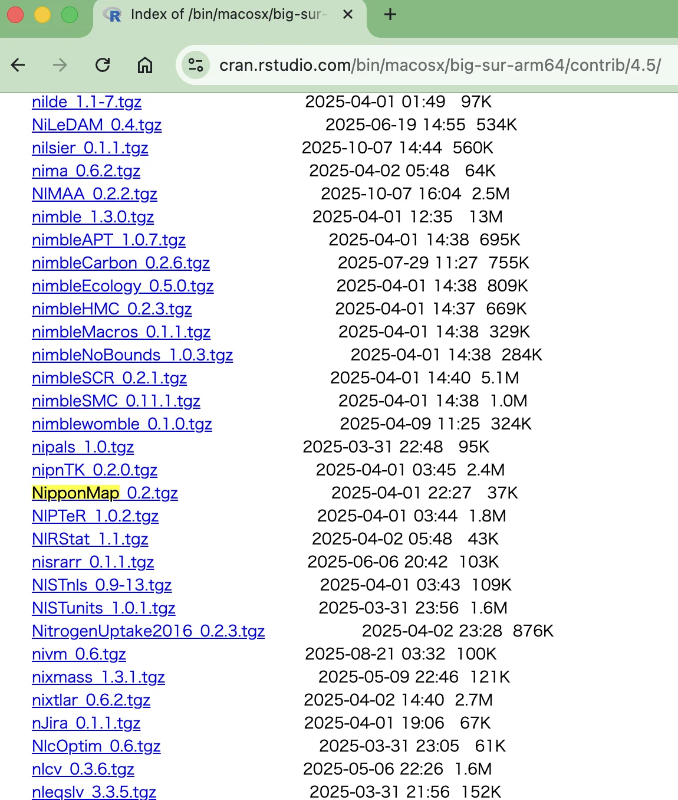
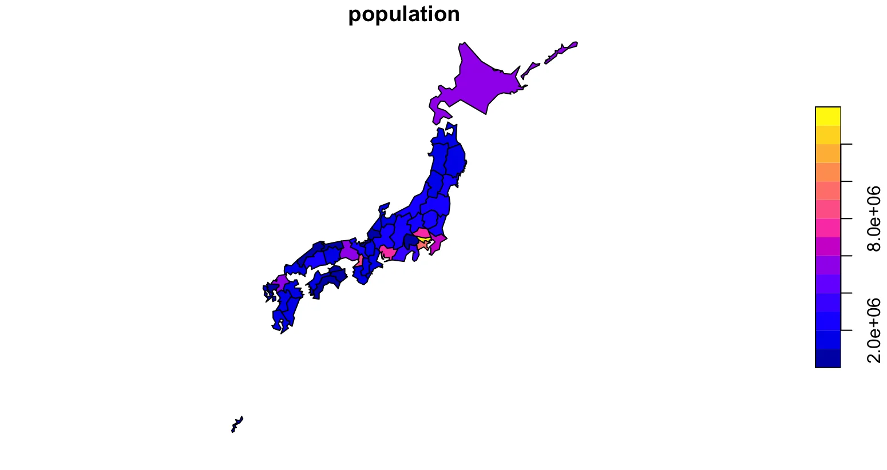
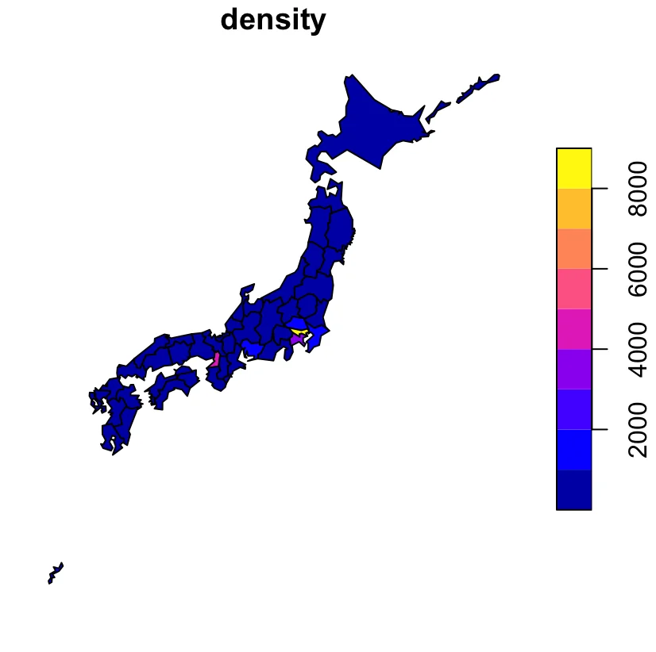
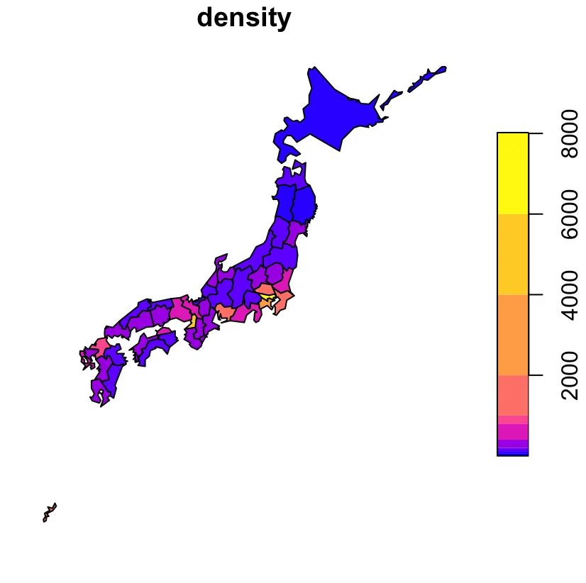
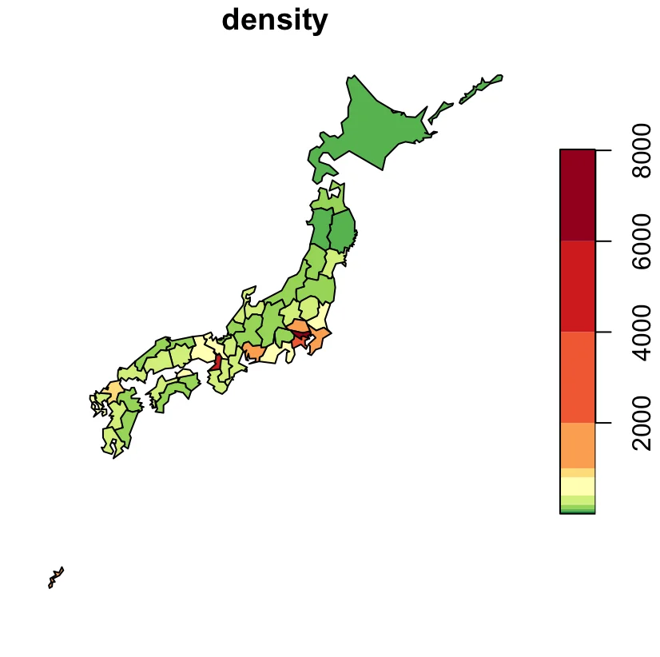
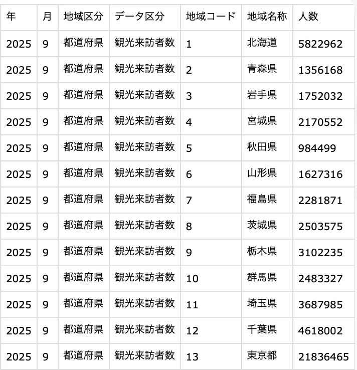
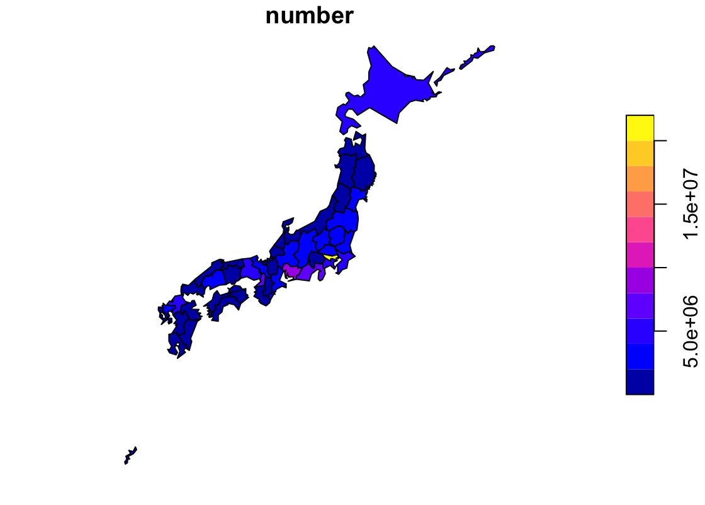
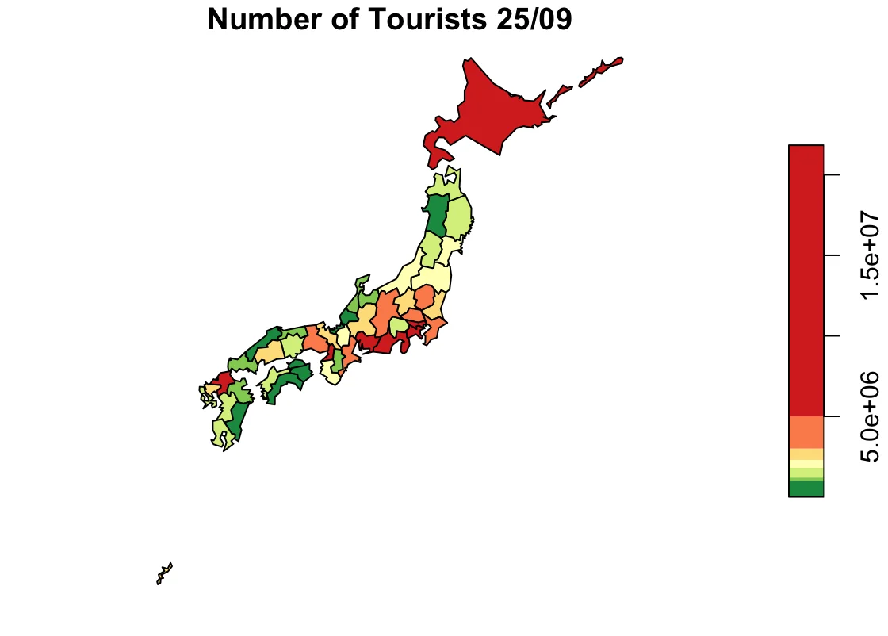

# 第11回 R言語を用いた地理空間データ分析

[目次に戻る](../index.md)

## 本ページの目的

これまでは、QGISを活用して地理空間データの分析を行ってきました。
今回からは前回インストールしたR、RStudioを活用して空間データの分析を行ってみましょう。
ここでは、以下の目的を達成することを目指しましょう。

- R言語を使用した地理空間データの取り扱い方

## R上における地理空間データの取り扱い方

QGISを使った演習でも紹介しましたが、地理空間データはラスタデータとベクタデータに分類できます。
ラスタデータは、写真のようなデータ形式のファイルでしたね。
また、ベクタデータでは、下記で示される「シェープファイル」形式で保存されていることを紹介しました。

- .shp：図形(点・線・面)を格納するファイル
- .shx：図形(点・線・面)と属性データの対応関係を記述するファイル
- .dbf：属性データを格納するファイル
- .prj：座標系を格納するファイル

これらのデータを国土交通省などの様々なサイトにアクセスしてデータを取得して、分析を行ってきました。
R言語のすごいところは、基本的なパッケージがあらかじめ用意されており、
インストールする構文を入れることで簡単に分析を開始することができる点にあります。
次章では、その一例を紹介したいと思います。

## 都道府県人口密度の可視化

ここでは、都道府県別の人口をRで生成・可視化してみます。
本章では、Nipponmap、sf、RColorBrewerをインストールするところから始めたいと思います。
RStudioを起動し、以下のコードをコピー&ペースとして実行してみてください。

```R
# パッケージのインストール
install.packages(c("sf", "NipponMap", "RColorBrewer"))
library(sf)
library(NipponMap)
library(RColorBrewer)
```

(こちらについては雰囲気程度の理解で十分です)
ログを見ると、<https://cran.rstudio.com/> というサイトにアクセスしてファイルをダウンロードしているように見えます。
macやLinuxで開発をやった経験のある方はリポジトリという言葉に聞き覚えがある人がいるかもしれません。
リポジトリを簡単に説明するとファイルやデータの保管場所のことです。特にプログラミングやソフトウェア開発では、ソースコードやドキュメント、設定ファイルなどをまとめて管理する場所を指します。
RはCRANという場所でソフトウェアやライブラリの配布が行われています。


次に、以下のコードを実行してみてください。(先ほどのコードは削除しても問題ありません)

```R
shp <- system.file("shapes/jpn.shp", package="NipponMap")[1] #NipponMapにあるシェープファイルの取り出し
pref <- read_sf(shp) #シェープファイルの読み込み
print(pref) #シェープファイルの出力
```

このようなデータが表示されるはずです。

```R
Simple feature collection with 47 features and 5 fields
Geometry type: MULTIPOLYGON
Dimension:     XY
Bounding box:  xmin: 127.6461 ymin: 26.0709 xmax: 148.8678 ymax: 45.5331
CRS:           NA
# A tibble: 47 × 6
   SP_ID jiscode name      population region                                                                     geometry
   <chr> <chr>   <chr>          <dbl> <chr>                                                                <MULTIPOLYGON>
 1 1     01      Hokkaido     5506419 Hokkaido (((139.7707 42.3018, 139.8711 42.6623, 140.1895 42.8243, 140.3062 42.7741…
 2 2     02      Aomori       1373339 Tohoku   (((140.8727 40.48187, 140.6595 40.4018, 140.3903 40.4843, 140.0229 40.417…
 3 3     03      Iwate        1330147 Tohoku   (((140.7862 39.85982, 140.8199 39.86421, 140.8813 39.87221, 140.8819 39.8…
 4 4     04      Miyagi       2348165 Tohoku   (((140.2802 38.01415, 140.2802 38.01417, 140.2805 38.02494, 140.2804 38.0…
 5 5     05      Akita        1085997 Tohoku   (((140.7895 39.86026, 140.8253 39.6481, 140.6565 39.3879, 140.8112 39.175…
```R

シェープファイルの中身を見るのは初めてかもしれません。詳しく中身を見てみましょう。
まず目につくのは、表データが部分でしょう。
当然ですが？日本は47都道府県に分かれていますので、47行の表データが格納されていますね。
また、6種類の列カラムがありますね。

- SP_ID：都道府県コード(整数)
- jiscode：都道府県コード(文字列)
- name：都道府県名(文字列)
- population：人口(整数)
- region：地方
- geometry：都道府県ごとのポリゴンの幾何情報(図形の頂点の位置座標など)

次にファイルの概要を見てみましょう。
Dimensionは次元という意味ですね、XY平面、つまり二次元データであることが明示されています。
Bounding boxはこのデータの範囲を表しています。(緯度経度基準)
CRSはN/Aになっています。CRSは座標参照系でしたね。世界測地系(WGS84)や日本測地系(JGD2011)が代表例でした。
このデータは、N/A(Not Available)になっており、CRSが指定されていないことが分かりました。
これでも分析はできますが、CRSを指定することを推奨します。
以下のコードを実行してください。

```R
st_crs(pref) <- 4326
```

再度print(pref)を実行すると

```R
Geodetic CRS:  WGS 84
```

世界測地系(WGS84)が指定されましたね！

さて、そろそろ画像データの出力をしてみましょう。
以下のコードを実行してください。

```R
plot(pref[,"population"])
```

こんな画像が出力されるはずです。


首都圏や京阪神などの人が多そうな都道府県の色が明るく表示されていますね。

ここからは都道府県ごとの1平方キロメートルあたりの人口密度の求め、それを可視化しましょう。
以下のコードを実行してください。

```R
# 面積の計算（km²）
pref$area_km2 <- as.numeric(st_area(pref)) / 10^6

# 人口密度の計算（人/km²）
pref$density <- pref$population / pref$area_km2

# プロット
plot(pref["density"],)
```

新しく、densityという列成分を作成し、面積を人口で割った値を代入しています。
このような結果が出るはずです。


可視化自体はうまくいっていますね。
ただし、はっきりと色が変化しているのは東京都、神奈川県、大阪府くらいしかありません。
これらの都府県の人口密度が高いと言っても、日本に住む人は当たり前じゃんで終わってしまいます😖。
もう少しデータを見やすくする必要がありそうですね。

## データをより見やすく加工する

前の章では、都道府県の人口密度を可視化しました。このような結果を得ましたね。

この図にはいくつかの課題があります。

- 首都圏以外の都道府県の色の区別がつかない
- 濃い青と境界線の黒が見づらい

まずは、色の区別がつくようにしましょう。
人口密度の計算の下に、以下のコードを上書き、実行してください。

```R
# 色分けのしきい値(breaks)の指定
breaks <- c(0, 10, 50, 100, 200, 400, 800, 1000, 2000, 4000, 6000, max(pref$density))

# プロット
plot(pref["density"], breaks=breaks)
```

このような結果が得られるはずです。

0から1000までのデータの色分けを細かくすることで、カラフルな画像を作成することができました。
これで他の首都圏以外の都道府県でも人口密度の比較が簡単にできるようになりました。

ここで重要ですが、右側にのせた「凡例」のように、人口密度の値が小さいところの色分けが細かいことを明示しています。
このように「意図的」に色分けをした際にはそのような加工をしたという情報を載せないとデータを見た人に誤解を得てしまう恐れがあります。
(作成した当人は当然分かりますが、作成した人はこの色分けは「等間隔」で区切られたデータと思うことが一般的です)
もちろんデータを見やすくすることは重要ですが、誤解を与えないような見せ方はデータサイエンティストとして非常に重要な作業です。

これでも十分ですが、秋田県と岩手県の県境とかはとても見づらいですね。
RColorBrewerパッケージを使って、より見やすい色分けをやってみましょう。
色分けのしきい値(breaks)の指定の下に、以下のコードを上書き、実行してください。

```R
# 色分けの間隔の指定
nc <- 11
# カラーパレットの変更
pal <- rev(brewer.pal(nc, "RdYlGn"))

# プロット
plot(pref["density"], breaks=breaks, nbreaks=nc, pal=pal)
```

このような結果が得られるはずです。


とても綺麗に可視化できましたね！
こうやってみると、首都圏の人口密度がいかに高いことが分かりますね。

以下のように、Rを用いれば空間データが簡単に地図化できます。
また、今回紹介したコードを活用して、他の地図(アメリカやイギリスなど)でも応用することができます。
興味があればやってみましょう。

## (演習) 都道府県観光来客数の可視化(2024年)

ここでは演習として、都道府県観光客数の可視化に挑戦してみましょう。
都道府県観光客数は、[公益社団法人日本観光振興協会 デジタル観光統計オープンデータ](https://www.nihon-kankou.or.jp/home/jigyou/research/d-toukei/)から取得することができます。
執筆当初の最新データ(2025年9月)のデータ一月分をダウンロードします。どの年月のデータでも構いません。
ただしこのデータと前章まで使用していた都道府県の名前が漢字とローマ字で異なっています。

取得したcsvデータの地域名称列を漢字からローマ字に変更してください。

結果を示すとこのような形になります。

どうしても東京都の数が顕著になってしまいますね。
(データの中身をみると他の道府県と比較して桁数が違いました)

前章で紹介したように、色分けのしきい値を変えるとこのような結果を得ることができます。

変えた部分としては、しきい値の他にカラーマップも変えてみました。
この部分については、個人の趣向が入るので独自性を出してみると良いでしょう。

ちょっとだけヒントを出しましたが、他の月になるとそれぞれの値が変化することが想定されます。
例えば、夏の時期は北海道が人気、冬の時期は九州沖縄が人気とかあるかもしれません。
(冬も北海道は人気かもしれませんが...)
興味がある人は、季節ごとに複数の分析結果を出してみると良いでしょう。
その際は、しきい値は共通化しておくと比較の際に便利ですよ

## 参考文献

本教材は、[Rではじめる地理空間データの統計解析入門](https://www.kspub.co.jp/book/detail/5273036.html)や以下の資料をもとに作成しました。

- [公益社団法人日本観光振興協会 デジタル観光統計オープンデータ](https://www.nihon-kankou.or.jp/home/jigyou/research/d-toukei/)
