# 第12回 空間相関分析

[目次に戻る](../index.md)

## 本ページの目的

- 空間相関とは何かについて理解を深める
- 近さの定義とその種類について理解を深める
- 近接行列を用いて都道府県間の地理関係を可視化する

## 空間相関とは

私たちの身の回りを見渡してみると、**似た特徴を持つものが近くに集まりやすい**という、小さな“当たり前”に気づけます。
例えばこんな例が考えられます。

- 商店街では、飲食店が一か所に集中する
- 都市の中で、同じ価格帯の住宅地が自然とまとまる
- 森の中では、特定の植物が集中的に生えている
- 教室でも、気の合う友達同士で自然に固まる

これらは偶然ではなく、私たちが無意識に理解している「近くにあるもの同士は影響を及ぼし合う」という性質の表れです。
この「似たもの同士が近くに集まる」という感覚は、実は科学的に扱おうという考えが地理情報科学の空間相関（spatial autocorrelation）の発端となります。

地理学者トブラー(1970)によると

```md
"Everything is related to everything else,
but near things are more related than distant things."
（すべての事象は互いに関連しているが、近くの事象ほど強く関連している。）
```

つまり、「似たもの同士が近くにいる」は、空間の本質そのものを表す法則なのです。

この空間の本質を定量的に扱うため、これから空間相関について解説していきます。

## 正の空間相関、負の空間相関

車での運転や街中を歩いていると、外や街の雰囲気がガラッと変わる体験をしたことがあるかと思います。
日本では、都市計画法に基づき、市街地を住宅・商業・工業などに区分し、土地利用を調整するための制度を設けています。
ここでは、土地利用の調整については歴史的、また地理的な背景によって自治体によって様相が非常に異なります。ここでは、代表的な都市を紹介しましょう。


上の図は、神奈川県川崎市の用途地域の図になります。
暖色が住居地域、寒色が工業地域を示しています。
JR東海道線の隣接に商業地域があり、それを囲うように住居地域、臨海部に工業地域と綺麗に区分されていることが示されています。
このように川崎市では近所同士では似たような建物が立つような都市計画を実施しているため、街中を歩いた時に、突然街の雰囲気がガラッと変わってしまうような体験をすることができるでしょう。

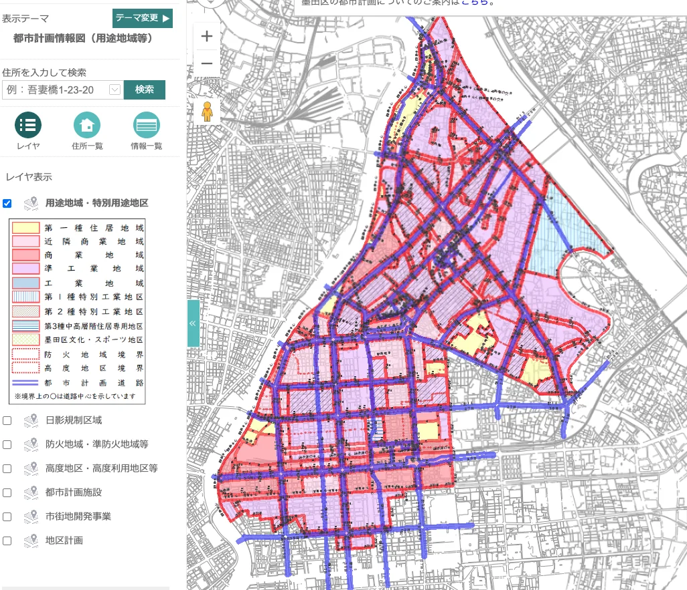
一方で、こちらの図は東京都墨田区の用途地域の図になります。
川崎市とは異なり、住居地域(黄色)、商業地域(赤色)、工業地域(紫、青色)がランダムに配置されていることがわかります。

どちらの都市計画が優れているか、例えば住みやすい土地かというのはこの情報のみでは議論しません。と言うかできません。土地利用の調整については歴史的、また地理的な背景によって自治体によって様相が非常に異なることがよくわかるかと思います。しかしそれがわかるだけでは定性的な、つまりなんとなくわかったと言う状態に過ぎません。これを定量的、つまり数量を使って評価しようと試みるのが空間相関になります。

## 近さの定義

空間相関をモデル化するためには、近さを定義する必要があります。
近さという言葉は身近に感じられますが、じっくり考えると曖昧な言葉ですね。目視できる範囲が近所？隣は近所として、その隣は近所ではない？など評価することもできるでしょう。近さの定義方法にはいくつかの考え方があります。以下にまとめました。

1. ゾーンによる方法
   1. 境界を共有するゾーン(マンハッタン距離)
   2. 境界または点を共有するゾーン(チェビシェフ距離)
   3. 最近隣$k$ゾーン
   4. 一定距離以内のゾーン
2. 距離減数関数を用いる方法
   1. $w_{i,j} = \frac{1}{d^\alpha_{i,j}}$
   2. $w_{i,j} = \exp\left(-\frac{d_{i,j}}{r}\right)$

**境界を共有するゾーン**はとても分りやすいかと思います。
これは、各座標の差（の絶対値）の総和を2点間の距離とする考え方です。マンハッタン距離と名付けられています。京都や札幌のような碁盤の目で整備されている都市の移動をイメージすると良いでしょう。
座標平面上の2点 $A(a_1, a_2), B(b_1, b_2)$ 間の距離$d_M$は以下のように求めることができます。

$$
d_M = \sum_{i=1}^2 | a_i - b_i |
$$
$d_M$が1、または2の例を以下の図にまとめました。$d_M = 1$ の場合には、図に示すようにチェスの駒であるルークが移動できる範囲と一致することから、**ルーク型**とも呼ばれます。

| $d_M=1$ | $d_M=2$ |
| ----- | ----- |
| 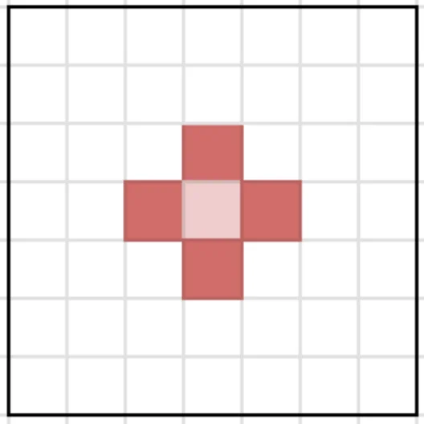 | 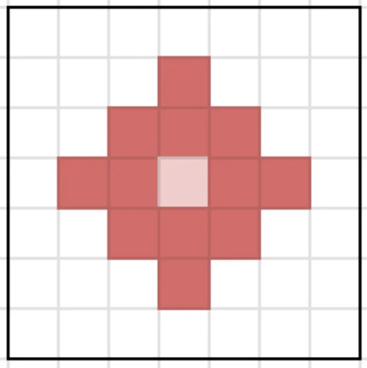 |

一方で、**境界または点を共有するゾーン**は各次元の差の絶対値を計算し、その中で最大のものを2点間の距離とする考え方です。この距離はチェビシェフ距離と名付けられています。座標平面上の$AB$間の距離$d_C$は以下のように求めることができます。

$$
d_C = \max_i |a_i - b_i|
$$

先程と同様に、$d_C$が1、または2の例を以下の図にまとめました。$d_C = 1$ の場合には、図に示すようにチェスの駒であるクイーンが移動できる範囲と一致することから、**クイーン型**とも呼ばれます。

| $d_C=1$ | $d_C=2$ |
| ----- | ----- |
| 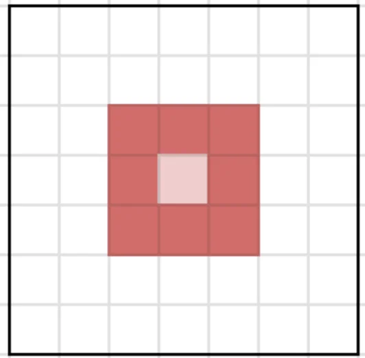 | 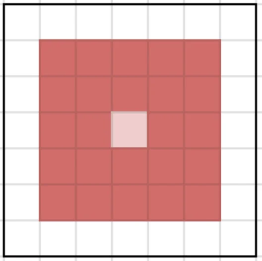 |

マンハッタン距離とチェビシェフ距離を比較すると、斜めの関係をどのように取り扱うかによってどちらを採用するかを決めると良いことが理解できるでしょう。

**最近隣$k$ゾーン**と**一定距離以内のゾーン**はユークリッド距離と考えてもらえると良いでしょう。このうち、**最近隣$k$ゾーン**はよく使われる指標です。$k$は中心から近い順に$k$番目までを抽出するという考え方です。具体例を以下に示します。

| $k$=4 | $k$=8 |
| ----- | ----- |
| 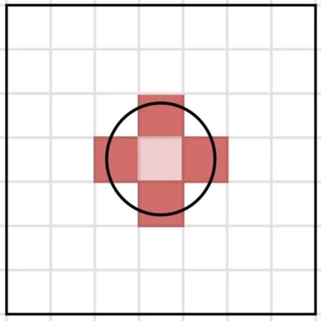 | 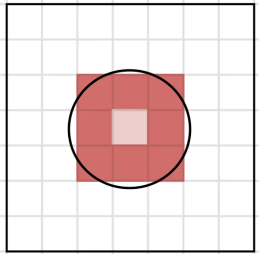 |

**ゾーンによる方法**は、近所とそれ以外を明確に分ける方法として活用することができます。一方で、**距離減数関数を用いる方法**は、距離に応じて影響度を滑らかに変化させることができます。上式は反比例を用いた方法、下式は指数関数を用いた方法です。下表のように、反比例を用いた方法は、直近により大きな重みを与える一方で、指数関数を用いた方法は比較的遠くにも重みを与えます。

| 反比例 | 指数関数 |
| :---: | :---: |
| $w_{i,j} = \frac{1}{d^\alpha_{i,j}}$ | $w_{i,j} = \exp\left(-\frac{d_{i,j}}{r}\right)$ |
| 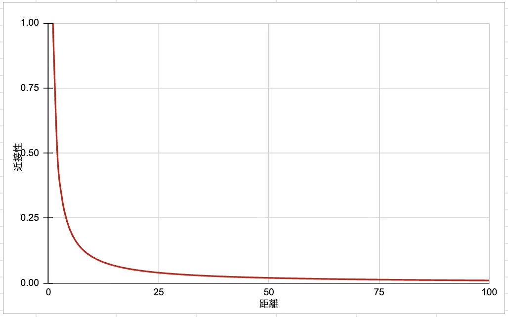 | 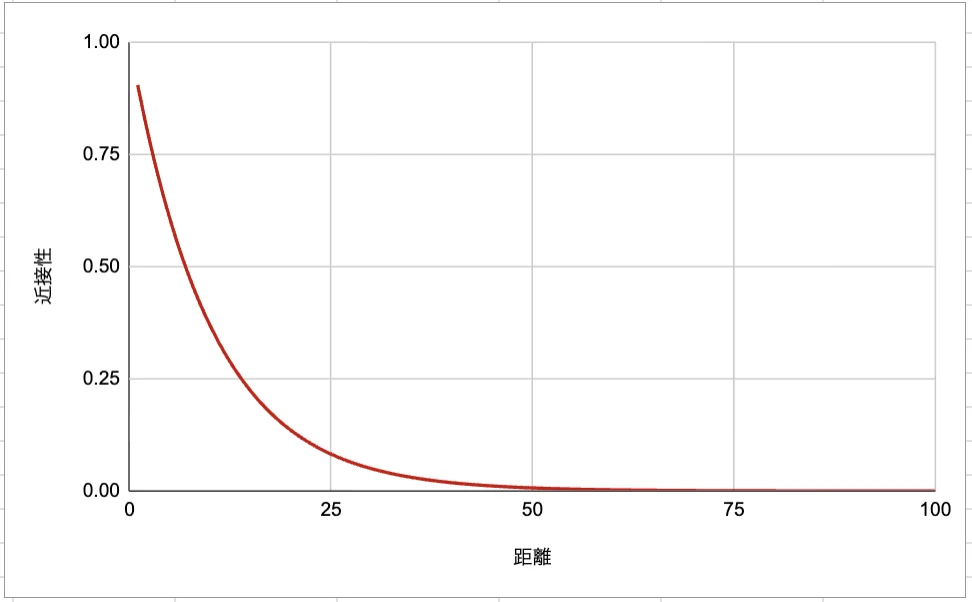 |

余談ですが、マンハッタン距離、ユークリッド距離、チェビシェフ距離は一つの式でまとめることができます。興味がある人は調べてみると良いでしょう。

## 近接行列

上記の法を用いて、近さを数量として定義できました。これはあくまで点(領域)同士の近さを評価するためのもので、これを複数の点(領域)同士を比較できるようにする必要があります。そのためには**近接行列**という行列を紹介する必要があります。近接行列とは、ゾーン$i$と$j$の近さ$w_{i,j}$を要素にもつ行列です。具体例として、一都三県間の近接行列を作成しましょう。
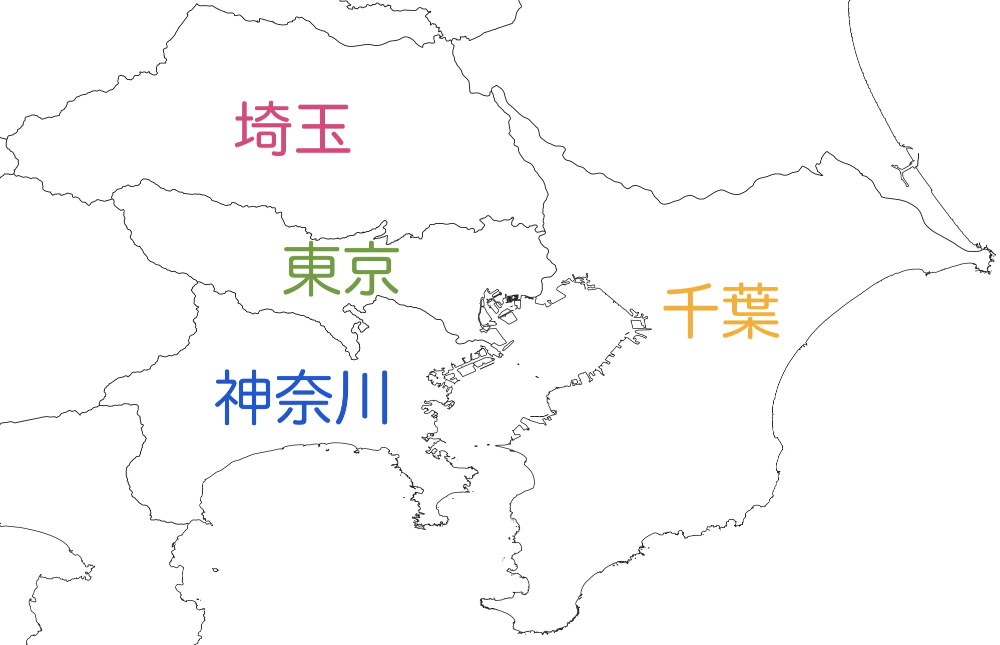
一都三県の地理関係を上図に示しました。これらの近接性を地理的に接続しているか否かで評価した場合、近接行列は以下の式のようになります。

$$
\begin{align}
\begin{bmatrix}
0 & 1 & 1 & 1 \\
1 & 0 & 0 & 1 \\
1 & 0 & 0 & 0 \\
1 & 1 & 0 & 0 \\
\end{bmatrix}
\tag{12.1}
\end{align}
$$

各行(列)は上(左)から東京、千葉、神奈川、埼玉を表しています。
上で示した行列から分かるように、近接行列は対称行列であり、したがって正方行列であることは自明です。また、対角要素は 0 として表されます。これは、同一ゾーン内での空間相関を考慮しないことを意味します。

近接行列は、行を正規化(normalization)して表現することがしばしばあります。これは、各行の合計が1になるように値を揃える操作になります。例えば式(12.1)は以下の行列に変換されます。

$$
\begin{align}
\begin{bmatrix}
0 & 1/3 & 1/3 & 1/3 \\
1/2 & 0 & 0 & 1/2 \\
1 & 0 & 0 & 0 \\
1/2 & 1/2 & 0 & 0 \\
\end{bmatrix}
\tag{12.2}
\end{align}
$$

この操作を行う理由として、隣接数が異なるまま分析すると、隣接数の多いゾーンのみ影響が過大評価されてしまう点が挙げられます。長野県を例として挙げた場合、隣接数は7となりますが、この値をそのまま用いると、隣接数の多さが空間的影響の大きさとして過度に反映されてしまいます。その結果、各ゾーンの影響力を公平に比較できなくなります。空間経済学では一般的に各行を正規化して分析に扱うことが標準的です。

## Rを用いた近接行列の生成と視覚化

実際にRを用いて近接行列の生成と視覚化の方法を紹介します。
ここでは、以下のRパッケージを呼び出します。

```R
install.packages(c( "sf", "NipponMap", "spdep")) #初回のみ実行
library(sf)
library(NipponMap)
library(spdep)
```

spdepパッケージは、空間データの統計解析を分析するための主要なパッケージです。今後よく登場してきます。

ここでは、前回でも登場した都道府県のデータを用いて、都道府県（陸続きではない北海道とお沖縄県を除く）間の近接行列を生成・可視化します。以下のコードを読み込んで実行しましょう。

```R
shp <- system.file("shapes/jpn.shp", package="NipponMap")[1]
pref0 <- read_sf(shp)
pref0b <- pref0[!(pref0$name %in% c("Hokkaido", "Okinawa")), ] #北海道と沖縄県をデータから除外
st_crs(pref0b) <- 4326 #WGS84のEPSGコード
```

第3回[座標参照系(CRS)](./03-spatial-data-analysis.md#座標参照系crs)の解説時に、「位置座標が緯度軽度で与えられているため、適切な距離計算が困難」と説明したのを覚えていますか？今回は、WGS84の測地系から**平面直角座標系第9系**に投影変換します。**平面直角座標系第9系**は、関東の1点を中心とした平面であり、こちらの平面に変換すると距離計算が可能になります。

```R
pref <- st_transform(pref0b, crs=6677) #平面直角座標系第9系のEPSGコード
```

(日本の平面直角座標系は全部で19あります。詳しくは[こちら](https://www.gsi.go.jp/sokuchikijun/jpc.html)を参照すること)

近接行列はpoly2nb関数を用いることで欲しい行列を簡単に得ることができます。今回はチェビシェフ距離(クイーン型)に基づく近接行列を生成しましょう。

```R
# クイーン型の近接行列の可視化
nb1 <- poly2nb(pref, queen=TRUE)
plot(st_geometry(pref), col="white", border="grey")
plot(nb1, coords, add=TRUE, col="red", cex=0.01, lwd=1.15)
```

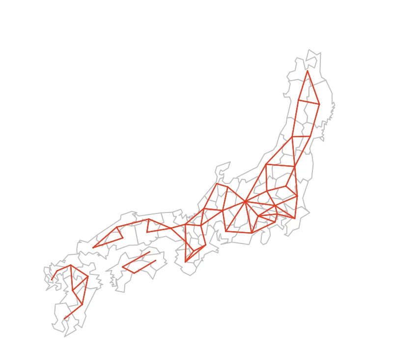
このような図が表示されたらOKです。ちなみにqueenの中身をFALSEに変えるとマンハッタン距離(ルーク型)になります。

必須ではありませんが、近接行列(nb1)を元にどの都道府県で接続されているかを表形式で取得するプログラムを用意しました。適宜実行してみてください。

```R
edges <- do.call(
  rbind,
  lapply(seq_along(nb1), function(i) {
    if (length(nb1[[i]]) == 0) return(NULL)
    if (length(pref$name[ nb1[[i]] ]) == 0) return(NULL)
    data.frame(
      from    = pref$name[i],
      to      = pref$name[ nb1[[i]] ],
      stringsAsFactors = FALSE
    )
  })
)
```

次に、最近隣4ゾーンで近接行列を定義し、それに基づいた可視化に挑戦してみましょう。以下のプログラムを実行してください。

```R
# k=4近傍に基づく近接行列の可視化
knn <- knearneigh(coords, 4)
nb1 <- knn2nb(knn)
plot(st_geometry(pref), col="white", border="grey")
plot(nb1, coords, add=TRUE, col="red", cex=0.01, lwd=1.15)
```

上のプログラムの解説をすると、近隣4ゾーンをknearneigh関数を用いて探索し、近傍情報をknn形式のオブジェクトで格納します。その後、knn2nb関数でnb形式に変換します。以下の図を出力できましたか？
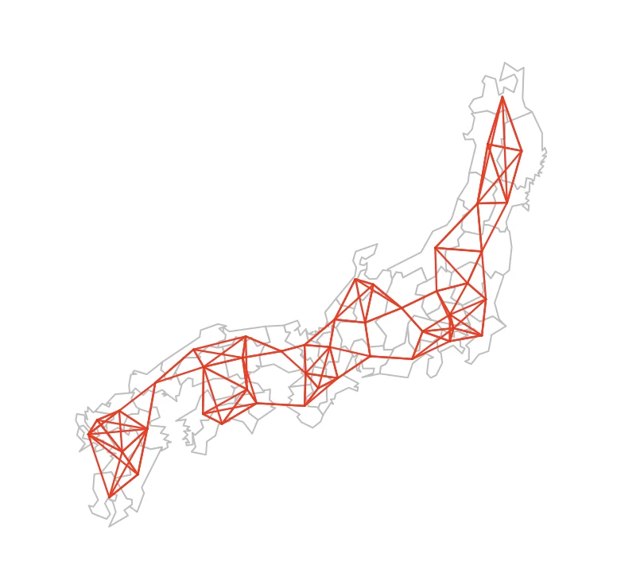

最後に一定距離(150km)内のゾーンを近接とする場合について紹介します。
以下のプログラムを実行してみましょう。

```R
# 一定距離(150km)以内に基づく近接行列の可視化
nb1 <- dnearneigh(coords, d1=0, d2=150000)
plot(st_geometry(pref), col="white", border="grey")
plot(nb1, coords, add=TRUE, col="red", cex=0.01, lwd=1.15)
```

こちらのプログラムではdnearneigh関数を用いて各都道府県が持つ重心点に基づき、重心点間の距離が150000m(=150km)以内であれば近接とみなす方法を採用しています。

最後に今回紹介した可視化を一覧化してみました。
近さをどのように取り扱うかによって可視化の結果が大きく異なることを理解できれば十分です。

| シェビチェフ距離(クイーン型) | 最近隣4ゾーン | 一定距離(150km)以内 |
| :---: | :---: | :---: |
|  |  | 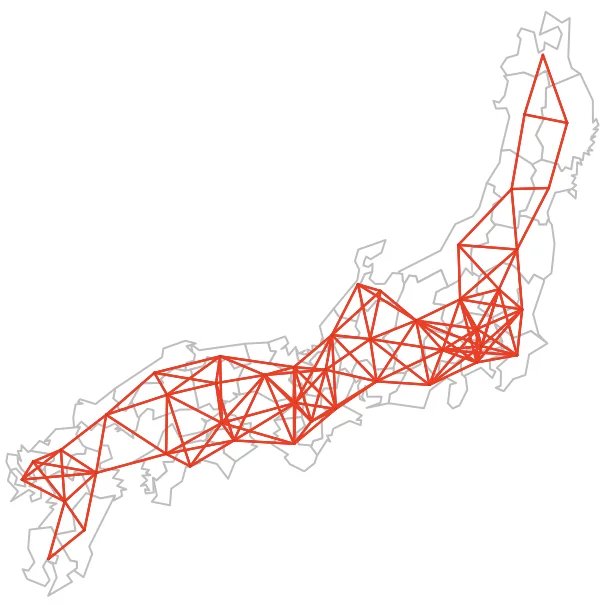 |

## まとめ

空間相関とは**近い地域ほど似た特徴を持つ**という空間の基本原理です。
これを扱うためには、**近さ**をルーク型・クイーン型・k近傍などで明確に定義する必要がりました。
近さの関係は近接行列として数値化され、空間統計で重要な役割を果たします。
行を正規化した近接行列は、地域ごとの隣接数の違いを調整し、比較可能にすることができます。(次回の演習で活躍します)
プログラムを用いて、近さの定義から近接行列の生成・可視化まで一連の分析を実践的に行いました。

## 参考文献

- [ガイドマップかわさき](https://kawasaki.geocloud.jp/webgis/?p=1)
- [すみだまちづくりマップ - 墨田区](https://www.sonicweb-asp.jp/sumida/)
- [わかりやすい平面直角座標系 - 国土地理院](https://www.gsi.go.jp/sokuchikijun/jpc.html)
