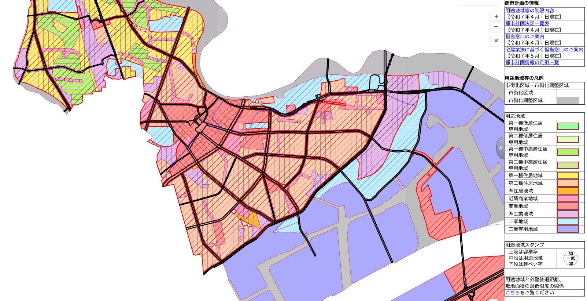
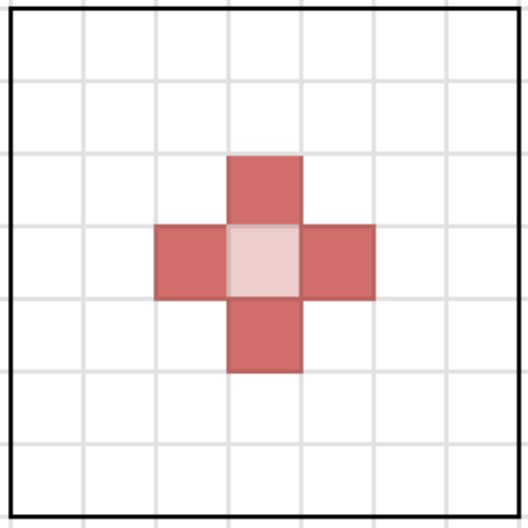
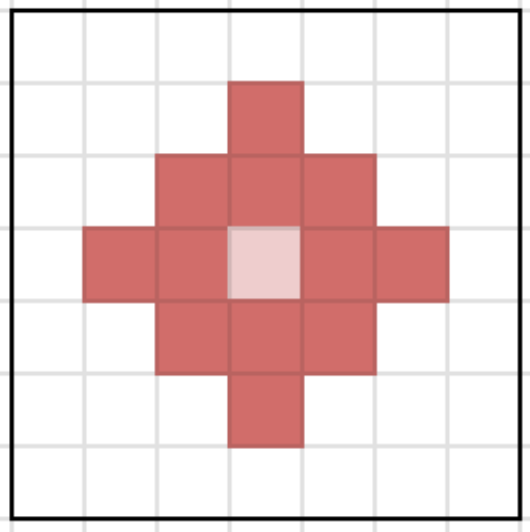
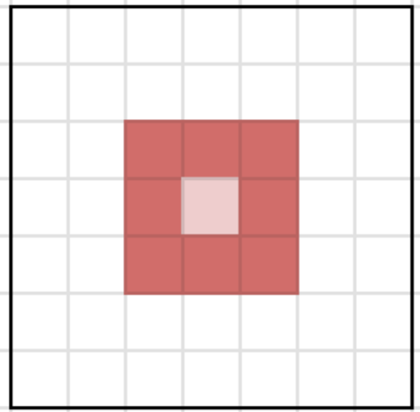
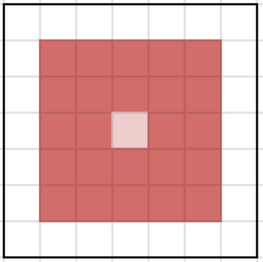
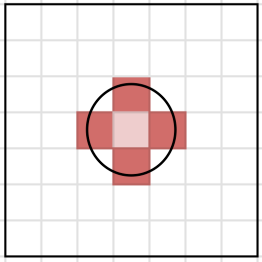
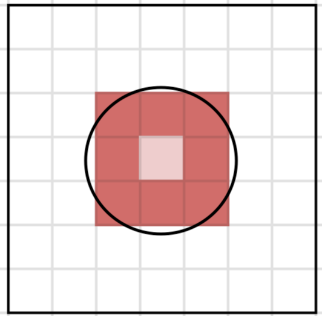
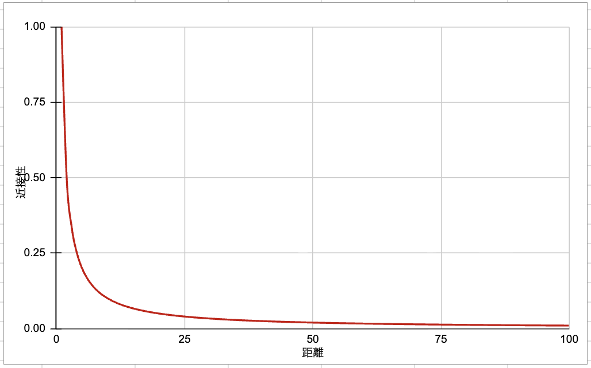
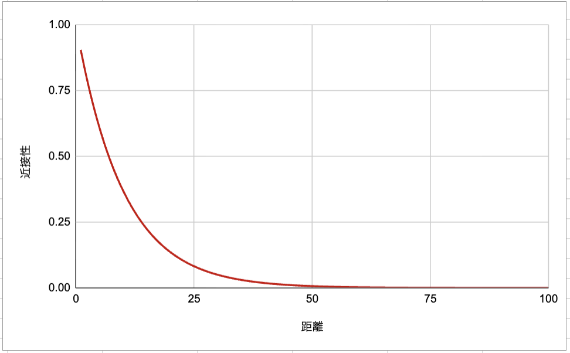

# 第12回 空間相関分析

[目次に戻る](../index.md)

## 本ページの目的

- 空間相関
- 近さの定義
- 近接行列

## 空間相関とは

私たちの身の回りを見渡してみると、**似た特徴を持つものが近くに集まりやすい**という、小さな“当たり前”に気づけます。
例えばこんな例が考えられます。

- 商店街では、飲食店が一か所に集中する
- 都市の中で、同じ価格帯の住宅地が自然とまとまる
- 森の中では、特定の植物が集中的に生えている
- 教室でも、気の合う友達同士で自然に固まる

これらは偶然ではなく、私たちが無意識に理解している「近くにあるもの同士は影響を及ぼし合う」という性質の表れです。
この「似たもの同士が近くに集まる」という感覚は、実は科学的に扱おうという考えが地理情報科学の空間相関（spatial autocorrelation）の発端となります。

地理学者トブラー(1970)によると

```md
"Everything is related to everything else,
but near things are more related than distant things."
（すべての事象は互いに関連しているが、近くの事象ほど強く関連している。）
```

つまり、「似たもの同士が近くにいる」は、空間の本質そのものを表す法則なのです。

この空間の本質を定量的に扱うため、これから空間相関について解説していきます。

## 正の空間相関、負の空間相関

車での運転や街中を歩いていると、外や街の雰囲気がガラッと変わる体験をしたことがあるかと思います。
日本では、都市計画法に基づき、市街地を住宅・商業・工業などに区分し、土地利用を調整するための制度を設けています。
ここでは、土地利用の調整については歴史的、また地理的な背景によって自治体によって様相が非常に異なります。ここでは、代表的な都市を紹介しましょう。


上の図は、神奈川県川崎市の用途地域の図になります。
暖色が住居地域、寒色が工業地域を示しています。
JR東海道線の隣接に商業地域があり、それを囲うように住居地域、臨海部に工業地域と綺麗に区分されていることが示されています。
このように川崎市では近所同士では似たような建物が立つような都市計画を実施しているため、街中を歩いた時に、突然街の雰囲気がガラッと変わってしまうような体験をすることができるでしょう。


一方で、こちらの図は東京都墨田区の用途地域の図になります。
川崎市とは異なり、住居地域(黄色)、商業地域(赤色)、工業地域(紫、青色)がランダムに配置されていることがわかります。

どちらの都市計画が優れているか、例えば住みやすい土地かというのはこの情報のみでは議論しません。と言うかできません。土地利用の調整については歴史的、また地理的な背景によって自治体によって様相が非常に異なることがよくわかるかと思います。しかしそれがわかるだけでは定性的な、つまりなんとなくわかったと言う状態に過ぎません。これを定量的、つまり数量を使って評価しようと試みるのが空間相関になります。

## 近さの定義

空間相関をモデル化するためには、近所を定義する必要があります。
近所という言葉は身近に感じられますが、じっくり考えると曖昧な言葉ですね。目視できる範囲が近所？隣は近所として、その隣は近所ではない？など評価することもできるでしょう。近所の定義方法にはいくつかの考え方があります。以下にまとめました。

1. ゾーンによる方法
   1. 境界を共有するゾーン(マンハッタン距離)
   2. 境界または点を共有するゾーン(チェビシェフ距離)
   3. 最近隣$k$ゾーン
   4. 一定距離以内のゾーン
2. 距離減数関数を用いる方法
   1. $w_{i,j} = \frac{1}{d^\alpha_{i,j}}$
   2. $w_{i,j} = \exp\left(-\frac{d_{i,j}}{r}\right)$

**境界を共有するゾーン**はとても分りやすいかと思います。
これは、各座標の差（の絶対値）の総和を2点間の距離とする考え方です。マンハッタン距離と名付けられています。京都や札幌のような碁盤の目で整備されている都市の移動をイメージすると良いでしょう。
座標平面上の2点 $A(a_1, a_2), B(b_1, b_2)$ 間の距離$d_M$は以下のように求めることができます。

$$
d_M = \sum_{i=1}^2 | a_i - b_i |
$$
$d_M$が1、または2の例を以下の図にまとめました。

| $d_M=1$ | $d_M=2$ |
| ----- | ----- |
|  |  |

一方で、**境界または点を共有するゾーン**は各次元の差の絶対値を計算し、その中で最大のものを2点間の距離とする考え方です。この距離はチェビシェフ距離と名付けられています。座標平面上の$AB$間の距離$d_C$は以下のように求めることができます。

$$
d_C = \max_i |a_i - b_i|
$$

先程と同様に、$d_C$が1、または2の例を以下の図にまとめました。

| $d_C=1$ | $d_C=2$ |
| ----- | ----- |
|  |  |

マンハッタン距離とチェビシェフ距離を比較すると、斜めの関係をどのように取り扱うかによってどちらを採用するかを決めると良いことが理解できるでしょう。

**最近隣$k$ゾーン**と**一定距離以内のゾーン**は一般的なユークリッド距離と考えてもらえると良いでしょう。このうち、**最近隣$k$ゾーン**はよく使われる指標です。$k$は中心から近い順に$k$番目までを抽出するという考え方です。具体例を以下に示します。

| $k$=4 | $k$=8 |
| ----- | ----- |
|  |  |

**ゾーンによる方法**は、近所とそれ以外を明確に分ける方法として活用することができます。一方で、**距離減数関数を用いる方法**は、距離に応じて影響度を滑らかに変化させることができます。上式は反比例を用いた方法、下式は指数関数を用いた方法です。下表のように、反比例を用いた方法は、直近により大きな重みを与える一方で、指数関数を用いた方法は比較的遠くにも重みを与えます。

| 反比例 | 指数関数 |
| :---: | :---: |
| $w_{i,j} = \frac{1}{d^\alpha_{i,j}}$ | $w_{i,j} = \exp\left(-\frac{d_{i,j}}{r}\right)$ |
|  |  |

余談ですが、マンハッタン距離、ユークリッド距離、チェビシェフ距離は一つの式でまとめることができます。興味がある人は調べてみると良いでしょう。

## 近接行列


## 参考文献

- [ガイドマップかわさき](https://kawasaki.geocloud.jp/webgis/?p=1)
- [すみだまちづくりマップ - 墨田区](https://www.sonicweb-asp.jp/sumida/)
