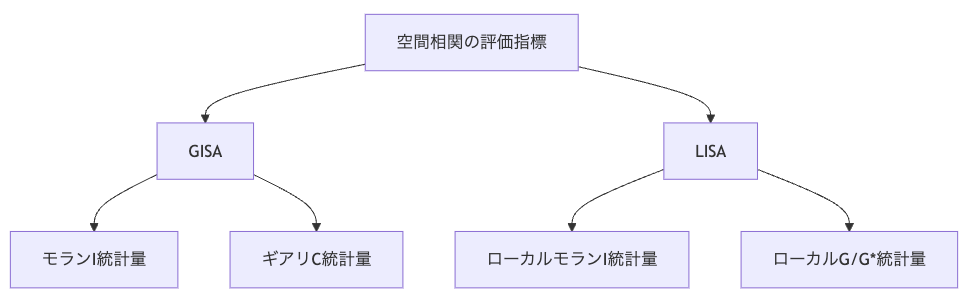
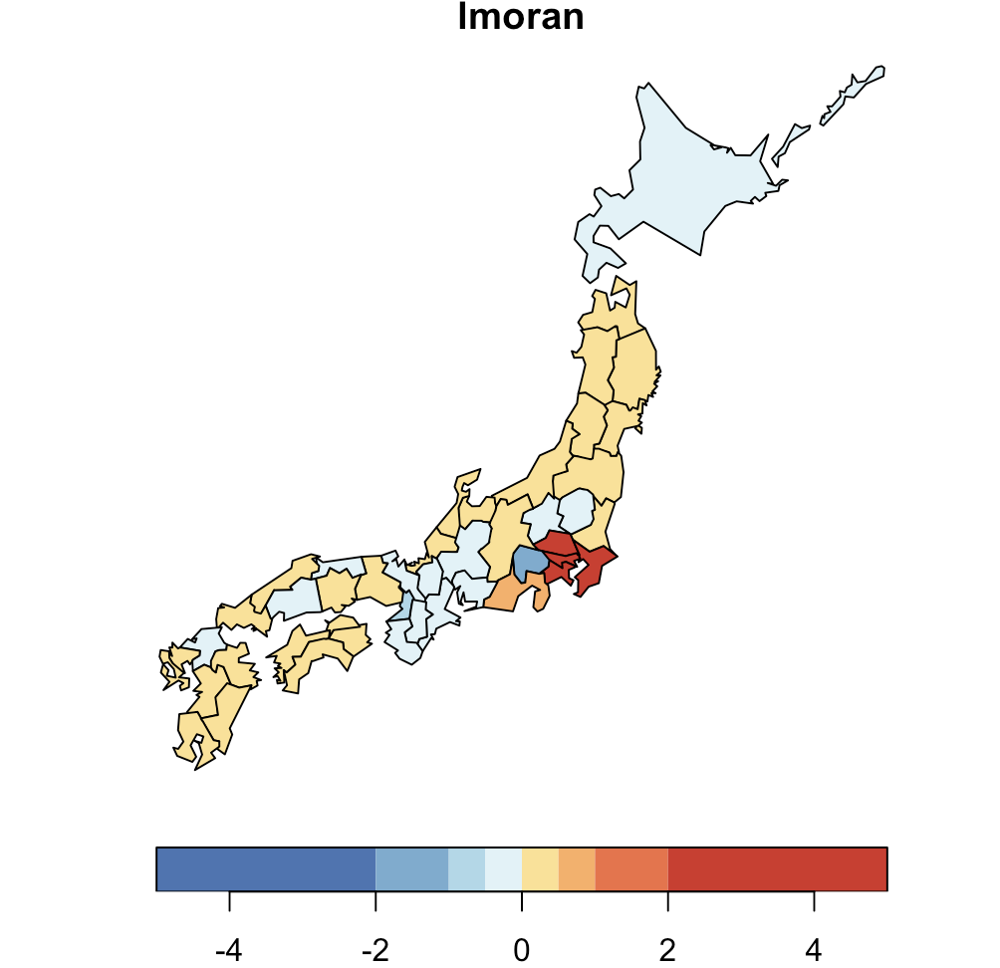
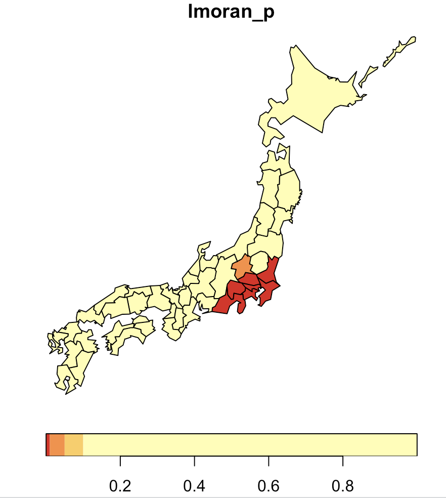
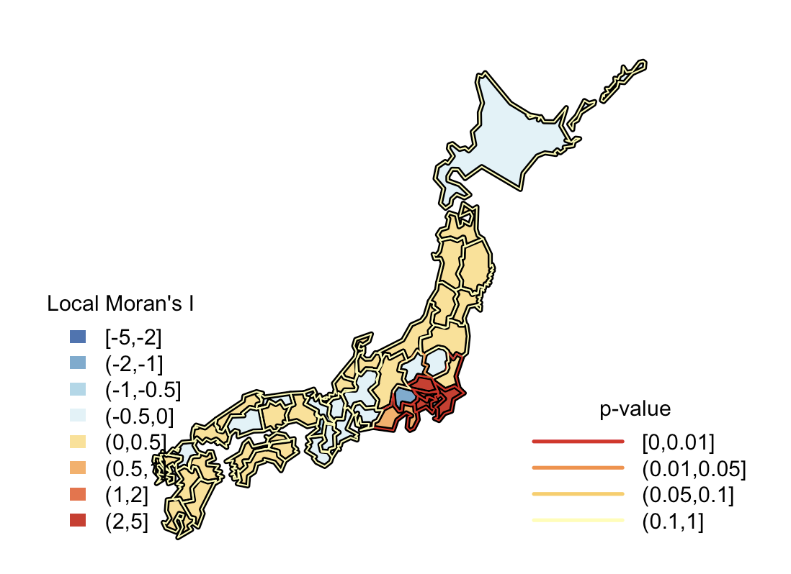
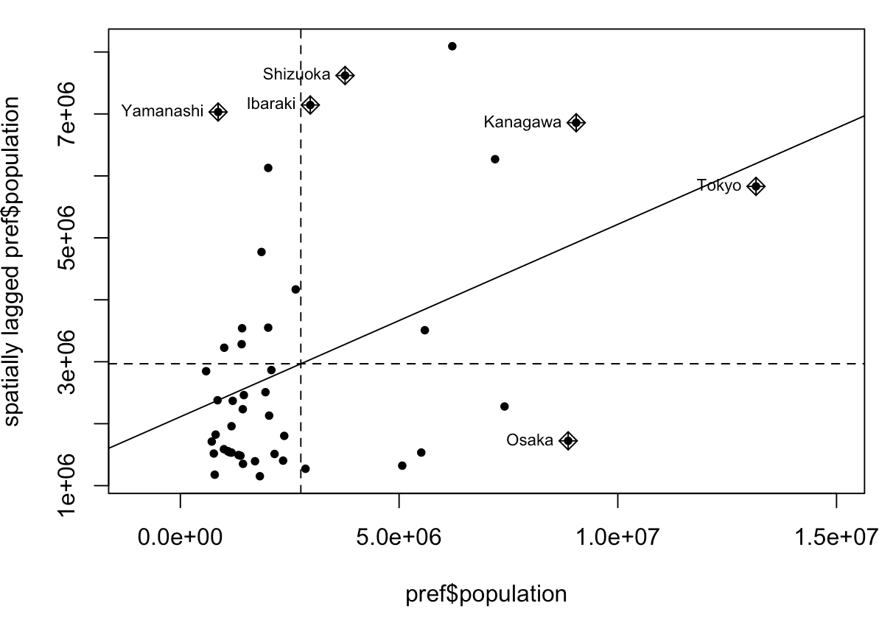

# 第13回 空間統計量

[目次に戻る](../index.md)

## 本ページの目的

- 大域空間統計量(GISA)と局所空間統計量(LISA)について理解を深める
- モランI統計量とギアリC統計量を用いて空間相関を求めることができる
- 統計量を用いて地域間の空間相関を可視化することができる

## 今回登場する各指標の関係性

今回は空間統計量について紹介しますが、はじめに各統計量の関係性について以下にまとめました。
一つずつ順番に解説していきます。


## 大域空間統計量(GISA)と局所空間統計量(LISA)

大域空間統計量(global indicator of spatial association; GISA)は、標本全体に対する空間の強さを評価する指標です。一方で、局所空間統計量(local indicator of spatial association; LISA)は、各ゾーン周辺の局所的な空間特性を評価するための統計量です。

今回は代表的な統計量であるモランI統計量と、ギアリC統計量について紹介します。

## モランI統計量

モランI統計量(Moran's I statistic)は、$N$個のゾーンで得られた標本データ$y_1, \cdots, y_N $の空間相関を評価します。標本データとしては人口や降水量といった数量データを扱うのが一般的です。モランI統計量の求め方は以下の通りです。

$$
I = \frac{N}{S_0}\frac{\sum_i\sum_j w_{i,j}(y_j-\bar{y})(y_i-\bar{y})}{\sum_i(y_i-\bar{y})^2} \tag{13.1}
$$

$\bar{y}$は標本平均、$S_0=\sum_i\sum_j w_{i,j}$は基準化定数（近接行列の要素の総和）を表しています。$w_{i,j}$は前回説明した近接行列の各要素です。この統計量は、自ゾーン$i$と近隣ゾーン$j$との相関の強さの評価指標として表現されています。

ここで、近接行列が行標準化されている場合、この統計量の最大値は1となります。したがって、「1に近いほど正の空間相関が強く、0に近いほどランダムな分布に近い」という一般的な相関係数と似た解釈が可能になります。正の空間相関の強さを以下に示します。（参考書に記載の数値とは若干異なります）

- $I=0.90〜1.00$：極めて強い
- $I=0.70〜0.90$：強い
- $I=0.50〜0.70$：中程度
- $I=0.30〜0.50$：弱い
- $I=0.00〜0.30$：無相関

モランI統計量が求められるようになったということは、「$N$個のゾーンで得られた標本データ$y_1, \cdots, y_N $の空間相関を評価できる」ようになったわけです。

データ分析を行う上で空間相関があったら嬉しいな☺️という感じで分析するのですが、それを評価するためには仮説検定が必要です。今回は空間相関の有無を検定するため、「標本データがランダムな空間分布を持つ($I=E[I]$)」という帰無仮説の下で得られるモランI統計量のz値を求めます。
この時のz値は以下の式です。

$$
z[I] = \frac{I-E[I]}{\sqrt{Var[I]}} \tag{13.2}
$$

帰無仮説の下でのモランI統計量の期待値$E[I]=-\frac{1}{N-1}$と分散$Var[I]$は既知であり、Nが十分であるときz検定を使用することができます。仮設検定の演習はこのあと行います。

## ギアリC統計量

ギアリC統計量とは、代表的なもう一つの統計量であり以下の式で定義されます。

$$
C = \frac{N-1}{S_0}\frac{\sum_i\sum_j w_{i,j}(y_j-y_i)^2}{\sum_i(y_i-\bar{y})^2} \tag{13.3}
$$

$C$は非負の値をとり、$C<1$のとき正の空間相関、$C=1$のときランダム性、$C>1$のとき負の相関関係があることを意味します。モランI統計量と比較して得られた統計量とその意味が反転していることに注意してください。仮設検定には「標本データがランダムな空間分布を持つ$(I=E[I])$」という帰無仮説の下で得られるz値が用いられます。その式は以下の通りです。

$$
z[C] = \frac{C-E[C]}{\sqrt{Var[C]}} \tag{13.4}
$$

## ローカルモランI統計量

ローカルモランI統計量は、モランI統計量をゾーンごとに分解することで得られる統計量$I_i$です。$I_i$は以下の式で定義されます。

$$
I_i = \frac{y_i-\bar{y}}{m_2}\sum_j{w_{i,j}(y_j-\bar{y})} \tag{13.5}
$$

このときの$m_2$は、

$$
m_2 = \frac{1}{N-1}\sum_{k=1}^N (y_k-\bar{y}) \tag{13.6}
$$

であり、定数(異なるゾーンでも同じ値を使う)となります。

ローカルモランI統計量を用いることで、空間相関の有無がゾーンごとに検定することができます。この検定には「ゾーン$i$の周辺には空間相関が存在しない」という帰無仮説の下で得られるz値を用います。

$$
z[I_i] = \frac{I_i-E[I_i]}{\sqrt{Var[I_i]}} \tag{13.7}
$$

## ローカルG/G*統計量

ローカルG統計量は、空間集積の検定統計量として幅広く用いられています。ローカルG統計量は以下の式で定義されます。

$$
G_i = \frac{\sum_j w_{i,j}y_j}{\sum_i y_i} \tag{13.8}
$$

$w_{i,j}$は近接行列の各要素ですが、自ゾーンの情報は0、つまり情報がないことを意味していました。したがって、$G_i$を用いて空間集積の指標としては解釈の面で難があります。そこで、自ゾーンも含む近隣ゾーンにおける空間集積の度合いを評価する$G_i^*$統計量が用いられてきました。式(13.8)と比較してみましょう。

$$
G_i^* = \frac{\sum_j w_{i,j}^*y_j}{\sum_i y_i} \tag{13.9}
$$

このとき、
$$
w_{i, j}^* =
\begin{cases}
1, & \text{if } i = j \\
0, & \text{if } i \neq j
\end{cases}
$$
です。

GISAとしてのG/G*統計量は、人口、売上高といった非負の観測値に対する統計量です。G/G*統計量は0以上の値をとり、その値が小さいことは観測値がランダムな空間分布を持つことを、一方で値が大きいことは大きな観測値が特定の地域に集中していることを意味しています。もちろんGISAとしての統計量はありますが、G/G*統計量はLISAとしての活用が活発です。

(*今回の演習では登場しませんが、これを使った分析に挑戦したい人は参考書を参照してください。)

## 都道府県別人口による空間統計量を用いた仮説検定

ここでは、モランの I 統計量を用いて、都道府県別人口に基づく空間相関の仮説検定を行います。

まず仮設検定では、以下のように帰無仮説と対立仮説を設定します。

- **帰無仮説**：都道府県別人口はランダムな空間分布を持つ
- **対立仮説**：都道府県別人口はランダムな空間分布を持たない

### 使用パッケージ

```R
library(sf)
library(spdep)
library(RColorBrewer)
library(NipponMap)
```

### データの読み込みと座標変換

NipponMap パッケージから沖縄県を除いた都道府県を抽出し、その後に近隣県を定義するため、平面直角座標系（EPSG:6677）へ変換します。

```R
shp <- system.file("shapes/jpn.shp", package="NipponMap")[1]
pref0 <- read_sf(shp)
pref0b <- pref0[pref0$name != "Okinawa",]
st_crs(pref0b) <- 4326
pref <- st_transform(pref0b, crs = 6677)
```

### 近隣県の定義（近接行列の作成）

今回は「最近隣4ゾーン」を使うため、`knearneigh` により近隣を定義します。

```R
coords <- st_coordinates(st_centroid(pref))
knn <- knearneigh(coords, 4)
nb2 <- knn2nb(knn)
w <- nb2listw(nb2)
```

`w` には以下が格納されます：

- neighbours 属性：各都道府県の近隣県の ID
- weights 属性：行標準化された重み

### モラン I 統計量の計算

```R
moran <- moran.test(pref$population, listw = w, alternative = "two.sided")
```

結果は以下のようになりました：

```R
Moran I test under randomisation

data:  pref$population
weights: w

Moran I statistic standard deviate = 3.7896, p-value = 0.0001509
alternative hypothesis: two.sided
sample estimates:
Moran I statistic       Expectation          Variance
      0.310751996      -0.022222222       0.007720491
```

対応関係：

- Moran I statistic → I
- Expectation → E[I]
- Variance → V[I]
- Moran I statistic standard deviate → z[I]

### 結果の解釈

得られた p 値は **0.01 を下回る**ため、有意水準 1% で帰無仮説は棄却されます。

したがって、**都道府県別人口には統計的に有意な空間相関が存在する** ことが確認されました。

例を挙げると、一都三県は一様に人口が多いということを考えると、直感にあった結果と言えるでしょう。

## 近隣県の人口による空間統計量を用いた仮説検定

次にローカルモランI統計量を用いて、近隣県の人口に基づく空間相関の仮説検定を行います。

まず仮設検定では、以下のように帰無仮説と対立仮説を設定します。

- **帰無仮説**：近隣県の人口はランダムの空間分布を持つ
- **対立仮説**：近隣県の人口はランダムの空間分布を持たない

モランI統計量と同様に都道府県人口と近隣県の定義を近接行列を用いて表現します。

### ローカルモラン I 統計量の計算

```R
lmoran <- localmoran.test(pref$population, listw = w, alternative = "two.sided")
```

取得した統計量を地図上に描画しましょう。

```R
pref$lmoran <- lmoran[, "Ii"]
breaks <- c ( -5, -2, -1, -0.5, 0, 0.5, 1, 2, 5)
nc <- length(breaks)-1
pal <- rev(brewer.pal(n = nc, name ="RdYlBu"))
plot(pref[,"lmoran"], pal = pal, breaks=breaks, key.pos = 1)
```

以下の結果が表示されたらokです


この結果を確認すると、東京都周辺に強い正の空間相関が見られることが確認できました。一方、山梨県ではこの値が負となっており、人口の大きい都県に囲まれていることがわかりました。

次に、ローカルモランI統計量の統計的有意性を確認するために$p$値をプロットしましょう。

```R
# p値を取り出す
pref$lmoran_p <- lmoran[, "Pr(z != E(Ii))"]

# 階級区分と配色の指定
breaks <- c(0, 0.01, 0.05, 0.10, 1)
nc <- length(breaks) - 1
pal <- rev(brewer.pal(n = nc, name = "YlOrRd"))
plot(pref[,"lmoran_p"], pal = pal, breaks=breaks, key.pos = 1)
```

このような結果が得られました


この図は、赤は1%水準、薄いオレンジは10%水準で統計的に有意な空間分布を持つことを意味しています。例えば東京都周辺では統計的に人口が集中していることが確認されました。一方で、山梨県は周辺に人口が集中していることがわかりました。これは負の空間相関という意味です。この図だとわかりにくいので統計量と$p$値を組み合わせた図を下に示します。


塗りつぶした色を統計量、枠線を$p$値として表しています。

このようにローカルモランI統計量は空間データの分布パターンをゾーンごとに評価、検定することができるツールです。

## モラン散布図

ローカルモランI統計量によって得られた値(Ii)を用いると次の解釈ができます。

| 区分名 | 英語名 | 典型的な状況                      | Ii の符号 | 周辺地域の特徴         | 解釈（意味）                       |
|----------------　|-----------------|----------------------------------|-----------|--------------------------|------------------------------------|
| ホットスポット | High–High (HH) | 自分が高く、周囲も高い           | 正        | 高い値が隣り合う        | 高値の集積。人口が集中している等 |
| クールスポット | Low–Low (LL)   | 自分が低く、周囲も低い           | 正        | 低い値が隣り合う        | 低値の集積。人口が少ない地域が連続 |
| 一人勝ち       | High–Low (HL)  | 自分が高く、周囲は低い           | 負        | 周囲より突出して高い    | 孤立した高値。局所的な突出地点     |
| 一人負け       | Low–High (LH)  | 自分が低く、周囲は高い           | 負        | 周囲より突出して低い    | 孤立した低値。他地域に比べて弱い  |

これを4象限として表した図がモラン散布図です。今回の都道府県の人口のデータを使って表現すると以下の結果となります。

```R
moran.plot(pref$population, listw=w, labels=pref$name, pch=20, xlim=c(-1000000, 15000000))
```



モラン散布図は、右上をホットスポット、右下が一人勝ち、左上が一人負け、左下がクールスポットとして表現されています。
今回表示された都道府県は統計的に特徴のある点が代表として選定されています。

## まとめ

- 大域空間統計量（GISA）と局所空間統計量（LISA）
  - GISA はデータ全体の空間相関を評価する指標
  - LISA は各ゾーン周辺の局所的な空間構造を評価する指標

- モラン I 統計量とギアリ C 統計量
  - モラン I 統計量：正の空間相関の強さを測定する代表的な統計量
  - ギアリ C 統計量：値の類似性を重視し、1 を境に相関の方向を判断

- ローカルモラン I 統計量とその可視化
  - 各地域単位での空間相関の強弱を判定できる
  - p 値と組み合わせることで、統計的に有意なホットスポット／クールスポットを特定可能
  - モラン散布図により、地域の特徴を視覚的に理解できる
