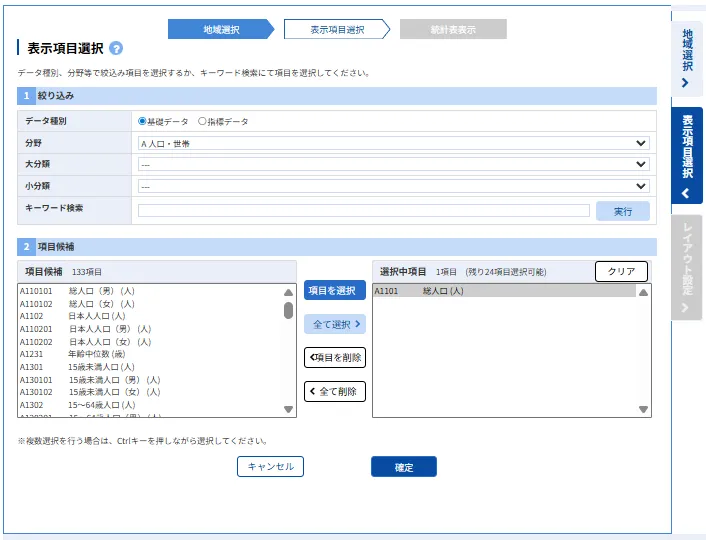
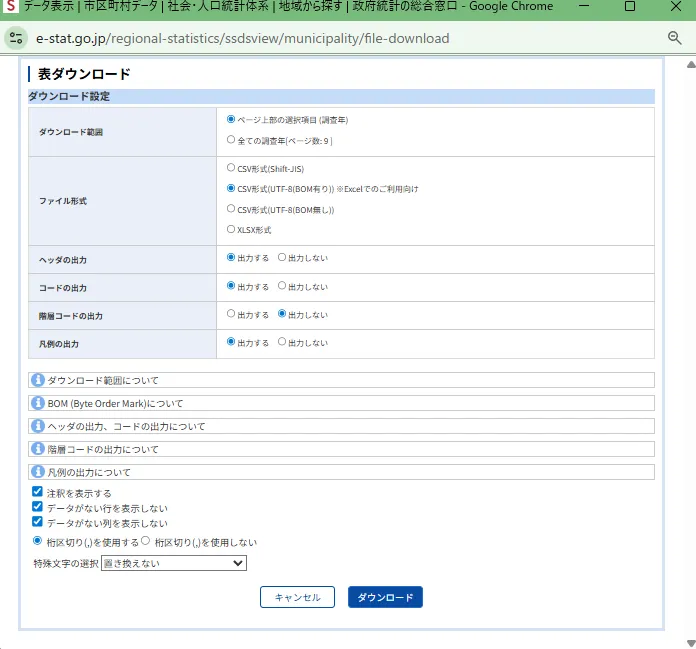

# 第14回 時空間解析

[目次に戻る](../index.md)

## この講義の目次

{: .card .card-toc }

- [（演習1）空間相関分析](#exe1)
- [（演習2）空間統計量](#exe2)
- [課題の提出方法](#how-to-submit)

## （演習1）空間相関分析 {#exe1}

都道府県観光客数の可視化を実施し、結果について考察しなさい。
都道府県観光客数は、[公益社団法人日本観光振興協会 デジタル観光統計オープンデータ](https://www.nihon-kankou.or.jp/home/jigyou/research/d-toukei/)から取得すること。

### 取得データについて

一例として、2025年9月のデータ一月分をダウンロードした。どの年月のデータでも構わない。各人で指定して決めること。
ただし、都道府県の名前が漢字とローマ字で混在していることに注意し、取得したcsvデータの地域名称列を漢字からローマ字に変更すること。

単純な結果を示すとこのような形になる。

この例では、東京都の数が顕著になっているため、演習を実施する際には結果を見やすいようにしきい値を適宜指定すること。

## （演習2）空間統計量 {#exe2}

都道府県を選択し、市町村人口に基づく空間相関の仮説検定を行い、結果について考察しなさい。課題の提出方法については下記に示している。検定の立て方、分析方法については第13回の講義を参考にすること。

### 都道府県の決め方

第十四回の講義で指定する。欠席等の場合は神奈川県・埼玉県・千葉県の中から選択すること。

### 市町村人口のダウンロード

市町村人口は政府統計(e-stat)の2020年度から取得すること。
[市町村データ](https://www.e-stat.go.jp/regional-statistics/ssdsview/municipality)
*政令指定都市にある区の人口は分析に含めないとする（例：札幌市 中央区・北区...はすべて札幌市として分析する）

下図のように絞り込み条件を市（特別区部を除く）と町・村を選択するとよい。

データの種別は（A1101 総人口（人））を選択すること。下図を参考にするとよい。

ダウンロード設定は以下の図を参考にするとよい。

- ダウンロード範囲：ページ上部の選択項目（操作年）
- ファイル形式：CSV形式(UTF-8(BOM有り))

## 演習の提出方法 {#how-to-submit}

### 課題の提出内容

Google Formに以下の情報を記入し提出すること

- 課題1
  - ソースコード
  - 分析した年月
  - 都道府県観光客数の可視化した結果の図
  - 上記の結果と図を用いた考察
- 課題2
  - ソースコード
  - 市町村のローカルモランI統計量の統計的有意性を確認できる図
  - 市町村のモラン散布図
  - 空間統計量を用いた仮説検定の実施結果とその考察

### 課題の提出先

Google Formで提出

提出期限：XX月YY日 17:00まで
