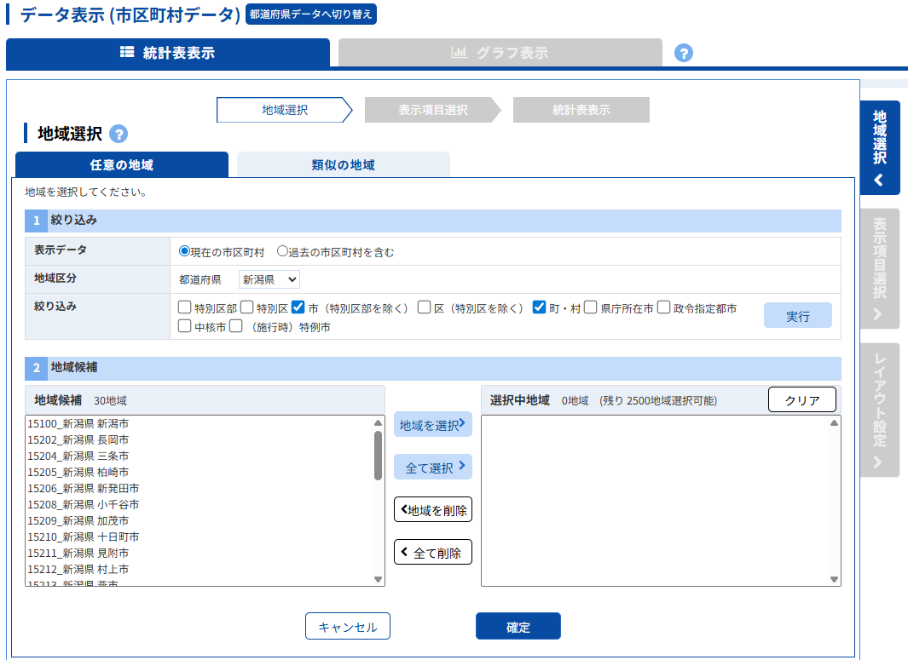
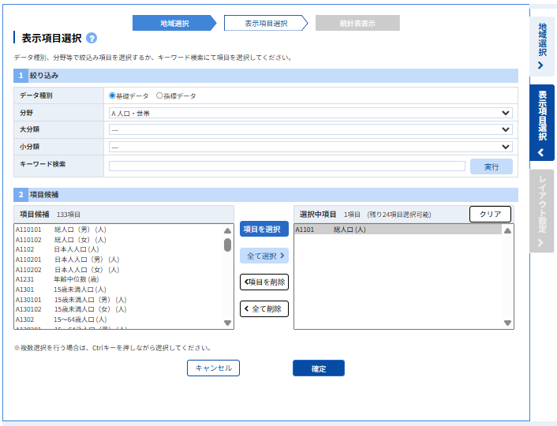
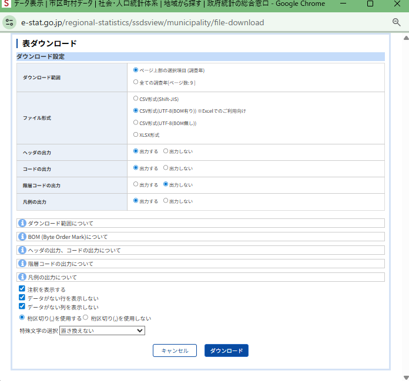

# 第14回 時空間解析

[目次に戻る](../index.md)

## この講義の目次

{: .card .card-toc }

- [（演習1）空間相関分析](#exe1)
- [（演習2）空間統計量](#exe2)
- [課題の提出方法](#how-to-submit)

## （演習1）空間相関分析 {#exe1}

## （演習2）空間統計量 {#exe2}

都道府県を選択し、市町村人口に基づく空間相関の仮説検定を行い、結果について考察しなさい。課題の提出方法については下記に示している。検定の立て方、分析方法については第13回の講義を参考にすること。

### 都道府県の決め方

第十四回の講義で指定する。欠席等の場合は神奈川県・埼玉県・千葉県の中から選択すること。

### 市町村人口のダウンロード

市町村人口は政府統計(e-stat)の2020年度から取得すること。
[市町村データ](https://www.e-stat.go.jp/regional-statistics/ssdsview/municipality)
*政令指定都市にある区の人口は分析に含めないとする（例：札幌市 中央区・北区...はすべて札幌市として分析する）

下図のように絞り込み条件を市（特別区部を除く）と町・村を選択するとよい。

データの種別は（A1101 総人口（人））を選択すること。下図を参考にするとよい。

ダウンロード設定は以下の図を参考にするとよい。

- ダウンロード範囲：ページ上部の選択項目（操作年）
- ファイル形式：CSV形式(UTF-8(BOM有り))

## 演習の提出方法 {#how-to-submit}

### 課題の提出内容

A4 2~4枚程度で以下の情報を含め提出すること

- 課題1
- 課題2
  - 空間統計量を用いた仮説検定の実施結果とその考察
  - 市町村のローカルモランI統計量の統計的有意性を確認できる図
  - 市町村のモラン散布図

ファイル名は学籍番号_氏名_空間統計量とし、pdfで提出すること

### 課題の提出先

Google Formで提出

提出期限：XX月YY日 17:00まで
